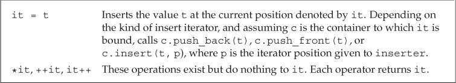
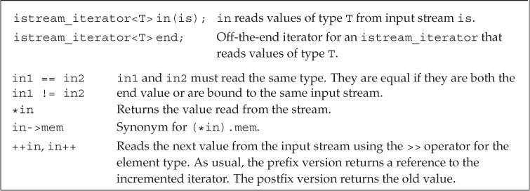

# 第10章 泛型算法

## 概述（Overview）

大多数算法都定义在头文件*algorithm*中，此外标准库还在头文件*numeric*中定义了一组数值泛型算法。一般情况下，这些算法并不直接操作容器，而是遍历由两个迭代器指定的元素范围进行操作。

`find`函数将范围中的每个元素与给定值进行比较，返回指向第一个等于给定值的元素的迭代器。如果无匹配元素，则返回其第二个参数来表示搜索失败。

```c++
int val = 42;   // value we'll look for
// result will denote the element we want if it's in vec, or vec.cend() if not
auto result = find(vec.cbegin(), vec.cend(), val);
// report the result
cout << "The value " << val
    << (result == vec.cend() ? " is not present" : " is present") << endl;
```

迭代器参数令算法不依赖于特定容器，但依赖于元素类型操作。

泛型算法本身不会执行容器操作，它们只会运行于迭代器之上，执行迭代器操作。算法可能改变容器中元素的值，或者在容器内移动元素，但不会改变底层容器的大小（当算法操作插入迭代器时，迭代器可以向容器中添加元素，但算法自身不会进行这种操作）。

## 初识泛型算法（A First Look at the Algorithms）

### 只读算法（Read-Only Algorithms）

`accumulate`函数（定义在头文件*numeric*中）用于计算一个序列的和。它接受三个参数，前两个参数指定需要求和的元素范围，第三个参数是和的初值（决定加法运算类型和返回值类型）。

```c++
// sum the elements in vec starting the summation with the value 0
int sum = accumulate(vec.cbegin(), vec.cend(), 0);
string sum = accumulate(v.cbegin(), v.cend(), string(""));
// error: no + on const char*
string sum = accumulate(v.cbegin(), v.cend(), "");
```

建议在只读算法中使用`cbegin`和`cend`函数。

`equal`函数用于确定两个序列是否保存相同的值。它接受三个迭代器参数，前两个参数指定第一个序列范围，第三个参数指定第二个序列的首元素。`equal`函数假定第二个序列至少与第一个序列一样长。

```c++
// roster2 should have at least as many elements as roster1
equal(roster1.cbegin(), roster1.cend(), roster2.cbegin());
```

只接受单一迭代器表示第二个操作序列的算法都假定第二个序列至少与第一个序列一样长。

### 写容器元素的算法（Algorithms That Write Container Elements）

`fill`函数接受两个迭代器参数表示序列范围，还接受一个值作为第三个参数，它将给定值赋予范围内的每个元素。

```c++
// reset each element to 0
fill(vec.begin(), vec.end(), 0);
```

`fill_n`函数接受单个迭代器参数、一个计数值和一个值，它将给定值赋予迭代器指向位置开始的指定个元素。

```c++
// reset all the elements of vec to 0
fill_n(vec.begin(), vec.size(), 0);
```

向目的位置迭代器写入数据的算法都假定目的位置足够大，能容纳要写入的元素。

插入迭代器（insert iterator）是一种向容器内添加元素的迭代器。通过插入迭代器赋值时，一个与赋值号右侧值相等的元素会被添加到容器中。

`back_inserter`函数（定义在头文件*iterator*中）接受一个指向容器的引用，返回与该容器绑定的插入迭代器。通过此迭代器赋值时，赋值运算符会调用`push_back`将一个具有给定值的元素添加到容器中。

```c++
vector<int> vec;    // empty vector
auto it = back_inserter(vec);   // assigning through it adds elements to vec
*it = 42;   // vec now has one element with value 42
// ok: back_inserter creates an insert iterator that adds elements to vec
fill_n(back_inserter(vec), 10, 0);  // appends ten elements to vec
```

`copy`函数接受三个迭代器参数，前两个参数指定输入序列，第三个参数指定目的序列的起始位置。它将输入序列中的元素拷贝到目的序列中，返回目的位置迭代器（递增后）的值。

```c++
int a1[] = { 0,1,2,3,4,5,6,7,8,9 };
int a2[sizeof(a1) / sizeof(*a1)];     // a2 has the same size as a1
// ret points just past the last element copied into a2
auto ret = copy(begin(a1), end(a1), a2);    // copy a1 into a2
```

`replace`函数接受四个参数，前两个迭代器参数指定输入序列，后两个参数指定要搜索的值和替换值。它将序列中所有等于第一个值的元素都替换为第二个值。

```c++
// replace any element with the value 0 with 42
replace(ilst.begin(), ilst.end(), 0, 42);
```

相对于`replace`，`replace_copy`函数可以保留原序列不变。它接受第三个迭代器参数，指定调整后序列的保存位置。

```c++
// use back_inserter to grow destination as needed
replace_copy(ilst.cbegin(), ilst.cend(), back_inserter(ivec), 0, 42);
```

很多算法都提供“copy”版本，这些版本不会将新元素放回输入序列，而是创建一个新序列保存结果。

### 重排容器元素的算法（Algorithms That Reorder Container Elements）

`sort`函数接受两个迭代器参数，指定排序范围。它利用元素类型的`<`运算符重新排列元素。

```c++
void elimDups(vector<string> &words)
{
    // sort words alphabetically so we can find the duplicates
    sort(words.begin(), words.end());
    // unique reorders the input range so that each word appears once in the
    // front portion of the range and returns an iterator one past the unique range
    auto end_unique = unique(words.begin(), words.end());
    // erase uses a vector operation to remove the nonunique elements
    words.erase(end_unique, words.end());
}
```

`unique`函数重排输入序列，消除相邻的重复项，返回指向不重复值范围末尾的迭代器。


## 定制操作（Customizing Operations）

默认情况下，很多比较算法使用元素类型的`<`或`==`运算符完成操作。可以为这些算法提供自定义操作来代替默认运算符。

### 向算法传递函数（Passing a Function to an Algorithm）

谓词（predicate）是一个可调用的表达式，其返回结果是一个能用作条件的值。标准库算法使用的谓词分为一元谓词（unary predicate，接受一个参数）和二元谓词（binary predicate，接受两个参数）。接受谓词参数的算法会对输入序列中的元素调用谓词，因此元素类型必须能转换为谓词的参数类型。

```c++
// comparison function to be used to sort by word length
bool isShorter(const string &s1, const string &s2)
{
    return s1.size() < s2.size();
}

// sort on word length, shortest to longest
sort(words.begin(), words.end(), isShorter);
```

稳定排序函数`stable_sort`可以维持输入序列中相等元素的原有顺序。

### lambda表达式（Lambda Expressions）

`find_if`函数接受两个迭代器参数和一个谓词参数。迭代器参数用于指定序列范围，之后对序列中的每个元素调用给定谓词，并返回第一个使谓词返回非0值的元素。如果不存在，则返回尾迭代器。

对于一个对象或表达式，如果可以对其使用调用运算符`()`，则称它为可调用对象（callable object）。可以向算法传递任何类别的可调用对象。

一个`lambda`表达式表示一个可调用的代码单元，类似未命名的内联函数，但可以定义在函数内部。其形式如下：

```c++
[capture list] (parameter list) -> return type { function body }
```

其中，*capture list*（捕获列表）是一个由`lambda`所在函数定义的局部变量的列表（通常为空）。*return type*、*parameter list*和*function body*与普通函数一样，分别表示返回类型、参数列表和函数体。但与普通函数不同，`lambda`必须使用尾置返回类型，且不能有默认实参。

定义`lambda`时可以省略参数列表和返回类型，但必须包含捕获列表和函数体。省略参数列表等价于指定空参数列表。省略返回类型时，若函数体只是一个`return`语句，则返回类型由返回表达式的类型推断而来。否则返回类型为`void`。

```c++
auto f = [] { return 42; };
cout << f() << endl;    // prints 42
```

`lambda`可以使用其所在函数的局部变量，但必须先将其包含在捕获列表中。捕获列表只能用于局部非`static`变量，`lambda`可以直接使用局部`static`变量和其所在函数之外声明的名字。

```c++
// get an iterator to the first element whose size() is >= sz
auto wc = find_if(words.begin(), words.end(), 
                    [sz](const string &a) { return a.size() >= sz; });
```

`for_each`函数接受一个输入序列和一个可调用对象，它对输入序列中的每个元素调用此对象。

```c++
// print words of the given size or longer, each one followed by a space
for_each(wc, words.end(),
            [] (const string &s) { cout << s << " "; });
```

### lambda捕获和返回（Lambda Captures and Returns）

被`lambda`捕获的变量的值是在`lambda`创建时拷贝，而不是调用时拷贝。在`lambda`创建后修改局部变量不会影响`lambda`内对应的值。

```c++
size_t v1 = 42; // local variable
// copies v1 into the callable object named f
auto f = [v1] { return v1; };
v1 = 0;
auto j = f();   // j is 42; f stored a copy of v1 when we created it
```

`lambda`可以以引用方式捕获变量，但必须保证`lambda`执行时变量存在。

```c++
size_t v1 = 42; // local variable
// the object f2 contains a reference to v1
auto f2 = [&v1] { return v1; };
v1 = 0;
auto j = f2();  // j is 0; f2 refers to v1; it doesn't store it
```

可以让编译器根据`lambda`代码隐式捕获函数变量，方法是在捕获列表中写一个`&`或`=`符号。`&`为引用捕获，`=`为值捕获。

可以混合使用显式捕获和隐式捕获。混合使用时，捕获列表中的第一个元素必须是`&`或`=`符号，用于指定默认捕获方式。显式捕获的变量必须使用与隐式捕获不同的方式。

```c++
// os implicitly captured by reference; c explicitly captured by value
for_each(words.begin(), words.end(),
            [&, c] (const string &s) { os << s << c; });
// os explicitly captured by reference; c implicitly captured by value
for_each(words.begin(), words.end(),
            [=, &os] (const string &s) { os << s << c; });
```

`lambda`捕获列表形式：


默认情况下，对于值方式捕获的变量，`lambda`不能修改其值。如果希望修改，就必须在参数列表后添加关键字`mutable`。

```c++
size_t v1 = 42; // local variable
// f can change the value of the variables it captures
auto f = [v1] () mutable { return ++v1; };
v1 = 0;
auto j = f();   // j is 43
```

对于引用方式捕获的变量，`lambda`是否可以修改依赖于此引用指向的是否是`const`类型。

`transform`函数接受三个迭代器参数和一个可调用对象。前两个迭代器参数指定输入序列，第三个迭代器参数表示目的位置。它对输入序列中的每个元素调用可调用对象，并将结果写入目的位置。

```c++
transform(vi.begin(), vi.end(), vi.begin(),
            [](int i) -> int { if (i < 0) return -i; else return i; });
```

为`lambda`定义返回类型时，必须使用尾置返回类型。

### 参数绑定（Binding Arguments）

`bind`函数定义在头文件*functional*中，相当于一个函数适配器，它接受一个可调用对象，生成一个新的可调用对象来适配原对象的参数列表。一般形式如下：

```c++
auto newCallable = bind(callable, arg_list);
```

其中，*newCallable*本身是一个可调用对象，*arg_list*是一个以逗号分隔的参数列表，对应给定的*callable*的参数。之后调用*newCallable*时，*newCallable*会再调用*callable*，并传递给它*arg_list*中的参数。*arg_list*中可能包含形如`_n`的名字，其中*n*是一个整数。这些参数是占位符，表示*newCallable*的参数，它们占据了传递给*newCallable*的参数的位置。数值*n*表示生成的可调用对象中参数的位置：`_1`为*newCallable*的第一个参数，`_2`为*newCallable*的第二个参数，依次类推。这些名字都定义在命名空间*placeholders*中，它又定义在命名空间*std*中，因此使用时应该进行双重限定。

```c++
using std::placeholders::_1;
using namespace std::placeholders;
bool check_size(const string &s, string::size_type sz);

// check6 is a callable object that takes one argument of type string
// and calls check_size on its given string and the value 6
auto check6 = bind(check_size, _1, 6);
string s = "hello";
bool b1 = check6(s);    // check6(s) calls check_size(s, 6)
```

`bind`函数可以调整给定可调用对象中的参数顺序。

```c++
// sort on word length, shortest to longest
sort(words.begin(), words.end(), isShorter);
// sort on word length, longest to shortest
sort(words.begin(), words.end(), bind(isShorter, _2, _1));
```

默认情况下，`bind`函数的非占位符参数被拷贝到`bind`返回的可调用对象中。但有些类型不支持拷贝操作。

如果希望传递给`bind`一个对象而又不拷贝它，则必须使用标准库的`ref`函数。`ref`函数返回一个对象，包含给定的引用，此对象是可以拷贝的。`cref`函数生成保存`const`引用的类。

```c++
ostream &print(ostream &os, const string &s, char c);
for_each(words.begin(), words.end(), bind(print, ref(os), _1, ' '));
```

## 再探迭代器（Revisiting Iterators）

除了为每种容器定义的迭代器之外，标准库还在头文件*iterator*中定义了另外几种迭代器。

- 插入迭代器（insert iterator）：该类型迭代器被绑定到容器对象上，可用来向容器中插入元素。
- 流迭代器（stream iterator）：该类型迭代器被绑定到输入或输出流上，可用来遍历所关联的IO流。
- 反向迭代器（reverse iterator）：该类型迭代器向后而不是向前移动。除了`forward_list`之外的标准库容器都有反向迭代器。
- 移动迭代器（move iterator）：该类型迭代器用来移动容器元素。

### 插入迭代器（Insert Iterators）

插入器是一种迭代器适配器，它接受一个容器参数，生成一个插入迭代器。通过插入迭代器赋值时，该迭代器调用容器操作向给定容器的指定位置插入一个元素。

插入迭代器操作：



插入器有三种类型，区别在于元素插入的位置：

- `back_inserter`：创建一个调用`push_back`操作的迭代器。
- `front_inserter`：创建一个调用`push_front`操作的迭代器。
- `inserter`：创建一个调用`insert`操作的迭代器。此函数接受第二个参数，该参数必须是一个指向给定容器的迭代器，元素会被插入到该参数指向的元素之前。

```c++
list<int> 1st = { 1,2,3,4 };
list<int> lst2, lst3;   // empty lists
// after copy completes, 1st2 contains 4 3 2 1
copy(1st.cbegin(), lst.cend(), front_inserter(lst2));
// after copy completes, 1st3 contains 1 2 3 4
copy(1st.cbegin(), lst.cend(), inserter(lst3, lst3.begin()));
```

### iostream迭代器（iostream Iterators）

`istream_iterator`从输入流读取数据，`ostream_iterator`向输出流写入数据。这些迭代器将流当作特定类型的元素序列处理。

创建流迭代器时，必须指定迭代器读写的对象类型。`istream_iterator`使用`>>`来读取流，因此`istream_iterator`要读取的类型必须定义了`>>`运算符。创建`istream_iterator`时，可以将其绑定到一个流。如果默认初始化，则创建的是尾后迭代器。

```c++
istream_iterator<int> int_it(cin);  // reads ints from cin
istream_iterator<int> int_eof;      // end iterator value
ifstream in("afile");
istream_iterator<string> str_it(in);   // reads strings from "afile"
```

对于一个绑定到流的迭代器，一旦其关联的流遇到文件尾或IO错误，迭代器的值就与尾后迭代器相等。

```c++
istream_iterator<int> in_iter(cin);     // read ints from cin
istream_iterator<int> eof;      // istream ''end'' iterator
while (in_iter != eof)      // while there's valid input to read
    // postfix increment reads the stream and returns the old value of the iterator
    // we dereference that iterator to get the previous value read from the stream
    vec.push_back(*in_iter++);
```

可以直接使用流迭代器构造容器。

```c++
istream_iterator<int> in_iter(cin), eof;    // read ints from cin
vector<int> vec(in_iter, eof);      // construct vec from an iterator range
```

`istream_iterator`操作：



将`istream_iterator`绑定到一个流时，标准库并不保证迭代器立即从流读取数据。但可以保证在第一次解引用迭代器之前，从流中读取数据的操作已经完成了。

定义`ostream_iterator`对象时，必须将其绑定到一个指定的流。不允许定义空的或者表示尾后位置的`ostream_iterator`。

`ostream_iterator`操作：


`*`和`++`运算符实际上不会对`ostream_iterator`对象做任何操作。但是建议代码写法与其他迭代器保持一致。

```c++
ostream_iterator<int> out_iter(cout, " ");
for (auto e : vec)
    *out_iter++ = e;    // the assignment writes this element to cout
cout << endl;
```

可以为任何定义了`<<`运算符的类型创建`istream_iterator`对象，为定义了`>>`运算符的类型创建`ostream_iterator`对象。

### 反向迭代器（Reverse Iterators）

递增反向迭代器会移动到前一个元素，递减会移动到后一个元素。

```c++
sort(vec.begin(), vec.end());   // sorts vec in "normal" order
// sorts in reverse: puts the smallest element at the end of vec
sort(vec.rbegin(), vec.rend());
```


不能从`forward_list`或流迭代器创建反向迭代器。

调用反向迭代器的`base`函数可以获得其对应的普通迭代器。

```c++
// find the last element in a comma-separated list
auto rcomma = find(line.crbegin(), line.crend(), ',');
// WRONG: will generate the word in reverse order
cout << string(line.crbegin(), rcomma) << endl;
// ok: get a forward iterator and read to the end of line
cout << string(rcomma.base(), line.cend()) << endl;
```


反向迭代器的目的是表示元素范围，而这些范围是不对称的。用普通迭代器初始化反向迭代器，或者给反向迭代器赋值时，结果迭代器与原迭代器指向的并不是相同元素。

## 泛型算法结构（Structure of Generic Algorithms）

算法要求的迭代器操作可以分为5个迭代器类别（iterator category）：


### 5类迭代器（The Five Iterator Categories）

C++标准指定了泛型和数值算法的每个迭代器参数的最小类别。对于迭代器实参来说，其能力必须大于或等于规定的最小类别。向算法传递更低级的迭代器参数会产生错误（大部分编译器不会提示错误）。

迭代器类别：

- 输入迭代器（input iterator）：可以读取序列中的元素，只能用于单遍扫描算法。必须支持以下操作：

- - 用于比较两个迭代器相等性的相等`==`和不等运算符`!=`。
  - 用于推进迭代器位置的前置和后置递增运算符`++`。
  - 用于读取元素的解引用运算符`*`；解引用只能出现在赋值运算符右侧。
  - 用于读取元素的箭头运算符`->`。

- 输出迭代器（output iterator）：可以读写序列中的元素，只能用于单遍扫描算法，通常指向目的位置。必须支持以下操作：

- - 用于推进迭代器位置的前置和后置递增运算符`++`。
  - 用于读取元素的解引用运算符`*`；解引用只能出现在赋值运算符左侧（向已经解引用的输出迭代器赋值，等价于将值写入其指向的元素）。

- 前向迭代器（forward iterator）：可以读写序列中的元素。只能在序列中沿一个方向移动。支持所有输入和输出迭代器的操作，而且可以多次读写同一个元素。因此可以使用前向迭代器对序列进行多遍扫描。

- 双向迭代器（bidirectional iterator）：可以正向/反向读写序列中的元素。除了支持所有前向迭代器的操作之外，还支持前置和后置递减运算符`--`。除`forward_list`之外的其他标准库容器都提供符合双向迭代器要求的迭代器。

- 随机访问迭代器（random-access iterator）：可以在常量时间内访问序列中的任何元素。除了支持所有双向迭代器的操作之外，还必须支持以下操作：

- - 用于比较两个迭代器相对位置的关系运算符`<`、`<=`、`>`、`>=`。
  - 迭代器和一个整数值的加减法运算`+`、`+=`、`-`、`-=`，计算结果是迭代器在序列中前进或后退给定整数个元素后的位置。
  - 用于两个迭代器上的减法运算符`-`，计算得到两个迭代器的距离。
  - 下标运算符`[]`。

### 算法形参模式（Algorithm Parameter Patterns）

大多数算法的形参模式是以下四种形式之一：

```c++
alg(beg, end, other args);
alg(beg, end, dest, other args);
alg(beg, end, beg2, other args);
alg(beg, end, beg2, end2, other args);
```

其中*alg*是算法名称，*beg*和*end*表示算法所操作的输入范围。几乎所有算法都接受一个输入范围，是否有其他参数依赖于算法操作。*dest*表示输出范围，*beg2*和*end2*表示第二个输入范围。

向输出迭代器写入数据的算法都假定目标空间足够容纳要写入的数据。

接受单独一个迭代器参数表示第二个输入范围的算法都假定从迭代器参数开始的序列至少与第一个输入范围一样大。

### 算法命名规范（Algorithm Naming Conventions）

接受谓词参数的算法都有附加的`_if`后缀。

```c++
find(beg, end, val);       // find the first instance of val in the input range
find_if(beg, end, pred);   // find the first instance for which pred is true
```

将执行结果写入额外目的空间的算法都有`_copy`后缀。

```c++
reverse(beg, end);              // reverse the elements in the input range
reverse_copy(beg, end, dest);   // copy elements in reverse order into dest
```

一些算法同时提供`_copy`和`_if`版本。

## 特定容器算法（Container-Specific Algorithms）

对于`list`和`forward_list`类型，应该优先使用成员函数版本的算法，而非通用算法。

`list`和`forward_list`成员函数版本的算法：


`list`和`forward_list`的`splice`函数可以进行容器合并，其参数如下：


链表特有版本的算法操作会改变底层容器。