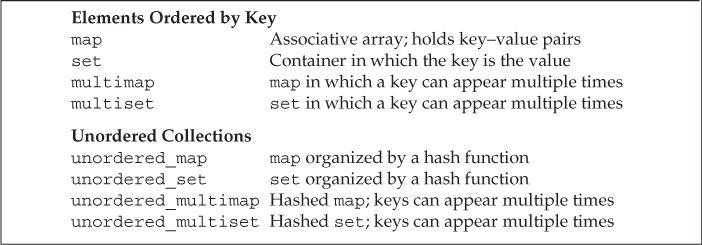
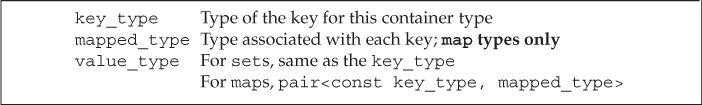
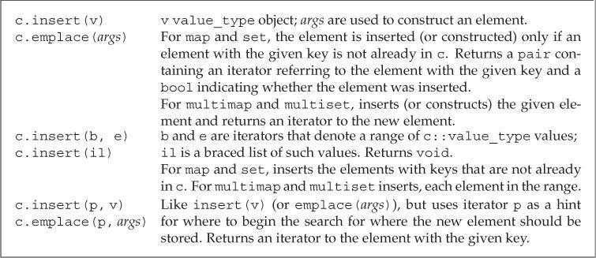
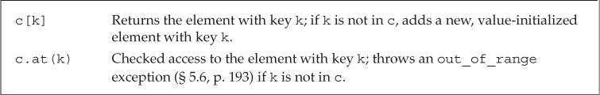
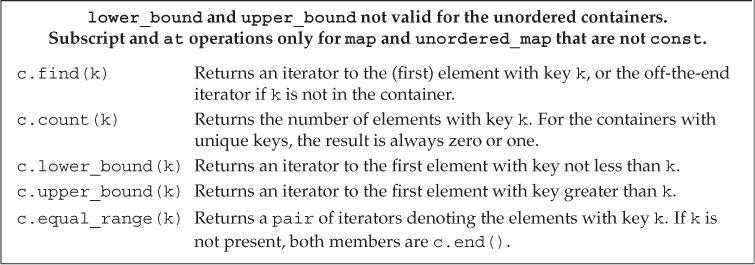
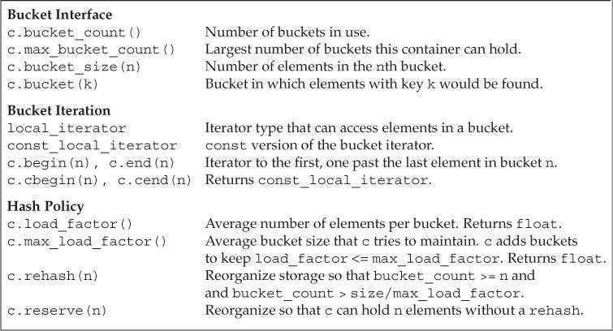

# 第11章 关联容器

关联容器支持高效的关键字查找和访问操作。2个主要的关联容器（associative-container）类型是`map`和`set`。

- `map`中的元素是一些键值对（key-value）：关键字起索引作用，值表示与索引相关联的数据。
- `set`中每个元素只包含一个关键字，支持高效的关键字查询操作：检查一个给定关键字是否在`set`中。

标准库提供了8个关联容器，它们之间的不同体现在三个方面：

- 是`map`还是`set`类型。
- 是否允许保存重复的关键字。
- 是否按顺序保存元素。

允许重复保存关键字的容器名字都包含单词`multi`；无序保存元素的容器名字都以单词`unordered`开头。



`map`和`multimap`类型定义在头文件*map*中；`set`和`multiset`类型定义在头文件*set*中；无序容器定义在头文件*unordered_map*和*unordered_set*中。

## 使用关联容器（Using an Associative Container）

`map`类型通常被称为关联数组（associative array）。

从`map`中提取一个元素时，会得到一个`pair`类型的对象。`pair`是一个模板类型，保存两个名为`first`和`second`的公有数据成员。`map`所使用的`pair`用`first`成员保存关键字，用`second`成员保存对应的值。

```c++
// count the number of times each word occurs in the input
map<string, size_t> word_count;     // empty map from string to size_t
string word;
while (cin >> word)
    ++word_count[word];     // fetch and increment the counter for word
for (const auto &w : word_count)    // for each element in the map
    // print the results
    cout << w.first << " occurs " << w.second
        << ((w.second > 1) ? " times" : " time") << endl;
```

`set`类型的`find`成员返回一个迭代器。如果给定关键字在`set`中，则迭代器指向该关键字，否则返回的是尾后迭代器。

## 关联容器概述（Overview of the Associative Containers）

### 定义关联容器（Defining an Associative Container）

定义`map`时，必须指定关键字类型和值类型；定义`set`时，只需指定关键字类型。

初始化`map`时，提供的每个键值对用花括号`{}`包围。

```C++
map<string, size_t> word_count;   // empty
// list initialization
set<string> exclude = { "the", "but", "and" };
// three elements; authors maps last name to first
map<string, string> authors =
{
    {"Joyce", "James"},
    {"Austen", "Jane"},
    {"Dickens", "Charles"}
};
```

`map`和`set`中的关键字必须唯一，`multimap`和`multiset`没有此限制。

### 关键字类型的要求（Requirements on Key Type）

对于有序容器——`map`、`multimap`、`set`和`multiset`，关键字类型必须定义元素比较的方法。默认情况下，标准库使用关键字类型的`<`运算符来进行比较操作。

用来组织容器元素的操作的类型也是该容器类型的一部分。如果需要使用自定义的比较操作，则必须在定义关联容器类型时提供此操作的类型。操作类型在尖括号中紧跟着元素类型给出。

```c++
bool compareIsbn(const Sales_data &lhs, const Sales_data &rhs)
{
    return lhs.isbn() < rhs.isbn();
}

// bookstore can have several transactions with the same ISBN
// elements in bookstore will be in ISBN order
multiset<Sales_data, decltype(compareIsbn)*> bookstore(compareIsbn);
```

### pair类型（The pair Type）

`pair`定义在头文件*utility*中。一个`pair`可以保存两个数据成员，分别命名为`first`和`second`。

```c++
pair<string, string> anon;        // holds two strings
pair<string, size_t> word_count;  // holds a string and an size_t
pair<string, vector<int>> line;   // holds string and vector<int>
```

`pair`的默认构造函数对数据成员进行值初始化。

`pair`支持的操作：


在C++11中，如果函数需要返回`pair`，可以对返回值进行列表初始化。早期C++版本中必须显式构造返回值。

```c++
pair<string, int> process(vector<string> &v)
{
    // process v
    if (!v.empty())
        // list initialize
        return { v.back(), v.back().size() };
    else
        // explicitly constructed return value
        return pair<string, int>();
}
```

## 关联容器操作（Operations on Associative Containers）

关联容器定义了类型别名来表示容器关键字和值的类型：



对于`set`类型，`key_type`和`value_type`是一样的。`set`中保存的值就是关键字。对于`map`类型，元素是关键字-值对。即每个元素是一个`pair`对象，包含一个关键字和一个关联的值。由于元素关键字不能改变，因此`pair`的关键字部分是`const`的。另外，只有`map`类型（`unordered_map`、`unordered_multimap`、`multimap`、`map`）才定义了`mapped_type`。

```c++
set<string>::value_type v1;        // v1 is a string
set<string>::key_type v2;          // v2 is a string
map<string, int>::value_type v3;   // v3 is a pair<const string, int>
map<string, int>::key_type v4;     // v4 is a string
map<string, int>::mapped_type v5;  // v5 is an int
```

### 关联容器迭代器（Associative Container Iterators）

解引用关联容器迭代器时，会得到一个类型为容器的`value_type`的引用。对`map`而言，`value_type`是`pair`类型，其`first`成员保存`const`的关键字，`second`成员保存值。

```c++
// get an iterator to an element in word_count
auto map_it = word_count.begin();
// *map_it is a reference to a pair<const string, size_t> object
cout << map_it->first;          // prints the key for this element
cout << " " << map_it->second;  // prints the value of the element
map_it->first = "new key";      // error: key is const
++map_it->second;               // ok: we can change the value through an iterator
```

虽然`set`同时定义了`iterator`和`const_iterator`类型，但两种迭代器都只允许只读访问`set`中的元素。类似`map`，`set`中的关键字也是`const`的。

```c++
set<int> iset = {0,1,2,3,4,5,6,7,8,9};
set<int>::iterator set_it = iset.begin();
if (set_it != iset.end())
{
    *set_it = 42;       // error: keys in a set are read-only
    cout << *set_it << endl;    // ok: can read the key
}
```

`map`和`set`都支持`begin`和`end`操作。使用迭代器遍历`map`、`multimap`、`set`或`multiset`时，迭代器按关键字升序遍历元素。

通常不对关联容器使用泛型算法。

### 添加元素（Adding Elements）

使用`insert`成员可以向关联容器中添加元素。向`map`和`set`中添加已存在的元素对容器没有影响。

通常情况下，对于想要添加到`map`中的数据，并没有现成的`pair`对象。可以直接在`insert`的参数列表中创建`pair`。

```c++
// four ways to add word to word_count
word_count.insert({word, 1});
word_count.insert(make_pair(word, 1));
word_count.insert(pair<string, size_t>(word, 1));
word_count.insert(map<string, size_t>::value_type(word, 1));
```

关联容器的`insert`操作：



`insert`或`emplace`的返回值依赖于容器类型和参数：

- 对于不包含重复关键字的容器，添加单一元素的`insert`和`emplace`版本返回一个`pair`，表示操作是否成功。`pair`的`first`成员是一个迭代器，指向具有给定关键字的元素；`second`成员是一个`bool`值。如果关键字已在容器中，则`insert`直接返回，`bool`值为`false`。如果关键字不存在，元素会被添加至容器中，`bool`值为`true`。
- 对于允许包含重复关键字的容器，添加单一元素的`insert`和`emplace`版本返回指向新元素的迭代器。

### 删除元素（Erasing Elements）

关联容器的删除操作：


与顺序容器不同，关联容器提供了一个额外的`erase`操作。它接受一个`key_type`参数，删除所有匹配给定关键字的元素（如果存在），返回实际删除的元素数量。对于不包含重复关键字的容器，`erase`的返回值总是1或0。若返回值为0，则表示想要删除的元素并不在容器中。

### map的下标操作（Subscripting a map）

`map`下标运算符接受一个关键字，获取与此关键字相关联的值。如果关键字不在容器中，下标运算符会向容器中添加该关键字，并值初始化关联值。

由于下标运算符可能向容器中添加元素，所以只能对非`const`的`map`使用下标操作。

`map`和`unordered_map`的下标操作：



对`map`进行下标操作时，返回的是`mapped_type`类型的对象；解引用`map`迭代器时，返回的是`value_type`类型的对象。

### 访问元素（Accessing Elements）

关联容器的查找操作：



如果`multimap`或`multiset`中有多个元素具有相同关键字，则这些元素在容器中会相邻存储。

```c++
multimap<string, string> authors;
// adds the first element with the key Barth, John
authors.insert({"Barth, John", "Sot-Weed Factor"});
// ok: adds the second element with the key Barth, John
authors.insert({"Barth, John", "Lost in the Funhouse"});

string search_item("Alain de Botton");      // author we'll look for
auto entries = authors.count(search_item);  // number of elements
auto iter = authors.find(search_item);      // first entry for this author
// loop through the number of entries there are for this author
while(entries)
{
    cout << iter->second << endl;   // print each title
    ++iter;      // advance to the next title
    --entries;   // keep track of how many we've printed
}
```

`lower_bound`和`upper_bound`操作都接受一个关键字，返回一个迭代器。如果关键字在容器中，`lower_bound`返回的迭代器会指向第一个匹配给定关键字的元素，而`upper_bound`返回的迭代器则指向最后一个匹配元素之后的位置。如果关键字不在`multimap`中，则`lower_bound`和`upper_bound`会返回相等的迭代器，指向一个不影响排序的关键字插入位置。因此用相同的关键字调用`lower_bound`和`upper_bound`会得到一个迭代器范围，表示所有具有该关键字的元素范围。

```c++
// definitions of authors and search_item as above
// beg and end denote the range of elements for this author
for (auto beg = authors.lower_bound(search_item),
        end = authors.upper_bound(search_item);
    beg != end; ++beg)
    cout << beg->second << endl;    // print each title
```

`lower_bound`和`upper_bound`有可能返回尾后迭代器。如果查找的元素具有容器中最大的关键字，则`upper_bound`返回尾后迭代器。如果关键字不存在，且大于容器中任何关键字，则`lower_bound`也返回尾后迭代器。

`equal_range`操作接受一个关键字，返回一个迭代器`pair`。若关键字存在，则第一个迭代器指向第一个匹配关键字的元素，第二个迭代器指向最后一个匹配元素之后的位置。若关键字不存在，则两个迭代器都指向一个不影响排序的关键字插入位置。

```c++
// definitions of authors and search_item as above
// pos holds iterators that denote the range of elements for this key
for (auto pos = authors.equal_range(search_item);
        pos.first != pos.second; ++pos.first)
    cout << pos.first->second << endl;  // print each title
```

## 无序容器（The Unordered Containers）

新标准库定义了4个无序关联容器（unordered associative container），这些容器使用哈希函数（hash function）和关键字类型的`==`运算符组织元素。

无序容器和对应的有序容器通常可以相互替换。但是由于元素未按顺序存储，使用无序容器的程序输出一般会与有序容器的版本不同。

无序容器在存储上组织为一组桶，每个桶保存零或多个元素。无序容器使用一个哈希函数将元素映射到桶。为了访问一个元素，容器首先计算元素的哈希值，它指出应该搜索哪个桶。容器将具有一个特定哈希值的所有元素都保存在相同的桶中。因此无序容器的性能依赖于哈希函数的质量和桶的数量及大小。

无序容器管理操作：



默认情况下，无序容器使用关键字类型的`==`运算符比较元素，还使用一个`hash<key_type>`类型的对象来生成每个元素的哈希值。标准库为内置类型和一些标准库类型提供了hash模板。因此可以直接定义关键字是这些类型的无序容器，而不能直接定义关键字类型为自定义类类型的无序容器，必须先提供对应的hash模板版本。