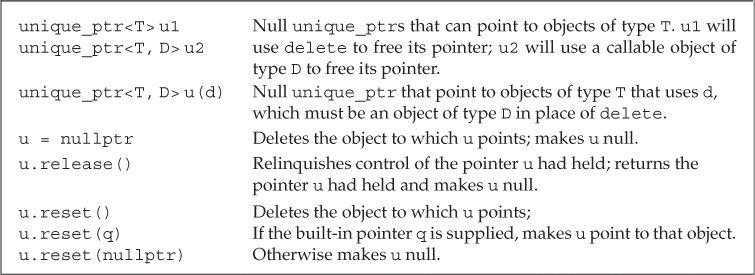
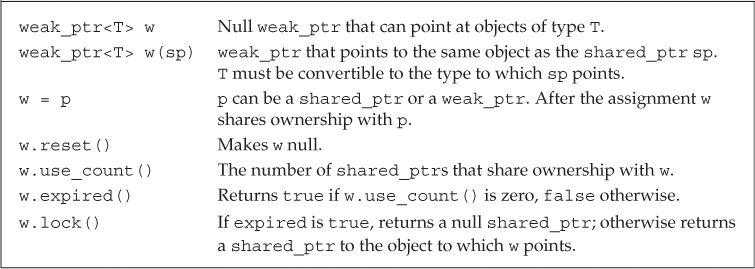

# 第12章 动态内存

程序用堆（heap）来存储动态分配（dynamically allocate）的对象。动态对象的生存期由程序控制。

## 动态内存与智能指针（Dynamic Memory and Smart Pointers）

C++中的动态内存管理通过一对运算符完成：`new`在动态内存中为对象分配空间并返回指向该对象的指针，可以选择对对象进行初始化；`delete`接受一个动态对象的指针，销毁该对象并释放与之关联的内存。

新标准库提供了两种智能指针（smart pointer）类型来管理动态对象。智能指针的行为类似常规指针，但它自动释放所指向的对象。这两种智能指针的区别在于管理底层指针的方式：`shared_ptr`允许多个指针指向同一个对象；`unique_ptr`独占所指向的对象。标准库还定义了一个名为`weak_ptr`的伴随类，它是一种弱引用，指向shared_ptr所管理的对象。这三种类型都定义在头文件*memory*中。

### shared_ptr类（The shared_ptr Class）

智能指针是模板，创建时需要指明指针可以指向的类型。默认初始化的智能指针中保存着一个空指针。

```c++
shared_ptr<string> p1;      // shared_ptr that can point at a string
shared_ptr<list<int>> p2;   // shared_ptr that can point at a list of ints
```

shared_ptr和unique_ptr都支持的操作：


shared_ptr独有的操作：


`make_shared`函数（定义在头文件*memory*中）在动态内存中分配一个对象并初始化它，返回指向此对象的shared_ptr。

```c++
// shared_ptr that points to an int with value 42
shared_ptr<int> p3 = make_shared<int>(42);
// p4 points to a string with value 9999999999
shared_ptr<string> p4 = make_shared<string>(10, '9');
// p5 points to an int that is value initialized
shared_ptr<int> p5 = make_shared<int>();
```

进行拷贝或赋值操作时，每个shared_ptr会记录有多少个其他shared_ptr与其指向相同的对象。

```c++
auto p = make_shared<int>(42);  // object to which p points has one user
auto q(p);  // p and q point to the same object
            // object to which p and q point has two users
```

每个shared_ptr都有一个与之关联的计数器，通常称为引用计数（reference count）。拷贝shared_ptr时引用计数会递增。例如使用一个shared_ptr初始化另一个shared_ptr，或将它作为参数传递给函数以及作为函数的返回值返回。给shared_ptr赋予新值或shared_ptr被销毁时引用计数会递减。例如一个局部shared_ptr离开其作用域。一旦一个shared_ptr的引用计数变为0，它就会自动释放其所管理的对象。

```c++
auto r = make_shared<int>(42);  // int to which r points has one user
r = q;  // assign to r, making it point to a different address
        // increase the use count for the object to which q points
        // reduce the use count of the object to which r had pointed
        // the object r had pointed to has no users; that object is automatically freed
```

shared_ptr的析构函数会递减它所指向对象的引用计数。如果引用计数变为0，shared_ptr的析构函数会销毁对象并释放空间。

如果将shared_ptr存放于容器中，而后不再需要全部元素，而只使用其中一部分，应该用erase删除不再需要的元素。

程序使用动态内存通常出于以下三种原因之一：

- 不确定需要使用多少对象。
- 不确定所需对象的准确类型。
- 需要在多个对象间共享数据。

### 直接管理内存（Managing Memory Directly）

相对于智能指针，使用new和delete管理内存很容易出错。

默认情况下，动态分配的对象是默认初始化的。所以内置类型或组合类型的对象的值将是未定义的，而类类型对象将用默认构造函数进行初始化。

```c++
string *ps = new string;    // initialized to empty string
int *pi = new int;     // pi points to an uninitialized int
```

可以使用值初始化方式、直接初始化方式、传统构造方式（圆括号`()`）或新标准下的列表初始化方式（花括号`{}`）初始化动态分配的对象。

```c++
int *pi = new int(1024);            // object to which pi points has value 1024
string *ps = new string(10, '9');   // *ps is "9999999999"
// vector with ten elements with values from 0 to 9
vector<int> *pv = new vector<int>{0,1,2,3,4,5,6,7,8,9};
string *ps1 = new string;     // default initialized to the empty string
string *ps = new string();    // value initialized to the empty string
int *pi1 = new int;      // default initialized; *pi1 is undefined
int *pi2 = new int();    // value initialized to 0; *pi2 is 0
```

只有当初始化的括号中仅有单一初始化器时才可以使用auto。

```c++
auto p1 = new auto(obj);    // p points to an object of the type of obj
                            // that object is initialized from obj
auto p2 = new auto{a,b,c};  // error: must use parentheses for the initializer
```

可以用new分配const对象，返回指向const类型的指针。动态分配的const对象必须初始化。

默认情况下，如果new不能分配所要求的内存空间，会抛出bad_alloc异常。使用定位new（placement new）可以阻止其抛出异常。定位new表达式允许程序向new传递额外参数。如果将`nothrow`传递给new，则new在分配失败后会返回空指针。bad_alloc和nothrow都定义在头文件*new*中。

```c++
// if allocation fails, new returns a null pointer
int *p1 = new int;            // if allocation fails, new throws std::bad_alloc
int *p2 = new (nothrow) int;  // if allocation fails, new returns a null pointer
```

使用delete释放一块并非new分配的内存，或者将相同的指针值释放多次的行为是未定义的。

由内置指针管理的动态对象在被显式释放前一直存在。

delete一个指针后，指针值就无效了（空悬指针，dangling pointer）。为了防止后续的错误访问，应该在delete之后将指针值置空。

### shared_ptr和new结合使用（Using shared_ptrs with new）

可以用new返回的指针初始化智能指针。该构造函数是explicit的，因此必须使用直接初始化形式。

```c++
shared_ptr<int> p1 = new int(1024);    // error: must use direct initialization
shared_ptr<int> p2(new int(1024));     // ok: uses direct initialization
```

默认情况下，用来初始化智能指针的内置指针必须指向动态内存，因为智能指针默认使用delete释放它所管理的对象。如果要将智能指针绑定到一个指向其他类型资源的指针上，就必须提供自定义操作来代替delete。


不要混合使用内置指针和智能指针。当将shared_ptr绑定到内置指针后，资源管理就应该交由shared_ptr负责。不应该再使用内置指针访问shared_ptr指向的内存。

```c++
// ptr is created and initialized when process is called
void process(shared_ptr<int> ptr)
{
    // use ptr
}   // ptr goes out of scope and is destroyed

int *x(new int(1024));   // dangerous: x is a plain pointer, not a smart pointer
process(x);     // error: cannot convert int* to shared_ptr<int>
process(shared_ptr<int>(x));    // legal, but the memory will be deleted!
int j = *x;     // undefined: x is a dangling pointer!

shared_ptr<int> p(new int(42));   // reference count is 1
process(p);     // copying p increments its count; in process the reference count is 2
int i = *p;     // ok: reference count is 1
```

智能指针的`get`函数返回一个内置指针，指向智能指针管理的对象。主要用于向不能使用智能指针的代码传递内置指针。使用get返回指针的代码不能delete此指针。

不要使用get初始化另一个智能指针或为智能指针赋值。

```c++
shared_ptr<int> p(new int(42));    // reference count is 1
int *q = p.get();   // ok: but don't use q in any way that might delete its pointer
{   // new block
    // undefined: two independent shared_ptrs point to the same memory
    shared_ptr<int>(q);
} // block ends, q is destroyed, and the memory to which q points is freed
int foo = *p;   // undefined; the memory to which p points was freed
```

可以用`reset`函数将新的指针赋予shared_ptr。与赋值类似，reset会更新引用计数，如果需要的话，还会释放内存空间。reset经常与`unique`一起使用，来控制多个shared_ptr共享的对象。

```c++
if (!p.unique())
    p.reset(new string(*p));   // we aren't alone; allocate a new copy
*p += newVal;   // now that we know we're the only pointer, okay to change this object
```

### 智能指针和异常（Smart Pointers and Exceptions）

如果使用智能指针，即使程序块过早结束，智能指针类也能确保在内存不再需要时将其释放。

```c++
void f()
{
    int *ip = new int(42);    // dynamically allocate a new object
    // code that throws an exception that is not caught inside f
    delete ip;     // free the memory before exiting
}

void f()
{
    shared_ptr<int> sp(new int(42));    // allocate a new object
    // code that throws an exception that is not caught inside f
} // shared_ptr freed automatically when the function ends
```

默认情况下shared_ptr假定其指向动态内存，使用delete释放对象。创建shared_ptr时可以传递一个（可选）指向删除函数的指针参数，用来代替delete。

```c++
struct destination;    // represents what we are connecting to
struct connection;     // information needed to use the connection
connection connect(destination*);   // open the connection
void disconnect(connection);    // close the given connection
void end_connection(connection *p)
{
    disconnect(*p);
}

void f(destination &d /* other parameters */)
{
    connection c = connect(&d);
    shared_ptr<connection> p(&c, end_connection);
    // use the connection
    // when f exits, even if by an exception, the connection will be properly closed
}
```

智能指针规范：

- 不使用相同的内置指针值初始化或reset多个智能指针。
- 不释放get返回的指针。
- 不使用get初始化或reset另一个智能指针。
- 使用get返回的指针时，如果最后一个对应的智能指针被销毁，指针就无效了。
- 使用shared_ptr管理并非new分配的资源时，应该传递删除函数。

### unique_ptr（unique_ptr）

与shared_ptr不同，同一时刻只能有一个unique_ptr指向给定的对象。当unique_ptr被销毁时，它指向的对象也会被销毁。

`make_unique`函数（C++14新增，定义在头文件*memory*中）在动态内存中分配一个对象并初始化它，返回指向此对象的unique_ptr。

```c++
unique_ptr<int> p1(new int(42));
// C++14
unique_ptr<int> p2 = make_unique<int>(42);
```

由于unique_ptr独占其指向的对象，因此unique_ptr不支持普通的拷贝或赋值操作。

unique_ptr操作：



`release`函数返回unique_ptr当前保存的指针并将其置为空。

`reset`函数成员接受一个可选的指针参数，重新设置unique_ptr保存的指针。如果unique_ptr不为空，则它原来指向的对象会被释放。

```c++
// transfers ownership from p1 (which points to the string Stegosaurus) to p2
unique_ptr<string> p2(p1.release());    // release makes p1 null
unique_ptr<string> p3(new string("Trex"));
// transfers ownership from p3 to p2
p2.reset(p3.release()); // reset deletes the memory to which p2 had pointed
```

调用release会切断unique_ptr和它原来管理的对象之间的联系。release返回的指针通常被用来初始化另一个智能指针或给智能指针赋值。如果没有用另一个智能指针保存release返回的指针，程序就要负责资源的释放。

```c++
p2.release();   // WRONG: p2 won't free the memory and we've lost the pointer
auto p = p2.release();   // ok, but we must remember to delete(p)
```

不能拷贝unique_ptr的规则有一个例外：可以拷贝或赋值一个即将被销毁的unique_ptr（移动构造、移动赋值）。

```c++
unique_ptr<int> clone(int p)
{
    unique_ptr<int> ret(new int (p));
    // . . .
    return ret;
}
```

老版本的标准库包含了一个名为`auto_ptr`的类，

类似shared_ptr，默认情况下unique_ptr用delete释放其指向的对象。unique_ptr的删除器同样可以重载，但unique_ptr管理删除器的方式与shared_ptr不同。定义unique_ptr时必须在尖括号中提供删除器类型。创建或reset这种unique_ptr类型的对象时，必须提供一个指定类型的可调用对象（删除器）。

```c++
// p points to an object of type objT and uses an object of type delT to free that object
// it will call an object named fcn of type delT
unique_ptr<objT, delT> p (new objT, fcn);

void f(destination &d /* other needed parameters */)
{
    connection c = connect(&d);  // open the connection
    // when p is destroyed, the connection will be closed
    unique_ptr<connection, decltype(end_connection)*> p(&c, end_connection);
    // use the connection
    // when f exits, even if by an exception, the connection will be properly closed
}
```

### weak_ptr（weak_ptr）

weak_ptr是一种不控制所指向对象生存期的智能指针，它指向一个由shared_ptr管理的对象。将weak_ptr绑定到shared_ptr不会改变shared_ptr的引用计数。如果shared_ptr被销毁，即使有weak_ptr指向对象，对象仍然有可能被释放。



创建一个weak_ptr时，需要使用shared_ptr来初始化它。

```c++
auto p = make_shared<int>(42);
weak_ptr<int> wp(p);    // wp weakly shares with p; use count in p is unchanged
```

使用weak_ptr访问对象时，必须先调用`lock`函数。该函数检查weak_ptr指向的对象是否仍然存在。如果存在，则返回指向共享对象的shared_ptr，否则返回空指针。

```c++
if (shared_ptr<int> np = wp.lock())
{ 
    // true if np is not null
    // inside the if, np shares its object with p
}
```

## 动态数组（Dynamic Arrays）

使用`allocator`类可以将内存分配和初始化过程分离，这通常会提供更好的性能和更灵活的内存管理能力。

### new和数组（new and Arrays）

使用new分配对象数组时需要在类型名之后跟一对方括号，在其中指明要分配的对象数量（必须是整型，但不必是常量）。new返回指向第一个对象的指针（元素类型）。

```c++
// call get_size to determine how many ints to allocate
int *pia = new int[get_size()];   // pia points to the first of these ints
```

由于new分配的内存并不是数组类型，因此不能对动态数组调用begin和end，也不能用范围for语句处理其中的元素。

默认情况下，new分配的对象是默认初始化的。可以对数组中的元素进行值初始化，方法是在大小后面跟一对空括号`()`。在新标准中，还可以提供一个元素初始化器的花括号列表。如果初始化器数量大于元素数量，则new表达式失败，不会分配任何内存，并抛出bad_array_new_length异常。

```c++
int *pia = new int[10];     // block of ten uninitialized ints
int *pia2 = new int[10]();    // block of ten ints value initialized to 0
string *psa = new string[10];    // block of ten empty strings
string *psa2 = new string[10]();    // block of ten empty strings
// block of ten ints each initialized from the corresponding initializer
int *pia3 = new int[10] { 0, 1, 2, 3, 4, 5, 6, 7, 8, 9 };
// block of ten strings; the first four are initialized from the given initializers
// remaining elements are value initialized
string *psa3 = new string[10] { "a", "an", "the", string(3,'x') };
```

虽然可以使用空括号对new分配的数组元素进行值初始化，但不能在括号中指定初始化器。这意味着不能用auto分配数组。

动态分配一个空数组是合法的，此时new会返回一个合法的非空指针。对于零长度的数组来说，该指针类似尾后指针，不能解引用。

使用`delete[]`释放动态数组。

```c++
delete p;       // p must point to a dynamically allocated object or be null
delete [] pa;   // pa must point to a dynamically allocated array or be null
```

如果在delete数组指针时忘记添加方括号，或者在delete单一对象时使用了方括号，编译器很可能不会给出任何警告，程序可能会在执行过程中行为异常。

unique_ptr可以直接管理动态数组，定义时需要在对象类型后添加一对空方括号`[]`。

```c++
// up points to an array of ten uninitialized ints
unique_ptr<int[]> up(new int[10]);
up.release();   // automatically uses delete[] to destroy its pointer
```

指向数组的unique_ptr：


与unique_ptr不同，shared_ptr不直接支持动态数组管理。如果想用shared_ptr管理动态数组，必须提供自定义的删除器。

```c++
// to use a shared_ptr we must supply a deleter
shared_ptr<int> sp(new int[10], [](int *p) { delete[] p; });
sp.reset();    // uses the lambda we supplied that uses delete[] to free the array
```

shared_ptr未定义下标运算符，智能指针类型也不支持指针算术运算。因此如果想访问shared_ptr管理的数组元素，必须先用get获取内置指针，再用内置指针进行访问。

```c++
// shared_ptrs don't have subscript operator and don't support pointer arithmetic
for (size_t i = 0; i != 10; ++i)
    *(sp.get() + i) = i;    // use get to get a built-in pointer
```

### allocator类（The allocator Class）

allocator类是一个模板，定义时必须指定其可以分配的对象类型。

```c++
allocator<string> alloc;    // object that can allocate strings
auto const p = alloc.allocate(n);   // allocate n unconstructed strings
```

标准库allocator类及其算法：


allocator分配的内存是未构造的，程序需要在此内存中构造对象。新标准库的`construct`函数接受一个指针和零或多个额外参数，在给定位置构造一个元素。额外参数用来初始化构造的对象，必须与对象类型相匹配。

```c++
auto q = p;     // q will point to one past the last constructed element
alloc.construct(q++);    // *q is the empty string
alloc.construct(q++, 10, 'c');  // *q is cccccccccc
alloc.construct(q++, "hi");     // *q is hi!
```

直接使用allocator返回的未构造内存是错误行为，其结果是未定义的。

对象使用完后，必须对每个构造的元素调用`destroy`进行销毁。destroy函数接受一个指针，对指向的对象执行析构函数。

```c++
while (q != p)
    alloc.destroy(--q);  // free the strings we actually allocated
```

`deallocate`函数用于释放allocator分配的内存空间。传递给deallocate的指针不能为空，它必须指向由allocator分配的内存。而且传递给deallocate的大小参数必须与调用allocator分配内存时提供的大小参数相一致。

```c++
alloc.deallocate(p, n);
```

allocator算法：


传递给`uninitialized_copy`的目的位置迭代器必须指向未构造的内存，它直接在给定位置构造元素。返回（递增后的）目的位置迭代器。