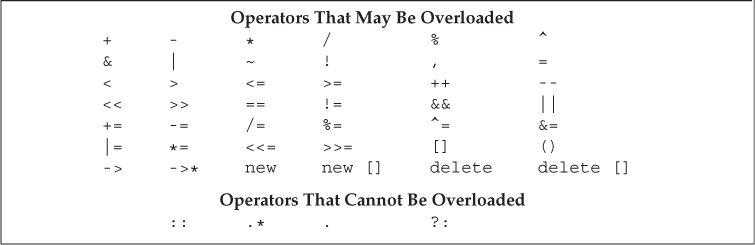
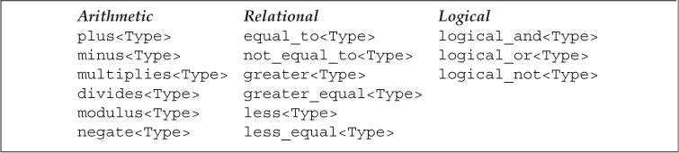

# 第14章 重载运算与类型转换

## 基本概念（Basic Concepts）

重载的运算符是具有特殊名字的函数，它们的名字由关键字`operator`和其后要定义的运算符号组成。

重载运算符函数的参数数量和该运算符作用的运算对象数量一样多。对于二元运算符来说，左侧运算对象传递给第一个参数，右侧运算对象传递给第二个参数。除了重载的函数调用运算符`operator()`之外，其他重载运算符不能含有默认实参。

如果一个运算符函数是类的成员函数，则它的第一个运算对象会绑定到隐式的this指针上。因此成员运算符函数的显式参数数量比运算对象的数量少一个。

当运算符作用于内置类型的运算对象时，无法改变该运算符的含义。

只能重载大多数已有的运算符，无权声明新的运算符号。



重载运算符的优先级和结合律与对应的内置运算符一致。

可以像调用普通函数一样直接调用运算符函数。

```c++
// equivalent calls to a nonmember operator function
data1 + data2;              // normal expression
operator+(data1, data2);    // equivalent function call
data1 += data2;             // expression-based ''call''
data1.operator+=(data2);    // equivalent call to a member operator function
```

通常情况下，不应该重载逗号`,`、取地址`&`、逻辑与`&&`和逻辑或`||`运算符。

建议只有当操作的含义对于用户来说清晰明了时才使用重载运算符，重载运算符的返回类型也应该与其内置版本的返回类型兼容。

如果类中含有算术运算符或位运算符，则最好也提供对应的复合赋值运算符。

把运算符定义为成员函数时，它的左侧运算对象必须是运算符所属类型的对象。

```C++
string s = "world";
string t = s + "!";     // ok: we can add a const char* to a string
string u = "hi" + s;    // would be an error if + were a member of string
```

如何选择将运算符定义为成员函数还是普通函数：

- 赋值`=`、下标`[]`、调用`()`和成员访问箭头`->`运算符必须是成员函数。
- 复合赋值运算符一般是成员函数，但并非必须。
- 改变对象状态或者与给定类型密切相关的运算符，如递增、递减、解引用运算符，通常是成员函数。
- 具有对称性的运算符可能转换任意一端的运算对象，如算术、相等性、关系和位运算符，通常是普通函数。

## 输入和输出运算符（Input and Output Operators）

### 重载输出运算符<<（Overloading the Output Operator <<）

通常情况下，输出运算符的第一个形参是ostream类型的普通引用，第二个形参是要打印类型的常量引用，返回值是它的ostream形参。

```c++
ostream &operator<<(ostream &os, const Sales_data &item)
{
    os << item.isbn() << " " << item.units_sold << " "
        << item.revenue << " " << item.avg_price();
    return os;
}
```

输出运算符应该尽量减少格式化操作。

输入输出运算符必须是非成员函数。而由于IO操作通常需要读写类的非公有数据，所以输入输出运算符一般被声明为友元。

### 重载输入运算符>>（Overloading the Input Operator >>）

通常情况下，输入运算符的第一个形参是要读取的流的普通引用，第二个形参是要读入的目的对象的普通引用，返回值是它的第一个形参。

```c++
istream &operator>>(istream &is, Sales_data &item)
{
    double price;   // no need to initialize; we'll read into price before we use it
    is >> item.bookNo >> item.units_sold >> price;
    if (is)    // check that the inputs succeeded
        item.revenue = item.units_sold * price;
    else
        item = Sales_data();    // input failed: give the object the default state
    return is;
}
```

输入运算符必须处理输入失败的情况，而输出运算符不需要。

以下情况可能导致读取操作失败：

- 读取了错误类型的数据。
- 读取操作到达文件末尾。
- 遇到输入流的其他错误。

当读取操作发生错误时，输入操作符应该负责从错误状态中恢复。

如果输入的数据不符合规定的格式，即使从技术上看IO操作是成功的，输入运算符也应该设置流的条件状态以标示出失败信息。通常情况下，输入运算符只设置failbit状态。eofbit、badbit等错误最好由IO标准库自己标示。

## 算术和关系运算符（Arithmetic and Relational Operators）

通常情况下，算术和关系运算符应该定义为非成员函数，以便两侧的运算对象进行转换。其次，由于这些运算符一般不会改变运算对象的状态，所以形参都是常量引用。

算术运算符通常会计算它的两个运算对象并得到一个新值，这个值通常存储在一个局部变量内，操作完成后返回该局部变量的副本作为结果（返回类型建议设置为原对象的const类型）。

```c++
// assumes that both objects refer to the same book
Sales_data operator+(const Sales_data &lhs, const Sales_data &rhs)
{
    Sales_data sum = lhs;   // copy data members from lhs into sum
    sum += rhs;     // add rhs into sum
    return sum;
}
```

如果类定义了算术运算符，则通常也会定义对应的复合赋值运算符，此时最有效的方式是使用复合赋值来实现算术运算符。

### 相等运算符（Equality Operators）

相等运算符设计准则：

- 如果类在逻辑上有相等性的含义，则应该定义`operator==`而非一个普通的命名函数。这样做便于使用标准库容器和算法，也更容易记忆。

- 通常情况下，operator==应该具有传递性。

- 如果类定义了operator==，则也应该定义`operator!=`。

- operator==和operator!=中的一个应该把具体工作委托给另一个。

  ```c++
  bool operator==(const Sales_data &lhs, const Sales_data &rhs)
  {
      return lhs.isbn() == rhs.isbn() &&
          lhs.units_sold == rhs.units_sold &&
          lhs.revenue == rhs.revenue;
  }
  
  bool operator!=(const Sales_data &lhs, const Sales_data &rhs)
  {
      return !(lhs == rhs);
  }
  ```

### 关系运算符（Relational Operators）

定义了相等运算符的类通常也会定义关系运算符。因为关联容器和一些算法要用到小于运算符，所以定义`operator<`会比较实用。

关系运算符设计准则：

- 定义顺序关系，令其与关联容器中对关键字的要求保持一致。
- 如果类定义了operator==，则关系运算符的定义应该与operator==保持一致。特别是，如果两个对象是不相等的，那么其中一个对象应该小于另一个对象。
- 只有存在唯一一种逻辑可靠的小于关系时，才应该考虑为类定义operator<。

## 赋值运算符（Assignment Operators）

赋值运算符必须定义为成员函数，复合赋值运算符通常也是如此。这两类运算符都应该返回其左侧运算对象的引用。

```c++
StrVec &StrVec::operator=(initializer_list<string> il)
{
    // alloc_n_copy allocates space and copies elements from the given range
    auto data = alloc_n_copy(il.begin(), il.end());
    free();     // destroy the elements in this object and free the space
    elements = data.first;      // update data members to point to the new
    space
    first_free = cap = data.second;
    return *this;
}

// member binary operator: left-hand operand is bound to the implicit this pointer
// assumes that both objects refer to the same book
Sales_data& Sales_data::operator+=(const Sales_data &rhs)
{
    units_sold += rhs.units_sold;
    revenue += rhs.revenue;
    return *this;
}
```

## 下标运算符（Subscript Operator）

下标运算符必须定义为成员函数。

类通常会定义两个版本的下标运算符：一个返回普通引用，另一个是类的常量成员并返回常量引用。

```c++
class StrVec
{
public:
    std::string& operator[](std::size_t n)
    { return elements[n]; }
    const std::string& operator[](std::size_t n) const
    { return elements[n]; }

private:
    std::string *elements;  // pointer to the first element in the array
}
```

## 递增和递减运算符（Increment and Decrement Operators）

定义递增和递减运算符的类应该同时定义前置和后置版本，这些运算符通常定义为成员函数。

为了与内置操作保持一致，前置递增或递减运算符应该返回运算后对象的引用。

```c++
// prefix: return a reference to the incremented/decremented object
StrBlobPtr& StrBlobPtr::operator++()
{
    ++curr;     // advance the current state
    return *this;
}
```

后置递增或递减运算符接受一个额外的（不被使用）int类型形参，该形参的唯一作用就是区分运算符的前置和后置版本。

```c++
class StrBlobPtr
{
public:
    // increment and decrement
    StrBlobPtr& operator++();    // prefix operators
    StrBlobPtr& operator--();
    StrBlobPtr operator++(int);  // postfix operators
    StrBlobPtr operator--(int);
};
```

为了与内置操作保持一致，后置递增或递减运算符应该返回运算前对象的原值（返回类型建议设置为原对象的const类型）。

```c++
StrBlobPtr StrBlobPtr::operator++(int)
{
    StrBlobPtr ret = *this;    // save the current value
    ++*this;      // advance one element; prefix ++ checks the increment
    return ret;   // return the saved state
}
```

如果想通过函数调用的方式使用后置递增或递减运算符，则必须为它的整型参数传递一个值。

```c++
StrBlobPtr p(a1);   // p points to the vector inside a1
p.operator++(0);    // call postfix operator++
p.operator++();     // call prefix operator++
```

## 成员访问运算符（Member Access Operators）

箭头运算符必须定义为成员函数，解引用运算符通常也是如此。

重载的箭头运算符必须返回类的指针或者自定义了箭头运算符的类的对象。

```c++
class StrBlobPtr
{
public:
    std::string& operator*() const
    {
        return (*p)[curr];   // (*p) is the vector to which this object points
    }
    std::string* operator->() const
    {   // delegate the real work to the dereference operator
        return & this->operator*();
    }
};
```

对于形如*point->mem*的表达式来说，*point*必须是指向类对象的指针或者是一个重载了`operator->`的类的对象。*point*类型不同，*point->mem*的含义也不同。

- 如果*point*是指针，则调用内置箭头运算符，表达式等价于*(\*point).mem*。
- 如果*point*是重载了operator->的类的对象，则使用*point.operator->()*的结果来获取*mem*，表达式等价于*(point.operator->())->mem*。其中，如果该结果是一个指针，则执行内置操作，否则重复调用当前操作。

## 函数调用运算符（Function-Call Operator）

函数调用运算符必须定义为成员函数。一个类可以定义多个不同版本的调用运算符，相互之间必须在参数数量或类型上有所区别。

```c++
class PrintString
{
public:
    PrintString(ostream &o = cout, char c = ' '):
        os(o), sep(c) { }
    void operator()(const string &s) const
    {
        os << s << sep;
    }
    
private:
    ostream &os;   // stream on which to write
    char sep;      // character to print after each output
};

PrintString printer;  // uses the defaults; prints to cout
printer(s);     // prints s followed by a space on cout
```

如果类定义了调用运算符，则该类的对象被称作函数对象（function object），函数对象常常作为泛型算法的实参。

```c++
for_each(vs.begin(), vs.end(), PrintString(cerr, '\n'));    
```

### lambda是函数对象（Lambdas Are Function Objects）

编写一个lambda后，编译器会将该表达式转换成一个未命名类的未命名对象，类中含有一个重载的函数调用运算符。

```c++
// sort words by size, but maintain alphabetical order for words of the same size
stable_sort(words.begin(), words.end(),
    [](const string &a, const string &b) { return a.size() < b.size(); });

// acts like an unnamed object of a class that would look something like
class ShorterString
{
public:
    bool operator()(const string &s1, const string &s2) const
    {
        return s1.size() < s2.size();
    }
};
```

lambda默认不能改变它捕获的变量。因此在默认情况下，由lambda产生的类中的函数调用运算符是一个const成员函数。如果lambda被声明为可变的，则调用运算符就不再是const函数了。

lambda通过引用捕获变量时，由程序负责确保lambda执行时该引用所绑定的对象确实存在。因此编译器可以直接使用该引用而无须在lambda产生的类中将其存储为数据成员。相反，通过值捕获的变量被拷贝到lambda中，此时lambda产生的类必须为每个值捕获的变量建立对应的数据成员，并创建构造函数，用捕获变量的值来初始化数据成员。

```c++
// get an iterator to the first element whose size() is >= sz
auto wc = find_if(words.begin(), words.end(),
            [sz](const string &a) { return a.size() >= sz; });

// would generate a class that looks something like
class SizeComp
{
public:
    SizeComp(size_t n): sz(n) { }   // parameter for each captured variable
    // call operator with the same return type, parameters, and body as the lambda
    bool operator()(const string &s) const
    { 
        return s.size() >= sz; 
    }
    
private:
    size_t sz;   // a data member for each variable captured by value
};
```

lambda产生的类不包含默认构造函数、赋值运算符和默认析构函数，它是否包含默认拷贝/移动构造函数则通常要视捕获的变量类型而定。

### 标准库定义的函数对象（Library-Defined Function Objects）

标准库在头文件*functional*中定义了一组表示算术运算符、关系运算符和逻辑运算符的类，每个类分别定义了一个执行命名操作的调用运算符。这些类都被定义为模板的形式，可以为其指定具体的应用类型（即调用运算符的形参类型）。



关系运算符的函数对象类通常被用来替换算法中的默认运算符，这些类对于指针同样适用。

```c++
vector<string *> nameTable;    // vector of pointers
// error: the pointers in nameTable are unrelated, so < is undefined
sort(nameTable.begin(), nameTable.end(),
        [](string *a, string *b) { return a < b; });
// ok: library guarantees that less on pointer types is well defined
sort(nameTable.begin(), nameTable.end(), less<string*>());
```

### 可调用对象与function（Callable Objects and function）

调用形式指明了调用返回的类型以及传递给调用的实参类型。不同的可调用对象可能具有相同的调用形式。

标准库`function`类型是一个模板，定义在头文件*functional*中，用来表示对象的调用形式。


创建一个具体的function类型时必须提供其所表示的对象的调用形式。

```c++
// ordinary function
int add(int i, int j) { return i + j; }
// function-object class
struct div
{
    int operator()(int denominator, int divisor)
    {
        return denominator / divisor;
    }
};

function<int(int, int)> f1 = add;      // function pointer
function<int(int, int)> f2 = div();    // object of a function-object class
function<int(int, int)> f3 = [](int i, int j) { return i * j; };  // lambda
                                   
cout << f1(4,2) << endl;   // prints 6
cout << f2(4,2) << endl;   // prints 2
cout << f3(4,2) << endl;   // prints 8
```

不能直接将重载函数的名字存入function类型的对象中，这样做会产生二义性错误。消除二义性的方法是使用lambda或者存储函数指针而非函数名字。

C++11新标准库中的function类与旧版本中的`unary_function`和`binary_function`没有关系，后两个类已经被bind函数代替。

## 重载、类型转换与运算符（Overloading，Conversions，and Operators）

转换构造函数和类型转换运算符共同定义了类类型转换（class-type conversion）。

### 类型转换运算符（Conversion Operators）

类型转换运算符是类的一种特殊成员函数，负责将一个类类型的值转换成其他类型。它不能声明返回类型，形参列表也必须为空，一般形式如下：

```c++
operator type() const;
```

类型转换运算符可以面向除了void以外的任意类型（该类型要能作为函数的返回类型）进行定义。

```c++
class SmallInt
{
public:
    SmallInt(int i = 0): val(i)
    {
        if (i < 0 || i > 255)
            throw std::out_of_range("Bad SmallInt value");
    }   
    operator int() const { return val; }
    
private:
    std::size_t val;
};
```

隐式的用户定义类型转换可以置于一个标准（内置）类型转换之前或之后，并与其一起使用。

```c++
// the double argument is converted to int using the built-in conversion
SmallInt si = 3.14;     // calls the SmallInt(int) constructor
// the SmallInt conversion operator converts si to int;
si + 3.14;     // that int is converted to double using the built-in conversion
```

应该避免过度使用类型转换函数。如果在类类型和转换类型之间不存在明显的映射关系，则这样的类型转换可能具有误导性。

C++11引入了显示的类型转换运算符（explicit conversion operator）。和显式构造函数一样，编译器通常不会将显式类型转换运算符用于隐式类型转换。

```c++
class SmallInt
{
public:
    // the compiler won't automatically apply this conversion
    explicit operator int() const { return val; }
    // other members as before
};

SmallInt si = 3;    // ok: the SmallInt constructor is not explicit
si + 3;     // error: implicit is conversion required, but operator int is explicit
static_cast<int>(si) + 3;    // ok: explicitly request the conversion
```

如果表达式被用作条件，则编译器会隐式地执行显式类型转换。

- if、while、do语句的条件部分。
- for语句头的条件表达式。
- 条件运算符`? :`的条件表达式。
- 逻辑非运算符`!`、逻辑或运算符`||`、逻辑与运算符`&&`的运算对象。

类类型向bool的类型转换通常用在条件部分，因此`operator bool`一般被定义为显式的。

### 避免有二义性的类型转换（Avoiding Ambiguous Conversions）

在两种情况下可能产生多重转换路径：

- A类定义了一个接受B类对象的转换构造函数，同时B类定义了一个转换目标是A类的类型转换运算符。

  ```c++
  // usually a bad idea to have mutual conversions between two class types
  struct B;
  struct A
  {
      A() = default;
      A(const B&); // converts a B to an A
      // other members
  };
  
  struct B
  {
      operator A() const; // also converts a B to an A
      // other members
  };
  
  A f(const A&);
  B b;
  A a = f(b);    // error ambiguous: f(B::operator A())
                 // or f(A::A(const B&))
  ```

- 类定义了多个类型转换规则，而这些转换涉及的类型本身可以通过其他类型转换联系在一起。

  ```c++
  struct A
  {
      A(int = 0);     // usually a bad idea to have two
      A(double);      // conversions from arithmetic types
      operator int() const;       // usually a bad idea to have two
      operator double() const;    // conversions to arithmetic types
      // other members
  };
  
  void f2(long double);
  A a;
  f2(a);    // error ambiguous: f(A::operator int())
            // or f(A::operator double())
  long lg;
  A a2(lg);   // error ambiguous: A::A(int) or A::A(double)
  ```

可以通过显式调用类型转换运算符或转换构造函数解决二义性问题，但不能使用强制类型转换，因为强制类型转换本身也存在二义性。

```c++
A a1 = f(b.operator A());    // ok: use B's conversion operator
A a2 = f(A(b));     // ok: use A's constructor
```

通常情况下，不要为类定义相同的类型转换，也不要在类中定义两个及两个以上转换源或转换目标都是算术类型的转换。

使用两个用户定义的类型转换时，如果转换前后存在标准类型转换，则由标准类型转换决定最佳匹配。

如果在调用重载函数时需要使用构造函数或者强制类型转换来改变实参的类型，通常意味着程序设计存在不足。

调用重载函数时，如果需要额外的标准类型转换，则该转换只有在所有可行函数都请求同一个用户定义类型转换时才有用。如果所需的用户定义类型转换不止一个，即使其中一个调用能精确匹配而另一个调用需要额外的标准类型转换，也会产生二义性错误。

```c++
struct C
{
    C(int);
    // other members
};

struct E
{
    E(double);
    // other members
};

void manip2(const C&);
void manip2(const E&);
// error ambiguous: two different user-defined conversions could be used
manip2(10);    // manip2(C(10) or manip2(E(double(10)))
```

### 函数匹配与重载运算符（Function Matching and Overloaded Operators）

表达式中运算符的候选函数集既包括成员函数，也包括非成员函数。

```c++
class SmallInt
{
    friend SmallInt operator+(const SmallInt&, const SmallInt&);
    
public:
    SmallInt(int = 0);    // conversion from int
    operator int() const { return val; }    // conversion to int
    
private:
    std::size_t val;
};

SmallInt s1, s2;
SmallInt s3 = s1 + s2;    // uses overloaded operator+
int i = s3 + 0;    // error: ambiguous
```

如果类既定义了转换目标是算术类型的类型转换，也定义了重载的运算符，则会遇到重载运算符与内置运算符的二义性问题。