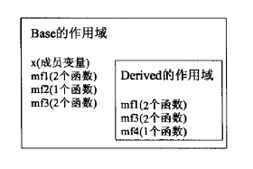

# 第15章 面向对象程序设计

## OOP：概述（OOP：An Overview）

面向对象程序设计（object-oriented programming）的核心思想是数据抽象（封装）、继承和动态绑定（多态）。

通过继承（inheritance）联系在一起的类构成一种层次关系。通常在层次关系的根部有一个基类（base class），其他类则直接或间接地从基类继承而来，这些继承得到的类叫做派生类（derived class）。基类负责定义在层次关系中所有类共同拥有的成员，而每个派生类定义各自特有的成员。

对于某些函数，基类希望它的派生类各自定义适合自身的版本，此时基类应该将这些函数声明为虚函数（virtual function）。方法是在函数名称前添加`virtual`关键字。

```C++
class Quote
{
public:
    std::string isbn() const;
    virtual double net_price(std::size_t n) const;
};
```

派生类必须通过类派生列表（class derivation list）明确指出它是从哪个或哪些基类继承而来的。类派生列表的形式首先是一个冒号，后面紧跟以逗号分隔的基类列表，其中每个基类前面可以添加访问说明符。

```c++
class Bulk_quote : public Quote
{ // Bulk_quote inherits from Quote
public:
    double net_price(std::size_t) const override;
};
```

派生类必须在其内部对所有重新定义的虚函数进行声明。

使用基类的引用或指针调用一个虚函数时将发生动态绑定（dynamic binding），也叫运行时绑定（run-time binding）。函数的运行版本将由实参决定。

## 定义基类和派生类（Defining Base and Derived Classes）

### 定义基类（Defining a Base Class）

基类通常都应该定义一个虚析构函数，即使该函数不执行任何实际操作也是如此。

除构造函数之外的任何非静态函数都能定义为虚函数。`virtual`关键字只能出现在类内部的声明语句之前而不能用于类外部的函数定义。如果基类把一个函数声明为虚函数，则该函数在派生类中隐式地也是虚函数。

成员函数如果没有被声明为虚函数，则其解析过程发生在编译阶段而非运行阶段。

派生类能访问基类的公有成员，不能访问私有成员。如果基类希望定义外部代码无法访问，但是派生类对象可以访问的成员，可以使用受保护的（protected）访问运算符进行说明。

### 定义派生类（Defining a Derived Class）

类派生列表中的访问说明符用于控制派生类从基类继承而来的成员是否对派生类的用户可见。

如果派生类没有覆盖其基类的某个虚函数，则该虚函数的行为类似于其他的普通函数，派生类会直接继承其在基类中的版本。

C++标准并没有明确规定派生类的对象在内存中如何分布，一个对象中继承自基类的部分和派生类自定义的部分不一定是连续存储的。

因为在派生类对象中含有与其基类对应的组成部分，所以能把派生类的对象当作基类对象来使用，也能将基类的指针或引用绑定到派生类对象中的基类部分上。这种转换通常称为派生类到基类的（derived-to-base）类型转换，编译器会隐式执行。

```c++
Quote item;         // object of base type
Bulk_quote bulk;    // object of derived type
Quote *p = &item;   // p points to a Quote object
p = &bulk;          // p points to the Quote part of bulk
Quote &r = bulk;    // r bound to the Quote part of bulk
```

每个类控制它自己的成员初始化过程，派生类必须使用基类的构造函数来初始化它的基类部分。派生类的构造函数通过构造函数初始化列表来将实参传递给基类构造函数。

```c++
Bulk_quote(const std::string& book, double p, 
            std::size_t qty, double disc) :
    Quote(book, p), min_qty(qty), discount(disc) { }
```

除非特别指出，否则派生类对象的基类部分会像数据成员一样执行默认初始化。

派生类初始化时首先初始化基类部分，然后按照声明的顺序依次初始化派生类成员。

派生类可以访问基类的公有成员和受保护成员。

如果基类定义了一个静态成员，则在整个继承体系中只存在该成员的唯一定义。如果某静态成员是可访问的，则既能通过基类也能通过派生类使用它。

已经完整定义的类才能被用作基类。

```c++
class Base { /* ... */ } ;
class D1: public Base { /* ... */ };
class D2: public D1 { /* ... */ };
```

*Base*是*D1*的直接基类（direct base），是*D2*的间接基类（indirect base）。最终的派生类将包含它直接基类的子对象以及每个间接基类的子对象。

C++11中，在类名后面添加`final`关键字可以禁止其他类继承它。

```c++
class NoDerived final { /* */ };    // NoDerived can't be a base class
class Base { /* */ };
// Last is final; we cannot inherit from Last
class Last final : Base { /* */ };  // Last can't be a base class
class Bad : NoDerived { /* */ };    // error: NoDerived is final
class Bad2 : Last { /* */ };        // error: Last is final
```

### 类型转换与继承（Conversions and Inheritance）

和内置指针一样，智能指针类也支持派生类到基类的类型转换，所以可以将一个派生类对象的指针存储在一个基类的智能指针内。

表达式的静态类型（static type）在编译时总是已知的，它是变量声明时的类型或表达式生成的类型；动态类型（dynamic type）则是变量或表达式表示的内存中对象的类型，只有运行时才可知。

如果表达式既不是引用也不是指针，则它的动态类型永远与静态类型一致。

不存在从基类到派生类的隐式类型转换，即使一个基类指针或引用绑定在一个派生类对象上也不行，因为编译器只能通过检查指针或引用的静态类型来判断转换是否合法。

```c++
Quote base;
Bulk_quote* bulkP = &base;   // error: can't convert base to derived
Bulk_quote& bulkRef = base;  // error: can't convert base to derived
```

如果在基类中含有一个或多个虚函数，可以使用`dynamic_cast`运算符，用于将基类的指针或引用安全地转换成派生类的指针或引用，该转换的安全检查将在运行期间执行。

如果已知某个基类到派生类的转换是安全的，可以使用`static_cast`强制覆盖掉编译器的检查工作。

派生类到基类的自动类型转换只对指针或引用有效，在派生类类型和基类类型之间不存在这种转换。

派生类到基类的转换允许我们给基类的拷贝/移动操作传递一个派生类的对象，这些操作是基类定义的，只会处理基类自己的成员，派生类的部分被切掉（sliced down）了。

```c++
Bulk_quote bulk;    // object of derived type
Quote item(bulk);   // uses the Quote::Quote(const Quote&) constructor
item = bulk;        // calls Quote::operator=(const Quote&)
```

用一个派生类对象为一个基类对象初始化或赋值时，只有该对象中的基类部分会被拷贝、移动或赋值，它的派生类部分会被忽略掉。

## 虚函数（Virtual Functions）

当且仅当通过指针或引用调用虚函数时，才会在运行过程解析该调用，也只有在这种情况下对象的动态类型有可能与静态类型不同。

在派生类中覆盖某个虚函数时，可以再次使用`virtual`关键字说明函数性质，但这并非强制要求。因为一旦某个函数被声明为虚函数，则在所有派生类中它都是虚函数。

在派生类中覆盖某个虚函数时，该函数在基类中的形参必须与派生类中的形参严格匹配。

派生类可以定义一个与基类中的虚函数名字相同但形参列表不同的函数，但编译器会认为该函数与基类中原有的函数是相互独立的，此时派生类的函数并没有覆盖掉基类中的版本。

C++11允许派生类使用`override`关键字显式地注明虚函数。如果`override`标记了某个函数，但该函数并没有覆盖已存在的虚函数，编译器将报告错误。`override`位于函数参数列表之后。

```c++
struct B
{
    virtual void f1(int) const;
    virtual void f2();
    void f3();
};

struct D1 : B 
{
    void f1(int) const override;    // ok: f1 matches f1 in the base
    void f2(int) override;      // error: B has no f2(int) function
    void f3() override;     // error: f3 not virtual
    void f4() override;     // error: B doesn't have a function named f4
}
```

与禁止类继承类似，函数也可以通过添加`final`关键字来禁止覆盖操作。

```c++
struct D2 : B
{
    // inherits f2() and f3() from B and overrides f1(int)
    void f1(int) const final;   // subsequent classes can't override f1(int)
};
```

`final`和`override`关键字出现在形参列表（包括任何`const`或引用修饰符）以及尾置返回类型之后。

虚函数也可以有默认实参，每次函数调用的默认实参值由本次调用的静态类型决定。如果通过基类的指针或引用调用函数，则使用基类中定义的默认实参，即使实际运行的是派生类中的函数版本也是如此。

如果虚函数使用默认实参，则基类和派生类中定义的默认实参值最好一致。

使用作用域运算符`::`可以强制执行虚函数的某个版本，不进行动态绑定。

```c++
// calls the version from the base class regardless of the dynamic type of baseP
double undiscounted = baseP->Quote::net_price(42);
```

通常情况下，只有成员函数或友元中的代码才需要使用作用域运算符来回避虚函数的动态绑定机制。

如果一个派生类虚函数需要调用它的基类版本，但没有使用作用域运算符，则在运行时该调用会被解析为对派生类版本自身的调用，从而导致无限递归。

## 抽象基类（Abstract Base Classes）

在类内部虚函数声明语句的分号前添加`=0`可以将一个虚函数声明为纯虚（pure virtual）函数。一个纯虚函数无须定义。

```c++
double net_price(std::size_t) const = 0;
```

可以为纯虚函数提供定义，但函数体必须定义在类的外部。

含有（或未经覆盖直接继承）纯虚函数的类是抽象基类。抽象基类负责定义接口，而后续的其他类可以覆盖该接口。

不能创建抽象基类的对象。

派生类构造函数只初始化它的直接基类。

重构（refactoring）负责重新设计类的体系以便将操作或数据从一个类移动到另一个类中。

## 访问控制与继承（Access Control and Inheritance）

一个类可以使用`protected`关键字来声明外部代码无法访问，但是派生类对象可以访问的成员。

派生类的成员或友元只能通过派生类对象来访问基类的`protected`成员。派生类对于一个基类对象中的`protected`成员没有任何访问权限。

```c++
class Base
{
protected:
    int prot_mem;   // protected member
};

class Sneaky : public Base
{
    friend void clobber(Sneaky&);   // can access Sneaky::prot_mem
    friend void clobber(Base&);     // can't access Base::prot_mem
    int j;   // j is private by default
};

// ok: clobber can access the private and protected members in Sneaky objects
void clobber(Sneaky &s) { s.j = s.prot_mem = 0; }
// error: clobber can't access the protected members in Base
void clobber(Base &b) { b.prot_mem = 0; }
```

基类中成员的访问说明符和派生列表中的访问说明符都会影响某个类对其继承成员的访问权限。

派生访问说明符对于派生类的成员及友元能否访问其直接基类的成员没有影响，对基类成员的访问权限只与基类中的访问说明符有关。

派生访问说明符的作用是控制派生类（包括派生类的派生类）用户对于基类成员的访问权限。

- 如果使用公有继承，则基类的公有成员和受保护成员在派生类中属性不发生改变。
- 如果使用受保护继承，则基类的公有成员和受保护成员在派生类中变为受保护成员。
- 如果使用私有继承，则基类的公有成员和受保护成员在派生类中变为私有成员。

派生类到基类转换的可访问性（假定*D*继承自*B*）：

- 只有当*D*公有地继承*B*时，用户代码才能使用派生类到基类的转换。
- 不论*D*以什么方式继承*B*，*D*的成员函数和友元都能使用派生类到基类的转换。
- 如果*D*继承*B*的方式是公有的或者受保护的，则*D*的派生类的成员函数和友元可以使用*D*到*B*的类型转换；反之，如果*D*继承*B*的方式是私有的，则不能使用。

对于代码中的某个给定节点来说，如果基类的公有成员是可访问的，则派生类到基类的类型转换也是可访问的。

友元对基类的访问权限由基类自身控制，即使对于派生类中的基类部分也是如此。

```c++
class Base
{
    // added friend declaration; other members as before
    friend class Pal;   // Pal has no access to classes derived from Base
};

class Pal
{
public:
    int f(Base b) { return b.prot_mem; }     // ok: Pal is a friend of Base
    int f2(Sneaky s) { return s.j; }         // error: Pal not friend of Sneaky
    // access to a base class is controlled by the base class, even inside a derived object
    int f3(Sneaky s) { return s.prot_mem; }  // ok: Pal is a friend
};
```

友元关系不能继承，每个类负责控制各自成员的访问权限。

使用`using`声明可以改变派生类继承的某个名字的访问级别。新的访问级别由该`using`声明之前的访问说明符决定。

```c++
class Base
{
public:
    std::size_t size() const { return n; }
protected:
    std::size_t n;
};

class Derived : private Base
{ // note: private inheritance
public:
    // maintain access levels for members related to the size of the object
    using Base::size;
protected:
    using Base::n;
};
```

派生类只能为那些它可以访问的名字提供`using`声明。

默认情况下，使用`class`关键字定义的派生类是私有继承的，而使用`struct`关键字定义的派生类是公有继承的。

建议显式地声明派生类的继承方式，不要仅仅依赖于默认设置。

## 继承中的类作用域（Class Scope under Inheritance）

当存在继承关系时，派生类的作用域嵌套在其基类的作用域之内。

一个对象、引用或指针的静态类型决定了该对象的哪些成员是可见的。

派生类定义的成员会隐藏同名的基类成员。

```c++
struct Base
{
protected:
    int mem;
};

struct Derived : Base
{
    int get_mem() { return mem; }   // returns Derived::mem  
protected:
    int mem;    // hides mem in the base
};
```

可以通过作用域运算符`::`来使用被隐藏的基类成员。

```c++
struct Derived : Base
{
    int get_base_mem() { return Base::mem; }
    // ...
};
```

除了覆盖继承而来的虚函数之外，派生类最好不要重用其他定义在基类中的名字。

和其他函数一样，成员函数无论是否是虚函数都能被重载。

派生类可以覆盖重载函数的0个或多个实例。如果派生类希望所有的重载版本对它来说都是可见的，那么它就需要覆盖所有版本，或者一个也不覆盖。

有时一个类仅需覆盖重载集合中的一些而非全部函数，此时如果我们不得不覆盖基类中的每一个版本的话，操作会极其繁琐。为了简化操作，可以为重载成员提供`using`声明。`using`声明指定了一个函数名字但不指定形参列表，所以一条基类成员函数的`using`声明语句就可以把该函数的所有重载实例添加到派生类作用域中。

```c++
class Base
{
private:
    int x;
    
public:
    virtual void mf1() = 0;
    virtual void mf1(int);
    virtual void mf2();
    void fm3();
    void fm3(double);
};

class Derived : public Base
{
public:
    // 让Base内名为mf1和mf3的所有定义
    // 在Derived作用域内可见
    using Base::mf1;
    using Base::mf3;
    virtual void mf1();
    void fm3();
    void fm4();
};
```



类内使用`using`声明改变访问级别的规则同样适用于重载函数的名字。

## 构造函数与拷贝控制（Constructors and Copy Control）

### 虚析构函数（Virtual Destructors）

一般来说，如果一个类需要析构函数，那么它也需要拷贝和赋值操作。但基类的析构函数不遵循该规则。

基类通常应该定义一个虚析构函数。

```c++
class Quote
{
public:
    // virtual destructor needed if a base pointer pointing to a derived object is deleted
    virtual ~Quote() = default;   // dynamic binding for the destructor
};
```

如果基类的析构函数不是虚函数，则`delete`一个指向派生类对象的基类指针会产生未定义的结果。

```c++
Quote *itemP = new Quote;   // same static and dynamic type
delete itemP;     // destructor for Quote called
itemP = new Bulk_quote;     // static and dynamic types differ
delete itemP;     // destructor for Bulk_quote called
```

虚析构函数会阻止编译器为类合成移动操作。

### 合成拷贝控制与继承（Synthesized Copy Control and Inheritance）

对于派生类的析构函数来说，它除了销毁派生类自己的成员外，还负责销毁派生类直接基类的成员。

派生类中删除的拷贝控制与基类的关系：

- 如果基类中的默认构造函数、拷贝构造函数、拷贝赋值运算符或析构函数是被删除的或者不可访问的函数，则派生类中对应的成员也会是被删除的。因为编译器不能使用基类成员来执行派生类对象中基类部分的构造、赋值或销毁操作。
- 如果基类的析构函数是被删除的或者不可访问的，则派生类中合成的默认和拷贝构造函数也会是被删除的。因为编译器无法销毁派生类对象中的基类部分。
- 编译器不会合成一个被删除的移动操作。当我们使用`=default`请求一个移动操作时，如果基类中对应的操作是被删除的或者不可访问的，则派生类中的操作也会是被删除的。因为派生类对象中的基类部分不能移动。同样，如果基类的析构函数是被删除的或者不可访问的，则派生类的移动构造函数也会是被删除的。

在实际编程中，如果基类没有默认、拷贝或移动构造函数，则一般情况下派生类也不会定义相应的操作。

因为基类缺少移动操作会阻止编译器为派生类合成自己的移动操作，所以当我们确实需要执行移动操作时，应该首先在基类中进行定义。

### 派生类的拷贝控制成员（Derived-Class Copy-Control Members）

当派生类定义了拷贝或移动操作时，该操作负责拷贝或移动包括基类成员在内的整个对象。

当为派生类定义拷贝或移动构造函数时，通常使用对应的基类构造函数初始化对象的基类部分。

```c++
class Base { /* ... */ } ;
class D: public Base
{
public:
    // by default, the base class default constructor initializes the base part of an object
    // to use the copy or move constructor, we must explicitly call that
    // constructor in the constructor initializer list
    D(const D& d): Base(d)   // copy the base members
    /* initializers for members of D */ { /* ... */ }
    D(D&& d): Base(std::move(d))    // move the base members
    /* initializers for members of D */ { /* ... */ }
};

// probably incorrect definition of the D copy constructor
// base-class part is default initialized, not copied
D(const D& d)   /* member initializers, but no base-class initializer */
{ /* ... */ }
```

在默认情况下，基类默认构造函数初始化派生类对象的基类部分。如果想拷贝或移动基类部分，则必须在派生类的构造函数初始化列表中显式地使用基类的拷贝或移动构造函数。

派生类的赋值运算符必须显式地为其基类部分赋值。

```c++
// Base::operator=(const Base&) is not invoked automatically
D &D::operator=(const D &rhs)
{
    Base::operator=(rhs);   // assigns the base part
    // assign the members in the derived class, as usual,
    // handling self-assignment and freeing existing resources as appropriate
    return *this;
}
```

派生类的析构函数只负责销毁派生类自己分配的资源。

```c++
class D: public Base
{
public:
    // Base::~Base invoked automatically
    ~D() { /* do what it takes to clean up derived members */ }
};
```

如果构造函数或析构函数调用了某个虚函数，则应该执行与构造函数或析构函数所属类型相对应的虚函数版本。

### 继承的构造函数（Inherited Constructors）

C++11新标准允许派生类重用（非常规方式继承）其直接基类定义的构造函数。继承方式是提供一条注明了直接基类名的`using`声明语句。

```c++
class Bulk_quote : public Disc_quote
{
public:
    using Disc_quote::Disc_quote;   // inherit Disc_quote's constructors
    double net_price(std::size_t) const;
};
```

通常情况下，`using`声明语句只是令某个名字在当前作用域内可见。而作用于构造函数时，`using`声明将令编译器产生代码。对于基类的每个构造函数，编译器都会生成一个与其形参列表完全相同的派生类构造函数。如果派生类含有自己的数据成员，则这些成员会被默认初始化。

构造函数的`using`声明不会改变该函数的访问级别，不能指定`explicit`或`constexpr`属性。

定义在派生类中的构造函数会替换继承而来的具有相同形参列表的构造函数。

派生类不能继承默认、拷贝和移动构造函数。如果派生类没有直接定义这些构造函数，则编译器会为其合成它们。

当一个基类构造函数含有默认实参时，这些默认值不会被继承。相反，派生类会获得多个继承的构造函数，其中每个构造函数分别省略掉一个含有默认值的形参。

## 容器与继承（Containers and Inheritance）

因为容器中不能保存不同类型的元素，所以不能把具有继承关系的多种类型的对象直接存储在容器中。

容器不能和存在继承关系的类型兼容。

如果想在容器中存储具有继承关系的对象，则应该存放基类的指针。