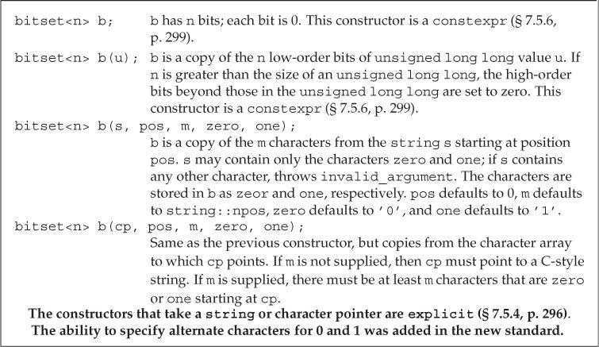
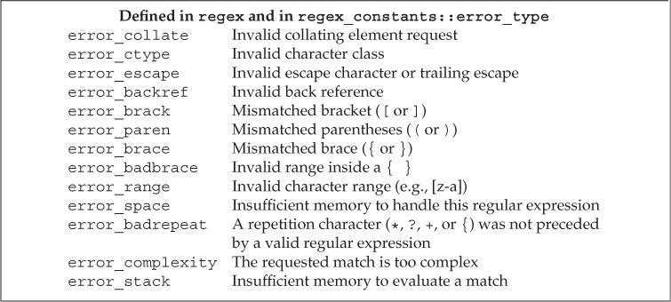
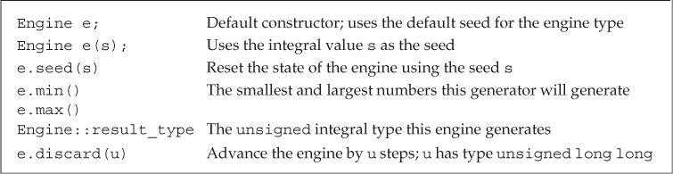
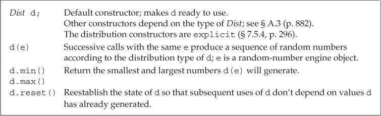
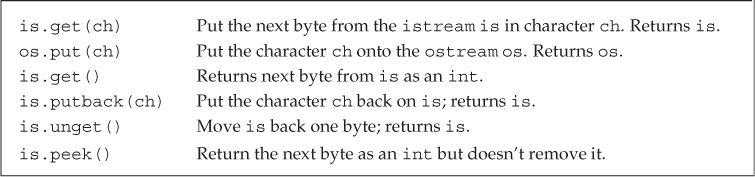

# 第17章 标准库特殊设施

## tuple类型（The tuple Type）

`tuple`是类似`pair`的模板，定义在头文件*tuple*中。与`pair`不同，`tuple`可以有任意数量的成员。如果希望将一些数据组合成单一对象，但又不想定义新数据结构时，可以使用`tuple`（“快速而随意”的数据结构）。


### 定义和初始化tuple（Defining and Initializing tuples）

定义`tuple`时需要指定每个成员的类型。创建`tuple`对象时，可以使用`tuple`的默认构造函数，它会对每个成员进行值初始化。或者给每个成员提供初始值。包含初始值的构造函数是`explicit`的，因此必须使用直接初始化语法。

```c++
tuple<size_t, size_t, size_t> threeD = { 1, 2, 3 };   // error
tuple<size_t, size_t, size_t> threeD{ 1, 2, 3 };      // ok
```

类似`make_pair`，`make_tuple`函数可以生成`tuple`对象。`tuple`的类型由初始值决定。

```c++
// tuple that represents a bookstore transaction: ISBN, count, price per book
auto item = make_tuple("0-999-78345-X", 3, 20.00);
```

可以使用`get`访问`tuple`的成员。`get`是一个函数模板，使用时必须指定一个显式模板实参，表示要访问的成员索引。传递给`get`一个`tuple`实参后，会返回其指定成员的引用。

```c++
auto book = get<0>(item);    // returns the first member of item
auto cnt = get<1>(item);     // returns the second member of item
auto price = get<2>(item)/cnt;    // returns the last member of item
get<2>(item) *= 0.8;    // apply 20% discount
```

可以使用`tuple_size`和`tuple_element`这两个辅助类模板查询`tuple`成员的数量和类型。

- `tuple_size`通过一个`tuple`类型来初始化，它有一个名为`value`的静态公有数据成员，类型为`size_t`，表示给定`tuple`中成员的数量。
- `tuple_element`通过一个索引值（整型常量）和一个`tuple`类型来初始化，它有一个名为`type`的公有数据成员，表示给定`tuple`中指定成员的类型。

使用`decltype`可以确定一个对象的类型。

```c++
typedef decltype(item) trans;    // trans is the type of item
// returns the number of members in object's of type trans
size_t sz = tuple_size<trans>::value;    // returns 3
// cnt has the same type as the second member in item
tuple_element<1, trans>::type cnt = get<1>(item);    // cnt is an int
```

`tuple`的关系和相等运算符逐对比较两个`tuple`对象的成员。只有当两个`tuple`的成员数量相等时才可以进行比较。使用`tuple`的相等或不等运算符时，每对成员必须支持`==`运算符；使用`tuple`的关系运算符时，每对成员必须支持`<`运算符。

由于`tuple`定义了`<`和`==`运算符，因此`tuple`序列可以被传递给算法，无序容器的关键字也可以使用`tuple`类型。

### 使用tuple返回多个值（Using a tuple to Return Multiple Values）

`tuple`的一个常见用途是从一个函数返回多个值。

## bitset类型（The bitset Type）

标准库在头文件*bitset*中定义了`bitset`类，用于处理二进制位。`bitset`可以处理超过最长整型类型大小的位集合。

### 定义和初始化bitset（Defining and Initializing bitsets）

`bitset`类是一个模板，类似`array`，具有固定的大小。定义一个`bitset`时需要指明它包含的二进制位数。



使用一个整型值初始化`bitset`时，此值会被转换为`unsigned long long`类型并被当作位模式处理。`bitset`中的二进制位就是此模式的副本。如果`bitset`的大小大于`unsigned long long`中的二进制位数，剩余的高位会被置为0。如果`bitset`的大小小于`unsigned long long`中的二进制位数，则只使用给定值的低位部分。

```c++
// bitvec1 is smaller than the initializer; high-order bits from the initializer are discarded
bitset<13> bitvec1 (0xbeef);    // bits are 1111011101111
// bitvec2 is larger than the initializer; high-order bits in bitvec2 are set to zero
bitset<20> bitvec2(0xbeef);     // bits are 00001011111011101111
// on machines with 64-bit long long 0ULL is 64 bits of 0, so ~0ULL is 64 ones
bitset<128> bitvec3(~0ULL);     // bits 0 ... 63 are one; 63 ... 127 are zero
```

可以使用`string`或字符数组指针来初始化`bitset`，字符直接表示位模式。使用字符串表示数时，字符串中下标最小的字符对应`bitset`的高位。如果`string`包含的字符数比`bitset`少，则`bitset`的高位被置为0。

```c++
bitset<32> bitvec4("1100"); // bits 2 and 3 are 1, all others are 0
string str("1111111000000011001101");
bitset<32> bitvec5(str, 5, 4);           // four bits starting at str[5], 1100
bitset<32> bitvec6(str, str.size()-4);   // use last four characters
```


### bitset操作（Operations on bitsets）

`bitset`操作：


`bitset`的下标运算符对`const`属性进行了重载。`const`版本的下标运算符在指定位置置位时返回`true`，否则返回`false`。非`const`版本返回`bitset`定义的一个特殊类型，用来控制指定位置的值。

`to_ulong`和`to_ullong`操作用来提取`bitset`的值。只有当`bitset`的大小不大于对应操作的返回值（`to_ulong`为`unsigned long`，`to_ullong`为`unsigned long long`）时，才能使用这两个操作。如果`bitset`中的值不能存入给定类型，则会引发`overflow_error`异常。

```c++
unsigned long ulong = bitvec3.to_ulong();
cout << "ulong = " << ulong << endl;
```

`bitset`的输入运算符从输入流读取字符，保存到临时的`string`对象中。遇到下列情况时停止读取：

- 读取的字符数达到对应`bitset`的大小。
- 遇到不是1和0的字符。
- 遇到文件结尾。
- 输入出现错误。

读取结束后用临时`string`对象初始化`bitset`。如果读取的字符数小于`bitset`的大小，则`bitset`的高位被置为0。

## 正则表达式（Regular Expressions）

正则表达式是一种描述字符序列的方法。C++11新标准增加了正则表达式库（RE库），定义在头文件*regex*中，包含多个组件。


`regex`类表示一个正则表达式。

```c++
// find the characters ei that follow a character other than c
string pattern("[^c]ei");
// we want the whole word in which our pattern appears
pattern = "[[:alpha:]]*" + pattern + "[[:alpha:]]*";
regex r(pattern);    // construct a regex to find pattern
smatch results;      // define an object to hold the results of a search
// define a string that has text that does and doesn't match pattern
string test_str = "receipt freind theif receive";
// use r to find a match to pattern in test_str
if (regex_search(test_str, results, r))     // if there is a match
    cout << results.str() << endl;     // print the matching word
```

`regex_match`和`regex_search`函数确定一个给定的字符序列与一个`regex`是否匹配。如果整个输入序列与表达式匹配，则`regex_match`函数返回`true`；如果输入序列中的一个子串与表达式匹配，则`regex_search`函数返回`true`。这两个函数的其中一个重载版本接受一个类型为`smatch`的附加参数。如果匹配成功，函数会将匹配信息保存在给定的`smatch`对象中。二者的参数形式如下：


### 使用正则表达式库（Using the Regular Expression Library）

默认情况下，`regex`使用的正则表达式语言是ECMAScript。

定义一个`regex`或者对一个`regex`调用`assign`为其赋新值时，可以指定一些标志来影响`regex`的操作。`ECMAScript`、`basic`、`extended`、`awk`、`grep`和`egrep`这六个标志指定编写正则表达式时所使用的语言。这六个标志中必须设置其中之一，且只能设置一个。默认情况下，`ECMAScript`标志被设置，`regex`会使用ECMA-262规范，这也是很多Web浏览器使用的正则表达式语言。


正则表达式的语法是否正确是在运行期间解析的。如果正则表达式存在错误，标准库会抛出类型为`regex_error`的异常。除了`what`操作外，`regex_error`还有一个名为`code`的成员，用来返回错误类型对应的数值编码。`code`返回的值是由具体实现定义的。RE库能抛出的标准错误如下，`code`返回对应错误的编号（从0开始）。



正则表达式在程序运行时才编译，这是一个非常慢的操作。因此构造一个`regex`对象或者给一个已经存在的`regex`赋值是很耗时间的。为了最小化这种开销，应该尽量避免创建不必要的`regex`。特别是在循环中使用正则表达式时，应该在循环体外部创建`regex`对象。

RE库为不同的输入序列都定义了对应的类型。使用时RE库类型必须与输入类型匹配。

- `regex`类保存`char`类型的正则表达式；`wregex`保存`wchar_t`类型的正则表达式。
- `smatch`表示`string`类型的输入序列；`cmatch`表示字符数组类型的输入序列；`wsmatch`表示`wstring`类型的输入序列；`wcmatch`表示宽字符数组类型的输入序列。


### 匹配与Regex迭代器类型（The Match and Regex Iterator Types）

`regex`迭代器是一种迭代器适配器，它被绑定到一个输入序列和一个`regex`对象上，每种输入类型都有对应的迭代器类型。

`sregex_iterator`操作：


以`sregex_iterator`为例，将`sregex_iterator`绑定到一个`string`和一个`regex`对象时，迭代器自动定位至给定`string`中的第一个匹配位置。即，`sregex_iterator`构造函数对给定`string`和`regex`调用`regex_search`。解引用迭代器时，返回最近一次搜索结果的`smatch`对象。递增迭代器时，它调用`regex_search`在输入`string`中查找下一个匹配位置。

```c++
// find the characters ei that follow a character other than c
string pattern("[^c]ei");
// we want the whole word in which our pattern appears
pattern = "[[:alpha:]]*" + pattern + "[[:alpha:]]*";
regex r(pattern, regex::icase);     // we'll ignore case in doing the match
// it will repeatedly call regex_search to find all matches in file
for (sregex_iterator it(file.begin(), file.end(), r), end_it;
        it != end_it; ++it)
    cout << it->str() << endl;   // matched word
```


匹配类型有两个名为`prefix`和`suffix`的成员，分别返回表示输入序列中当前匹配之前和之后部分的`ssub_match`对象。一个`ssub_match`对象有两个名为`str`和`length`的成员，分别返回匹配的`string`和该`string`的长度。

```c++
// same for loop header as before
for (sregex_iterator it(file.begin(), file.end(), r), end_it;
    it != end_it; ++it)
{
    auto pos = it->prefix().length();    // size of the prefix
    pos = pos > 40 ? pos - 40 : 0;       // we want up to 40 characters
    cout << it->prefix().str().substr(pos)          // last part of the prefix
        << "\n\t\t>>> " << it->str() << " <<<\n"    // matched word
        << it->suffix().str().substr(0, 40)         // first part of the suffix
        << endl;
}
```


`smatch`支持的操作：


### 使用子表达式（Using Subexpressions）

正则表达式中的模式通常包含一个或多个子表达式。子表达式是模式的一部分，本身也有意义。正则表达式语法通常用括号表示子表达式。

```c++
// r has two subexpressions: the first is the part of the file name before the period
// the second is the file extension
regex r("([[:alnum:]]+)\\.(cpp|cxx|cc)$", regex::icase);
```

匹配对象除了提供匹配整体的相关信息外，还可以用来访问模式中的每个子表达式。子匹配是按位置来访问的，第一个子匹配位置为0，表示整个模式对应的匹配，随后是每个子表达式对应的匹配。

子表达式的一个常见用途是验证必须匹配特定格式的数据，如电话号码和电子邮箱地址。

ECMAScript正则表达式语言的一些特性：

- 模式`[[:alnum:]]`匹配任意字母。
- 符号`+`表示匹配一个或多个字符。
- 符号`*`表示匹配零个或多个字符。
- `\{d}`表示单个数字，`\{d}{n}`表示一个n个数字的序列。
- 在方括号中的字符集合表示匹配这些字符中的任意一个。
- 后接`?`的组件是可选的。
- 类似C++，ECMAScript使用反斜线进行转义。由于模式包含括号，而括号是ECMAScript中的特殊字符，因此需要用`\(`和`\)`来表示括号是模式的一部分。

因为反斜线`\`是C++中的特殊字符，所以在模式中使用`\`时，需要一个额外的反斜线进行转义。

子匹配操作：


### 使用regex_replace（Using regex_replace）

正则表达式替换操作：


标准库定义了用于在正则表达式替换过程中控制匹配或格式的标志。这些标志可以传递给`regex_search`、`regex_match`函数或者`smatch`类的`format`成员。匹配和格式化标志的类型为`match_flag_type`，定义在命名空间*regex_constants*中。由于*regex_constants*定义在*std*中，因此在使用这些名字时，需要同时加上两个命名空间的限定符。


默认情况下，`regex_replace`输出整个输入序列。未与正则表达式匹配的部分会原样输出，匹配的部分按照格式字符串指定的格式输出。使用`format_no_copy`标志可以只输出匹配部分。

```c++
// generate just the phone numbers: use a new format string
string fmt2 = "$2.$5.$7 ";    // put space after the last number as a separator
// tell regex_replace to copy only the text that it replaces
cout << regex_replace(s, r, fmt2, format_no_copy) << endl;
```

## 随机数（Random Numbers）

在新标准出现之前，C和C++都依赖于一个简单的C库函数`rand`来生成随机数。该函数生成均匀分布的伪随机整数，每个随机数的范围在0和一个系统相关的最大值（至少为32767）之间。

头文件*random*中的随机数库定义了一组类来解决`rand`函数的一些问题：随机数引擎类（random-number engines）可以生成`unsigned`随机数序列；随机数分布类（random-number distribution classes）使用引擎类生成指定类型、范围和概率分布的随机数。


C++程序不应该使用`rand`函数，而应该使用`default_random_engine`类和恰当的分布类对象。

### 随机数引擎和分布（Random-Number Engines and Distribution）

随机数引擎是函数对象类，定义了一个不接受参数的调用运算符，返回一个随机`unsigned`整数。调用一个随机数引擎对象可以生成原始随机数。

```c++
default_random_engine e;    // generates random unsigned integers
for (size_t i = 0; i < 10; ++i)
    // e() "calls" the object to produce the next random number
    cout << e() << " ";
```

标准库定义了多个随机数引擎类，区别在于性能和随机性质量。每个编译器都会指定其中一个作为`default_random_engine`类型，此类型一般具有最常用的特性。

随机数引擎操作：



大多数情况下，随机数引擎的输出是不能直接使用的，因为生成的随机数范围通常与程序所需要的不符。

使用分布类对象可以得到指定范围的随机数。新标准库的`uniform_int_distribution<unsigned>`类型生成均匀分布的`unsigned`值。

```c++
// uniformly distributed from 0 to 9 inclusive
uniform_int_distribution<unsigned> u(0,9);
default_random_engine e;    // generates unsigned random integers
for (size_t i = 0; i < 10; ++i)
    // u uses e as a source of numbers
    // each call returns a uniformly distributed value in the specified range
    cout << u(e) << " ";
```

类似引擎类型，分布类型也是函数对象类。分布类型定义了一个接受一个随机数引擎参数的调用运算符。分布对象使用它的引擎参数生成随机数，并将其映射到指定的分布区间。

随机数发生器指分布对象和引擎对象的组合。

`rand`函数的生成范围在0到`RAND_MAX`之间，随机数引擎生成的`unsigned`整数在一个系统定义的范围内。一个引擎类型的范围可以通过调用该类型对象的`min`和`max`成员来获得。

即使随机数发生器生成的数看起来是随机的，但对于一个给定的发生器，每次运行程序时它都会返回相同的数值序列。

如果函数需要局部的随机数发生器，应该将其（包括引擎和分布对象）定义为`static`对象，这样随机数发生器就能在函数调用期间保持状态。否则每次调用函数都会生成相同的序列。

```c++
// returns a vector of 100 uniformly distributed random numbers
vector<unsigned> good_randVec()
{
    // because engines and distributions retain state, they usually should be
    // defined as static so that new numbers are generated on each call
    static default_random_engine e;
    static uniform_int_distribution<unsigned> u(0,9);
    vector<unsigned> ret;
    for (size_t i = 0; i < 100; ++i)
        ret.push_back(u(e));
    return ret;
}
```

通过为引擎提供一个种子（seed），可以让引擎在程序每次运行时生成不同的序列。种子是一个数值，引擎利用它从序列中的一个新位置重新开始生成随机数。

为引擎设置种子有两种方式：

- 在创建对象时提供种子。
- 调用引擎的`seed`成员设置种子。

```c++
default_random_engine e1;    // uses the default seed
default_random_engine e2(2147483646);   // use the given seed value
default_random_engine e3;    // uses the default seed value
e3.seed(32767);     // call seed to set a new seed value
```

选择种子的常用方法是调用系统函数`time`。该函数定义在头文件*ctime*中，返回从一个特定时刻到当前经过的秒数。`time`函数接受单个指针参数，指向用于写入时间的数据结构。如果指针为空，则函数简单地返回时间。

```c++
default_random_engine e1(time(0));   // a somewhat random seed
```

由于`time`函数返回以秒计算的时间，因此用`time`返回值作为种子的方式只适用于生成种子的间隔为秒级或更长时间的应用。另外如果程序作为一个自动过程的一部分反复运行，这种方式也会无效，可能多次使用的是相同的种子。

### 其他随机数分布（Other Kinds of Distributions）

从`rand`函数获得随机浮点数的一个常用但不正确的方法是用`rand`的结果除以`RAND_MAX`。但因为随机整数的精度通常低于随机浮点数，所以使用这种方法时，有一些浮点值永远不会被生成。

使用新标准库的`uniform_real_distribution`类型可以获得随机浮点数。

```c++
default_random_engine e;    // generates unsigned random integers
// uniformly distributed from 0 to 1 inclusive
uniform_real_distribution<double> u(0,1);
for (size_t i = 0; i < 10; ++i)
    cout << u(e) << " ";
```

分布类型操作：



除了总是生成`bool`类型的`bernouilli_distribution`外，其他分布类型都是模板。每个模板都接受单个类型参数，指定分布生成的结果类型。

分布类型限制了可以作为模板类型的参数类型，一些模板只能生成浮点数，而其他模板只能生成整数。分布类型还定义了一个默认模板类型参数，整型分布的默认参数是`int`，浮点数分布的默认参数是`double`。使用默认类型时应该在模板名后使用空尖括号。

```c++
// empty <> signify we want to use the default result type
uniform_real_distribution<> u(0,1);    // generates double by default
```

`bernouilli_distribution`类型是一个普通类，而非模板。该分布返回一个`bool`值，其中`true`的概率是一个常数，默认为0.5。

由于引擎会返回相同的随机数序列，因此需要在循环中使用引擎时，必须在循环体外定义引擎对象。否则每次循环都会创建新引擎，生成相同序列。同样，分布对象也需要保持运行状态，也必须在循环体外定义。

## IO库再探（The IO Library Revisited）

### 格式化输入与输出（Formatted Input and Output）

除了条件状态外，每个`iostream`对象还维护着一个格式状态来控制IO格式化细节。

标准库定义了一组操纵符（manipulator）来修改流的格式状态。操纵符是一个函数或对象，会影响流的状态，并能作为输入和输出运算符的运算对象。类似输入和输出运算符，操纵符也返回它所处理的流对象。

操纵符用于两大类输出控制：控制数值的输出格式，控制补白的数量和位置。

操纵符改变流的格式状态时，通常改变后的状态对所有后续IO都生效。大多数改变格式状态的操纵符都是设置/复原成对的，一个操纵符用于设置新格式，另一个用于恢复正常格式。

默认情况下，`bool`值输出为1（`true`）或0（`false`）。对流使用`boolalpha`操纵符可以输出`true`或`false`，还原格式时使用`noboolalpha`操纵符。

```c++
cout << "default bool values: " << true << " " << false
    << "\nalpha bool values: " << boolalpha
    << true << " " << false << endl;
```

输出：

```
default bool values: 1 0
alpha bool values: true false
```

默认情况下，整型值的输入输出使用十进制。可以使用`hex`、`oct`和`dec`操纵符将其改为十六进制、八进制或改回十进制。

```c++
cout << "default: " << 20 << " " << 1024 << endl;
cout << "octal: " << oct << 20 << " " << 1024 << endl;
cout << "hex: " << hex << 20 << " " << 1024 << endl;
cout << "decimal: " << dec << 20 << " " << 1024 << endl;
```

输出：

```
default: 20 1024
octal: 24 2000
hex: 14 400
decimal: 20 1024
```

`hex`、`oct`和`dec`操纵符只影响整型运算对象，浮点值的表示形式不受影响。

默认情况下，在输出数值时，没有可见的标识指出当前使用的进制模式。如果需要输出八进制或十六进制值，应该使用`showbase`操纵符。对流应用`showbase`后，在输出结果中会显示进制，显示模式和指定整型常量进制的规范相同。

- 前导`0x`表示十六进制。
- 前导`0`表示八进制。
- 无前导字符表示十进制。

还原格式时使用`noshowbase`操纵符。

```c++
cout << showbase;    // show the base when printing integral values
cout << "default: " << 20 << " " << 1024 << endl;
cout << "in octal: " << oct << 20 << " " << 1024 << endl;
cout << "in hex: " << hex << 20 << " " << 1024 << endl;
cout << "in decimal: " << dec << 20 << " " << 1024 << endl;
cout << noshowbase;   // reset the state of the stream
```

输出：

```
default: 20 1024
in octal: 024 02000
in hex: 0x14 0x400
in decimal: 20 1024
```

默认情况下，十六进制值（包括前导字符）以小写格式输出。使用`uppercase`操纵符可以输出大写字母。还原格式时使用`nouppercase`操纵符。

```c++
cout << uppercase << showbase << hex
    << "printed in hexadecimal: " << 20 << " " << 1024
    << nouppercase << noshowbase << dec << endl;
```

输出：

```
printed in hexadecimal: 0X14 0X400
```

浮点数的输出格式涉及三个方面：

- 输出精度（即输出多少个数字）。
- 十六进制、定点十进制或者科学记数法形式输出。
- 没有小数部分的浮点值是否输出小数点。

默认情况下，浮点值按六位数字精度输出；如果浮点值没有小数部分，则不输出小数点；根据浮点数的值选择输出为定点十进制或科学计数法形式：非常大或非常小的值输出为科学记数法形式，其他值输出为定点十进制形式。

默认情况下，精度控制输出的数字总位数。输出时，浮点值按照当前精度四舍五入而非截断。

调用IO对象的`precision`成员或者使用`setprecision`操纵符可以改变精度。

- `precision`成员是重载的。一个版本接受一个`int`值，将精度设置为此值，并返回旧精度值。另一个版本不接受参数，直接返回当前精度值。
- `setprecision`操纵符接受一个参数来设置精度。

`setprecision`操纵符和其他接受参数的操纵符都定义在头文件*iomanip*中。

```c++
// cout.precision reports the current precision value
cout << "Precision: " << cout.precision()
    << ", Value: " << sqrt(2.0) << endl;
// cout.precision(12) asks that 12 digits of precision be printed
cout.precision(12);
cout << "Precision: " << cout.precision()
    << ", Value: " << sqrt(2.0) << endl;
// alternative way to set precision using the setprecision manipulator
cout << setprecision(3);
cout << "Precision: " << cout.precision()
    << ", Value: " << sqrt(2.0) << endl;
```

输出：

```
Precision: 6, Value: 1.41421
Precision: 12, Value: 1.41421356237
Precision: 3, Value: 1.41
```

定义在头文件*iostream*中的操纵符：


操纵符可以强制流使用科学记数法、定点十进制或十六进制形式输出浮点值。

- `scientific`使用科学记数法表示浮点值。
- `fixed`使用定点十进制表示浮点值。
- `hexfloat`（新标准库）使用十六进制表示浮点值。
- `defaultfloat`（新标准库）将流恢复到默认状态。

除非程序需要控制浮点数的表示方式，否则最好由标准库来选择计数法。

```c++
cout << "default format: " << 100 * sqrt(2.0) << '\n'
    << "scientific: " << scientific << 100 * sqrt(2.0) << '\n'
    << "fixed decimal: " << fixed << 100 * sqrt(2.0) << '\n'
    << "hexadecimal: " << hexfloat << 100 * sqrt(2.0) << '\n'
    << "use defaults: " << defaultfloat << 100 * sqrt(2.0) << '\n';
```

输出：

```
default format: 141.421
scientific: 1.414214e+002
fixed decimal: 141.421356
hexadecimal: 0x1.1ad7bcp+7
use defaults: 141.421
```

`scientific`、`fixed`和`hexfloat`操纵符会改变流的精度含义。执行这些操纵符后，精度控制的将是小数点后面的数字位数，而默认情况下控制的是数字总位数。

默认情况下，当浮点值的小数部分为0时，不显示小数点。使用`showpoint`操纵符可以强制输出小数点，`noshowpoint`操纵符还原默认行为。

```c++
cout << 10.0 << endl;        // prints 10
cout << showpoint << 10.0    // prints 10.0000
    << noshowpoint << endl;  // revert to default format for the decimal point
```

按列输出时，通常需要非常精细地控制数据格式。

- `setw`指定下一个数字或字符串值的最小空间。
- `left`表示左对齐输出。
- `right`表示右对齐输出（默认格式）。
- `internal`控制负数的符号位置，它左对齐符号，右对齐值，中间空间用空格填充。
- `setfill`指定一个字符代替默认的空格进行补白。

`setw`类似`endl`，不改变输出流的内部状态，只影响下一次输出的大小。

```c++
int i = -16;
double d = 3.14159;
// pad the first column to use a minimum of 12 positions in the output
cout << "i: " << setw(12) << i << "next col" << '\n'
    << "d: " << setw(12) << d << "next col" << '\n';
// pad the first column and left-justify all columns
cout << left
    << "i: " << setw(12) << i << "next col" << '\n'
    << "d: " << setw(12) << d << "next col" << '\n'
    << right;   // restore normal justification
// pad the first column and right-justify all columns
cout << right
    << "i: " << setw(12) << i << "next col" << '\n'
    << "d: " << setw(12) << d << "next col" << '\n';
// pad the first column but put the padding internal to the field
cout << internal
    << "i: " << setw(12) << i << "next col" << '\n'
    << "d: " << setw(12) << d << "next col" << '\n';
// pad the first column, using # as the pad character
cout << setfill('#')
    << "i: " << setw(12) << i << "next col" << '\n'
    << "d: " << setw(12) << d << "next col" << '\n'
    << setfill(' ');    // restore the normal pad character
```

输出：

```
i: -16next col
d: 3.14159next col
i: -16 next col
d: 3.14159 next col
i: -16next col
d: 3.14159next col
i: - 16next col
d: 3.14159next col
i: -#########16next col
d: #####3.14159next col
```

头文件*iomanip*中定义的操纵符：


默认情况下，输入运算符会忽略空白字符（空格符、制表符、换行符、换纸符和回车符）。使用`noskipws`操纵符可以让输入运算符读取空白符，`skipws`操纵符还原默认行为。

```c++
cin >> noskipws;    // set cin so that it reads whitespace
while (cin >> ch)
    cout << ch;
cin >> skipws;      // reset cin to the default state so that it discards whitespace
```

### 未格式化的输入/输出操作（Unformatted Input/Output Operations）

标准库提供了一组低层操作，支持未格式化IO（unformatted IO）。这些操作可以将一个流当作无解释的字节序列来处理。

一些未格式化操作每次处理流的一个字节，它们会读取而不是忽略空白符。



使用未格式化IO操作`get`和`put`可以读取和写入一个字符。

```c++
char ch;
while (cin.get(ch))
    cout.put(ch);
```

有时读取完一个字符后才发现目前无法处理该字符，希望将其放回流中。标准库提供了三种方法退回字符。

- `peek`返回输入流中下一个字符的副本，但不会将其从流中删除。
- `unget`使输入流向后移动，令最后读取的值回到流中。即使不知道最后从流中读取了什么值，也可以调用`unget`。
- `putback`是特殊版本的`unget`，它退回从流中读取的最后一个值，但它接受一个参数，该参数必须与最后读取的值相同。

一般情况下，在读取下一个值之前，标准库保证程序可以退回最多一个值。

`peek`和无参数的`get`函数都以`int`类型从输入流返回字符。这些函数使用`int`的原因是可以返回文件尾标记。`char`范围中的每个值都表示一个真实字符，因此没有额外的值可以表示文件尾。返回`int`的函数先将要返回的字符转换为`unsigned char`，再将结果提升为`int`。因此即使字符集中有字符映射到负值，返回的`int`也是正值。而标准库使用负值表示文件尾，这样就能保证文件尾与任何合法字符的值都不相同。头文件*cstdio*定义了一个名为`EOF`的常量值，可以用它检测函数返回的值是否是文件尾。

```c++
int ch;    // use an int, not a char to hold the return from get()
// loop to read and write all the data in the input
while ((ch = cin.get()) != EOF)
    cout.put(ch);
```

一个常见的编程错误是将`get`或`peek`函数的返回值赋给`char`而非`int`对象，但编译器不能发现这个错误。

```c++
char ch;   // using a char here invites disaster!
// the return from cin.get is converted to char and then compared to an int
while ((ch = cin.get()) != EOF)
    cout.put(ch);
```

当`get`返回`EOF`时，该值会先被转换为`unsigned char`，之后提升得到的`int`值与`EOF`值不再相等，因此循环永远不会停止。

一些未格式化IO操作一次处理大块数据，这些操作可以提高程序执行速度，但需要自己分配并管理用来保存和提取数据的字符数组。


`get`和`getline`函数接受相同的参数，它们的行为类似但不相同。两个函数都一直读取数据，直到遇到下列情况之一：

- 已经读取了*size - 1*个字符。
- 遇到了文件尾（`EOF`）。
- 遇到了分隔符。

两个函数的区别在于处理分隔符的方式：`get`将分隔符留在输入流中作为下一个字符，而`getline`读取并丢弃分隔符。两个函数都不会将分隔符保存在结果数组中。

读取流数据时的一个常见错误是忘记从流中删除分隔符。

一些操作可能从输入流中读取了未知个数的字节，使用`gcount`函数可以确定上一次未格式化输入操作读取了多少字符。`gcount`函数应该在任何后续未格式化输入操作前调用，将字符退回流的操作也属于未格式化输入操作。如果在调用`gcount`前使用了`peek`、`unget`或`putback`操作，则`gcount`的返回值为0。

使用`clear`、`ignore`和`sync`函数可以清空输入流中的数据。读到非法字符时，输入流将处于错误状态。为了继续获取输入数据，先调用`clear`函数重置流的错误标记。再调用`ignore`清空流中指定大小的数据，或者调用`sync`直接清空流中所有数据。`numeric_limits<streamsize>::max()`返回流的缓冲区大小。

```c++
// 重置错误标志
cin.clear();

// 清除流中所有数据
cin.clear();
cin.ignore(numeric_limits<streamsize>::max());

// 清除流中一行数据
cin.ignore(numeric_limits<streamsize>::max(), '\n');
```

### 流随机访问（Random Access to a Stream）

随机IO本质上是依赖于操作系统的。

为了支持随机访问，IO类型通过维护一个标记来确定下一次读写操作的位置。`seek`函数用于移动标记，`tell`函数用于获取标记。标准库实际上定义了两对`seek`和`tell`函数，一对用于输入流（后缀为`g`，表示get），一对用于输出流（后缀为`p`，表示put）。


虽然标准库为所有流类型都定义了`seek`和`tell`函数，但它们是否有意义取决于流绑定到哪个设备。在大多数系统中，绑定到`cin`、`cout`、`cerr`和`clog`的流不支持随机访问。对这些流可以调用`seek`和`tell`函数，但在运行时会出现错误，流也会被置为无效状态。

从逻辑上考虑，`seek`和`tell`函数的使用范围如下：

- 可以对`istream`、`ifstream`、`istringstream`类型使用`g`版本。
- 可以对`ostream`、`ofstream`、`ostringstream`类型使用`p`版本。
- 可以对`iostream`、`fstream`、`stringstream`类型使用`g`和`p`版本。

一个流中只有一个标记——不存在独立的读标记和写标记。`fstream`和`stringstream`类型可以读写同一个流。在这些类型中，有单一的缓冲区用于保存读写的数据，同时标记也只有一个，表示缓冲区中的当前位置。标准库将两个版本的`seek`和`tell`函数都映射到这个标记。

由于流中只有一个标记，因此在切换读写操作时，必须使用`seek`函数来重定位标记。

`seek`函数有两个重载版本：一个版本使用绝对地址移动流标记；另一个版本使用指定位置和偏移量移动流标记。

```c++
// set the marker to a fixed position
seekg(new_position);    // set the read marker to the given pos_type location
seekp(new_position);    // set the write marker to the given pos_type location
// offset some distance ahead of or behind the given starting point
seekg(offset, from);    // set the read marker offset distance from from
seekp(offset, from);    // offset has type off_type
```

参数*new_position*和*offset*的类型分别是`pos_type`和`off_type`，这两个类型都是机器相关的，定义在头文件*istream*和*ostream*中。`pos_type`表示文件位置，而`off_type`表示距离当前位置的偏移量，偏移量可以是正数也可以是负数。

`tellg`和`tellp`函数返回一个`pos_type`值，表示流的当前位置。

