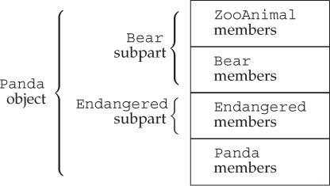

# 第18章 用于大型程序的工具

## 异常处理（Exception Handling）

异常处理机制允许程序中独立开发的部分能够在运行期间就出现的问题进行通信并做出相应的处理，使问题检测和解决过程相互分离。

### 抛出异常（Throwing an Exception）

在C++中，通过抛出（throwing）一条表达式来引发（raised）一个异常。被抛出的表达式类型和当前的调用链共同决定了应该使用哪段处理代码（handler）来处理该异常。被选中的处理代码是在调用链中与抛出对象类型匹配且距离最近的代码。

执行一个`throw`语句时，跟在`throw`后面的语句将不再执行。程序的控制权从`throw`转移到与之匹配的`catch`语句中。该`catch`可能是同一个函数中的局部`catch`，也可能位于直接或间接调用了发生异常的函数的另一个函数中。控制权的转移意味着两个问题：

- 沿着调用链的函数可能会提前退出。
- 一旦程序开始执行异常处理代码，则沿着调用链创建的对象会被销毁。

抛出异常后，程序暂停执行当前函数并立即寻找对应`catch`语句的过程叫做栈展开（stack unwinding）。栈展开沿着嵌套函数的调用链不断查找，直到找到了与异常匹配的`catch`语句为止。如果没有对应的`catch`语句，则退出主函数后查找过程结束。

- 如果找到了匹配的`catch`语句，则程序进入该子句并执行其中的代码。`catch`语句执行结束后，程序会转移到与`try`块关联的最后一个`catch`语句之后的位置继续执行。
- 如果没有找到匹配的`catch`语句，程序会调用标准库的`terminate`函数，终止运行。

在栈展开过程中，位于调用链上的语句块可能会提前退出，其中的局部对象也会被销毁。如果异常发生在构造函数或者数组及容器的元素初始化过程中，则当前的对象可能只构造了一部分，此时必须确保已构造的成员能被正确销毁。

如果一个块分配了资源，并且在执行资源释放代码前发生了异常，则资源不会被释放。

由于栈展开可能会调用析构函数，因此析构函数不应该抛出不能被它自身处理的异常。即，如果析构函数需要执行某个可能引发异常的操作，则该操作应该被放置在一个`try`语句块中，并在析构函数内部得到处理。实际编程中，析构函数仅仅是释放资源，不太可能引发异常。所有的标准库类型都能确保它们的析构函数不会引发异常。

编译器使用异常抛出表达式对异常对象（exception object）进行拷贝初始化，因此`throw`语句中的表达式必须具有完全类型。如果该表达式是类类型，则相应的类必须含有可访问的析构函数和拷贝/移动构造函数。如果该表达式是数组或函数类型，则表达式会被转换成对应的指针类型。

抛出一条表达式时，该表达式的静态编译类型决定了异常对象的类型。如果`throw`表达式解引用一个基类指针，而该指针实际指向派生类对象，则只有基类部分会被抛出。

抛出指针时必须确保在任何对应的处理代码中，指针指向的对象一定存在。

### 捕获异常（Catching an Exception）

`catch`语句（catch clause）中的异常声明（exception declaration）类似只包含一个形参的函数形参列表。声明的类型决定了处理代码所能捕获的异常类型。该类型必须是完全类型，可以是左值引用，但不能是右值引用。如果`catch`无须访问抛出的表达式，则可以忽略捕获形参的名字。

进入`catch`语句后，使用异常对象初始化异常声明中的参数。`catch`参数的特性和函数参数类似。

- 如果`catch`的参数类型是非引用类型，则该参数是异常对象的一个副本，改变参数不会影响异常对象本身。
- 如果`catch`的参数类型是引用类型，则该参数是异常对象的一个别名，改变参数就是改变异常对象本身。
- 在继承体系中，如果`catch`的参数类型是基类类型，则可以使用其派生类类型的异常对象对其初始化。
  - `catch`的参数是基类非引用类型时，异常对象会被切除一部分。
  - `catch`的参数是基类引用类型时，以常规方式绑定到异常对象。

异常声明的静态类型决定了`catch`语句所能执行的操作。如果`catch`的参数是基类类型，则无法使用派生类特有的成员。

通常情况下，如果`catch`接受的异常与某个继承体系有关，则最好将`catch`参数定义为引用类型。

查找异常处理代码时，最终结果是第一个与异常匹配的`catch`语句，但这未必是最佳匹配。因此，越特殊的`catch`越应该位于整个`catch`列表的前端。当程序使用具有继承关系的异常时，派生类异常的处理代码应该位于基类异常的处理代码之前。

异常和异常声明的匹配规则比函数参数严格，绝大多数类型转换都不能使用。

- 允许从非常量到常量的类型转换。
- 允许从派生类到基类的类型转换。
- 数组被转换成指向数组元素类型的指针，函数被转换成指向该函数类型的指针。

除此之外，包括标准算术类型转换和类类型转换在内的其他所有转换规则都不能在`catch`匹配过程中使用。

有时一个单独的`catch`语句不能完整处理某个异常。执行完一些校正操作后，当前的`catch`可能会让位于调用链上层的函数继续处理异常。一个`catch`语句通过重新抛出（rethrowing）的操作将异常传递给另一个`catch`语句。重新抛出是一条不包含表达式的`throw`语句。

```c++
throw;
```

空`throw`语句只能出现在`catch`或`catch`语句调用的函数之内。如果在异常处理代码之外的区域遇到了空`throw`语句，编译器将调用`terminate`函数。

重新抛出语句不指定新的表达式，而是将当前的异常对象沿着调用链向上传递。如果`catch`语句修改了其参数并重新抛出异常，则只有当`catch`异常声明是引用类型时，程序对参数所做的改变才会被保留并继续传播。

```c++
catch (my_error &eObj)
{   // specifier is a reference type
    eObj.status = errCodes::severeErr;  // modifies the exception
    object
    throw;   // the status member of the exception object is severeErr
}

catch (other_error eObj)
{   // specifier is a nonreference type
    eObj.status = errCodes::badErr;     // modifies the local copy only
    throw;   // the status member of the exception object is unchanged
}
```

使用省略号`...`作为异常声明可以一次性捕获所有异常，这种处理代码被称为捕获所有异常（catch-all）的处理代码，可以与任意类型的异常相匹配。

```c++
try
{
    // actions that cause an exception to be thrown
}
catch (...)
{
    // work to partially handle the exception
    throw;
}
```

`catch(…)`通常与重新抛出语句一起使用。

如果`catch(…)`与其他`catch`语句一起使用，则`catch(…)`必须位于最后，否则`catch(…)`后面的`catch`语句永远不会被匹配。

### 函数try语句块与构造函数（Function try Blocks and Constructors）

要想处理构造函数初始值列表抛出的异常，必须将构造函数写成函数`try`语句块（function try block）的形式。函数`try`语句块使得一组`catch`语句可以同时处理构造函数体和构造函数初始化过程中的异常。

```c++
template <typename T>
Blob<T>::Blob(std::initializer_list<T> il) try :
    data(std::make_shared<std::vector<T>>(il))
{
    /* empty body */
}
catch(const std::bad_alloc &e)
{
    handle_out_of_memory(e);
}
```

函数`try`语句块的`catch`语句会在结尾处隐式地重新抛出异常，通知上层函数对象构造失败。上层函数需要继续处理该异常。

在初始化构造函数参数时发生的异常不属于函数`try`语句块处理的范围。

### noexcept异常说明（The noexcept Exception Specification）

在C++11中，可以通过提供`noexcept`说明（noexcept specification）来指出某个函数不会抛出异常。

```c++
void recoup(int) noexcept;  // won't throw
void alloc(int);            // might throw
```

`noexcept`说明的出现位置：

- 关键字`noexcept`位于函数的参数列表之后，尾置返回类型之前。
- 对于一个函数来说，`noexcept`说明必须同时出现在该函数的所有声明和定义语句中。
- 函数指针的声明和定义也可以指定`noexcept`。
- 在`typedef`或类型别名中不能使用`noexcept`。
- 在成员函数中，关键字`noexcept`位于`const`或引用限定符之后，`final`、`override`或虚函数的`=0`之前。

编译器并不会在编译时检查`noexcept`说明。如果一个函数在指定了`noexcept`的同时又含有`throw`语句或其他可能抛出异常的操作，仍然会通过编译（个别编译器可能会提出警告）。

```c++
// this function will compile, even though it clearly violates its exception specification
void f() noexcept   // promises not to throw any exception
{
    throw exception();   // violates the exception specification
}
```

一旦`noexcept`函数抛出异常，程序会调用`terminate`函数终止运行（该过程是否执行栈展开未作规定）。因此`noexcept`可以用于两种情况：

- 确认函数不会抛出异常。
- 不知道该如何处理函数抛出的异常。

指明某个函数不会抛出异常可以让调用者不必再考虑异常处理操作。

早期的C++版本设计了一套更详细的异常说明方案。函数可以使用一个关键字`throw`，后面跟上用括号包围的异常类型列表，用于指定函数可能抛出的异常类型。关键字`throw`出现的位置与C++11的`noexcept`相同。该方案在C++11中被取消。但如果一个函数被声明为`throw()`的，则也说明该函数不会抛出异常。

```c++
void recoup(int) noexcept;   // recoup doesn't throw
void recoup(int) throw();   // equivalent declaration
```

`noexcept`说明符接受一个可选的实参，该实参必须能转换为`bool`类型。如果实参为`true`，则函数不会抛出异常；如果实参为`false`，则函数可能抛出异常。

```c++
void recoup(int) noexcept(true);    // recoup won't throw
void alloc(int) noexcept(false);    // alloc can throw
```

`noexcept`运算符（noexcept operator）是一个一元运算符，返回`bool`类型的右值常量表达式，表示给定的运算对象是否会抛出异常。和`sizeof`类似，`noexcept`运算符也不会对运算对象求值。

```c++
noexcept(e)
```

当*e*调用的函数都含有`noexcept`说明且*e*本身不含有`throw`语句时，上述表达式返回`true`，否则返回`false`。

`noexcept`运算符通常在`noexcept`说明符的实参中使用。

```c++
void f() noexcept(noexcept(g()));   // f has same exception specifier as g
```

函数指针与该指针指向的函数必须具有一致的异常说明。如果某个函数指针是`noexcept`的，则该指针只能指向`noexcept`函数；如果显式或隐式地说明了函数指针可能抛出异常，则该指针可以指向任何函数。

```c++
// both recoup and pf1 promise not to throw
void (*pf1)(int) noexcept = recoup;
// ok: recoup won't throw; it doesn't matter that pf2 might
void (*pf2)(int) = recoup;
pf1 = alloc;    // error: alloc might throw but pf1 said it wouldn't
pf2 = alloc;    // ok: both pf2 and alloc might throw
```

如果一个虚函数是`noexcept`的，则后续派生出来的虚函数必须也是`noexcept`的。如果基类的虚函数允许抛出异常，则派生类的对应函数既可以允许，也可以禁止抛出异常。

```c++
class Base
{
public:
    virtual double f1(double) noexcept;   // doesn't throw
    virtual int f2() noexcept(false);   // can throw
    virtual void f3();   // can throw
};

class Derived : public Base
{
public:
    double f1(double);   // error: Base::f1 promises not to throw
    int f2() noexcept(false);   // ok: same specification as Base::f2
    void f3() noexcept;   // ok: Derived f3 is more restrictive
};
```

编译器合成拷贝控制成员时，也会生成一个异常声明。如果所有的成员和基类操作都含有`noexcept`说明，则合成成员也是`noexcept`的。

### 异常类层次（Exception Class Hierarchies）

标准库异常类的继承体系：


`exception`类型只定义了拷贝构造函数、拷贝赋值运算符、一个虚析构函数和一个名为`what`的虚成员。`what`函数返回一个`const char*`，指向一个以`NULL`结尾的字符数组，并且不会抛出异常。

`exception`、`bad_cast`和`bad_alloc`类型定义了默认构造函数。`runtime_error`和`logic_error`类型没有默认构造函数，但是有一个接受C风格字符串或`string`类型实参的构造函数，该实参通常用于提供错误信息。`what`函数返回用于初始化异常对象的错误信息。

实际编程中通常会自定义`exception`（或者`exception`的标准库派生类）的派生类以扩展其继承体系。这些面向具体应用的异常类表示了与应用相关的异常状态。

## 命名空间（Namespaces）

大型应用程序通常会使用多个独立开发的库，其中某些名字可能会相互冲突。多个库将名字放置在全局命名空间中会产生命名空间污染（namespace pollution）。

命名空间分割了全局命名空间，其中每个命名空间都是一个作用域。

### 命名空间定义（Namespace Definitions）

命名空间的定义包含两部分：关键字`namespace`和随后的命名空间名字。在命名空间名字后面是一系列由花括号包围的声明和定义。能出现在全局作用域中的声明就也能出现在命名空间中。

```c++
namespace cplusplus_primer
{
    class Sales_data { / * ... * /};
    Sales_data operator+(const Sales_data&, const Sales_data&);
    class Query { /* ... */ };
    class Query_base { /* ... */};
}   // like blocks, namespaces do not end with a semicolon
```

命名空间作用域后面不需要分号结束。

和其他名字一样，命名空间的名字也必须在定义它的作用域内保持唯一。命名空间可以定义在全局作用域内，也可以定义在其他命名空间中，但是不能定义在函数或类的内部。

每个命名空间都是一个作用域，不同命名空间内可以有相同名字的成员。

定义在某个命名空间中的名字可以被该命名空间内的其他成员直接访问，也可以被这些成员内嵌作用域中的任何单位访问。位于该命名空间之外的代码则必须明确指出所使用的名字属于哪个命名空间。

```c++
cplusplus_primer::Query q = cplusplus_primer::Query("hello");
```

命名空间的定义可以是不连续的。

```c++
namespace nsp
{
    // declarations
}
```

如果之前没有名为*nsp*的命名空间定义，则上述代码创建一个新的命名空间；否则，上述代码打开已经存在的命名空间定义并为其添加新的成员声明。

利用命名空间不连续的特性可以将几个独立的接口和实现文件组成一个命名空间。此时，命名空间的组织方式类似管理自定义类和函数的方式。

- 命名空间的一部分成员用于定义类，以及声明作为类接口的函数和对象。这些成员应该放置在头文件中。
- 命名空间成员的定义部分放置在另外的源文件中。源文件需要包含对应的头文件。

程序中的某些实体只能定义一次，如非内联函数、静态数据成员等，命名空间中定义的名字也需要满足该要求。

```c++
// ---- Sales_data.h----
// #includes should appear before opening the namespace
# include <string>
namespace cplusplus_primer
{
    class Sales_data { /* ... */};
    Sales_data operator+(const Sales_data&, const Sales_data&);
    // declarations for the remaining functions in the Sales_data interface
}

// ---- Sales_data.cc----
// be sure any #includes appear before opening the namespace
# include "Sales_data.h"
namespace cplusplus_primer
{
    // definitions for Sales_data members and overloaded operators
}
```

通常情况下，`#include`不应该出现在命名空间内部。否则头文件中的所有名字都会被定义为该命名空间的成员。

定义多个类型不相关的命名空间时应该使用单独的文件分别表示每个类型。

可以在命名空间的外部定义该命名空间的成员。命名空间对于名字的声明必须在作用域内，同时该名字的定义需要明确指出其所属的命名空间。

```c++
// namespace members defined outside the namespace must use qualified names
cplusplus_primer::Sales_data
cplusplus_primer::operator+(const Sales_data& lhs, const Sales_data& rhs)
{
    Sales_data ret(lhs);
    // ...
}
```

模板特例化必须定义在原始模板所属的命名空间中。可以在命名空间内部添加模板特例化声明，而在外部对其进行定义。

```c++
// we must declare the specialization as a member of std
namespace std
{
    template <> struct hash<Sales_data>;
}

// having added the declaration for the specialization to std
// we can define the specialization outside the std namespace
template <> struct std::hash<Sales_data>
{
    size_t operator()(const Sales_data& s) const
    {
        return hash<string>()(s.bookNo) ^
            hash<unsigned>()(s.units_sold) ^
            hash<double>()(s.revenue);
    }
    // other members as before
};
```

全局作用域中定义的名字被隐式添加到全局命名空间（global namespace）中。全局命名空间以隐式方式声明，在所有程序中都存在。

作用域运算符`::`可以用于全局命名空间的成员。因为全局命名空间是隐式声明的，所以它并没有名字。

```c++
::member_name
```

命名空间可以嵌套。嵌套的命名空间同时也是一个嵌套的作用域，它嵌套在外层命名空间的作用域内。内层命名空间声明的名字会隐藏外层命名空间的同名成员。在嵌套的命名空间中定义的名字只在内层命名空间中有效，外层命名空间中的代码在访问时需要在名字前添加限定符。

C++11新增了内联命名空间（inline namespace）。和一般的嵌套命名空间不同，内联命名空间中的名字可以被外层命名空间直接使用。定义内联命名空间的方式是在`namespace`前添加关键字`inline`。`inline`必须出现在该命名空间第一次定义的地方。

```c++
inline namespace FifthEd
{
    // namespace for the code from the Primer Fifth Edition
}

namespace FifthEd
{   // implicitly inline
    class Query_base { /* ... */ };
    // other Query-related declarations
}
```

当应用程序的代码在两次发布之间发生了改变时，通常会使用内联命名空间。

```c++
namespace FourthEd
{
    class Item_base { /* ... */};
    class Query_base { /* ... */};
    // other code from the Fourth Edition
}

namespace cplusplus_primer
{
    #include "FifthEd.h"
    #include "FourthEd.h"
}
```

因为*FifthEd*是内联的，所以形如`cplusplus_primer::`的代码可以直接获得*FifthEd*的成员。如果想使用早期版本，则必须加上完整的外层命名空间名字。

未命名的命名空间（unnamed namespace）指关键字`namespace`后紧跟以花括号包围的一系列声明语句。未命名的命名空间中定义的变量拥有静态生命周期：它们在第一次使用前创建，直到程序结束才销毁。

一个未命名的命名空间可以在某个给定的文件内不连续，但是不能跨越多个文件。每个文件定义自己的未命名的命名空间。如果一个头文件定义了未命名的命名空间，则该命名空间中定义的名字在每个包含该头文件的文件中对应不同实体。

定义在未命名的命名空间中的名字可以直接使用，不能对其使用作用域运算符。

定义在未命名的命名空间中的名字的作用域与该命名空间所在的作用域相同。如果未命名的命名空间定义在最外层作用域中，则该命名空间中的名字必须要与全局作用域中的名字有所区别。

```c++
int i; // global declaration for i
namespace
{
    int i;
}
// ambiguous: defined globally and in an unnested, unnamed namespace
i = 10;

namespace local
{
    namespace
    {
        int i;
    }
}
// ok: i defined in a nested unnamed namespace is distinct from global i
local::i = 42;
```

在标准C++引入命名空间的概念之前，程序需要将名字声明为`static`的以令其对整个文件有效。在文件中进行静态声明的做法是从C语言继承而来的。在C语言中，声明为`static`的全局实体在其所在的文件之外不可见。该做法已经被C++标准取消，现在应该使用未命名的命名空间。

### 使用命名空间成员（Using Namespace Members）

可以使用关键字`namespace`和`=`为命名空间定义别名（namespace alias）。别名必须出现在命名空间的定义之后。

```c++
namespace primer = cplusplus_primer;
```

一个命名空间可以有多个别名，它们都与命名空间的原名等价。

一条`using`声明（using declaration）一次只引入命名空间的一个成员。

`using`声明的有效范围从`using`声明语句开始，一直到`using`声明所在的作用域结束为止。在此过程中，外层作用域的同名实体会被隐藏。未加限定的名字只能在`using`声明所在的作用域及其内层作用域中使用。

`using`声明可以出现在全局作用域、局部作用域、命名空间作用域和类的作用域中。在类的作用域中使用时，`using`声明只能指向基类成员。

和`using`声明不同，`using`指示使某个命名空间中的所有名字都可见。

`using`指示可以出现在全局作用域、局部作用域和命名空间作用域中，不能出现在类的作用域中。

如果对*std*等命名空间使用了`using`指示而未做任何特殊控制的话，会重新引入多个库之间的名字冲突问题。

 `using`指示具有将命名空间成员提升到包含命名空间本身和`using`指示的最近外层作用域的能力。

```c++
// namespace A and function f are defined at global scope
namespace A
{
    int i, j;
}

void f()
{
    using namespace A;  // injects the names from A into the global scope
    cout << i * j << endl;  // uses i and j from namespace A
    // ...
}
```

当命名空间被注入到其外层作用域之后，该命名空间中定义的名字可能会与其外层作用域的成员冲突。这种冲突允许存在，但是要想使用冲突的名字，就必须明确指出名字的版本。

```c++
namespace blip
{
    int i = 16, j = 15, k = 23;
    // other declarations
}
int j = 0;  // ok: j inside blip is hidden inside a namespace

void manip()
{
    // using directive; the names in blip are ''added'' to the global scope
    using namespace blip;   // clash between ::j and blip::j
    // detected only if j is used
    ++i;    // sets blip::i to 17
    ++j;    // error ambiguous: global j or blip::j?
    ++::j;  // ok: sets global j to 1
    ++blip::j;    // ok: sets blip::j to 16
    int k = 97;   // local k hides blip::k
    ++k;    // sets local k to 98
}
```

头文件如果在其顶层作用域中使用`using`声明或`using`指示，则会将名字注入到包含该头文件的所有文件中。通常，头文件只负责定义接口部分的名字，而不定义实现部分的名字。因此，头文件最多只能在它的函数或命名空间内使用`using`声明或`using`指示。

相比于使用`using`指示，在程序中对命名空间中的每个成员分别使用`using`声明效果更好。

- 如果程序使用了多个不同的库，而这些库中的名字通过`using`指示变得可见，则全局命名空间污染问题将重新出现。
- `using`指示引发的二义性错误只有在使用了冲突名字的地方才会被发现。而`using`声明引发的二义性错误在声明处就能发现。

建议在命名空间本身的实现文件中使用`using`指示。

### 类、命名空间与作用域（Classes，Namespaces，and Scope）

对命名空间内部名字的查找遵循常规查找规则：由内向外依次查找每个外层作用域。只有位于开放的块中且在使用点之前声明的名字才会被考虑。

```c++
namespace A
{
    int i;
    namespace B
    {
        int i;  // hides A::i within B
        int j;
        int f1()
        {
            int j;   // j is local to f1 and hides A::B::j
            return i;   // returns B::i
        }
    }   // namespace B is closed and names in it are no longer visible
    
    int f2()
    {
        return j;   // error: j is not defined
    }
    int j = i;   // initialized from A::i
}
```

对于位于命名空间中的类来说，名字的常规查找规则依然适用：当成员函数使用某个名字时，首先在该成员中查找，然后在类（包括基类）中查找，接着在外层作用域中查找。

可以从函数的限定名推断出名字查找时检查作用域的顺序，限定名以相反的顺序指出被查找的作用域。

命名空间中名字的隐藏规则有一个例外：传递给函数一个类类型的对象、指向类的引用或指针时，除了在常规作用域查找名字外，还会查找实参类所属的命名空间。该例外允许概念上作为类接口一部分的非成员函数无须单独的`using`声明就能被程序使用。

```c++
std::string s;
std::cin >> s;
// 等价于
std::operator>>(std::cin, s);

// 若该规则不存在，则必须为>>运算符提供using声明
using std::operator>>;
// 或者显式使用std::operator>>
std::operator>>(std::cin, s);
```

标准库定义的`move`和`forward`模板函数接受一个右值引用形参，可以匹配任何类型。如果应用程序也定义了一个接受单一参数的`move`和`forward`函数，则不管形参是什么类型，都会与标准库的版本冲突。对于这两个函数来说，冲突大多是无意的，因此建议使用它们的含有限定语的完整版本（即`std::move`、`std::forward`）。

如果一个未声明的类或函数第一次出现在友元声明中，则会被认定是离它最近的外层命名空间的成员。

### 重载与命名空间（Overloading and Namespaces）

`using`声明和`using`指示能将某些函数添加到候选函数集。

确定候选函数集时，会在函数的每个实参类（以及实参类的基类）所属的命名空间中搜索候选函数。这些命名空间中所有与被调用函数同名的函数都会被添加到候选集当中，即使其中某些函数在调用语句处不可见也是如此。

`using`声明语句声明的是一个名字，而非一个特定的函数。一个`using`声明囊括了重载函数的所有版本以确保不违反命名空间的接口。

```C++
using NS::print(int);   // error: cannot specify a parameter list
using NS::print;        // ok: using declarations specify names only
```

一个`using`声明引入的函数将重载该声明语句所属作用域中已有的其他同名函数。如果`using`声明出现在局部作用域中，则引入的名字会隐藏外层作用域的相关声明。如果`using`声明所在的作用域中已经有一个函数与引入的函数同名且形参列表相同，则该`using`声明会引发错误。除此之外，`using`声明将为引入的名字添加额外的重载实例，并最终扩充候选函数集的规模。

`using`指示将命名空间的成员提升到外层作用域中，如果命名空间的某个函数与该命名空间所属作用域中的函数同名，则命名空间的函数会被添加到重载集合中。

```c++
namespace libs_R_us
{
    extern void print(int);
    extern void print(double);
}
// ordinary declaration
void print(const std::string &);
// this using directive adds names to the candidate set for calls to print:
using namespace libs_R_us;
// the candidates for calls to print at this point in the program are:
// print(int) from libs_R_us
// print(double) from libs_R_us
// print(const std::string &) declared explicitly
void fooBar(int ival)
{
    print("Value: ");   // calls global print(const string &)
    print(ival);        // calls libs_R_us::print(int)
}
```

与`using`声明不同，`using`指示引入一个与已有函数形参列表完全相同的函数并不会引发错误。但需要明确指出调用的是命名空间中的函数版本还是当前作用域中的版本。

如果存在多个`using`指示，则来自每个命名空间的名字都会成为候选函数集的一部分。

## 多重继承与虚继承（Multiple and Virtual Inheritance）

多重继承（Multiple inheritance）是指从多个直接基类中产生派生类的能力。多重继承的派生类继承了所有父类的属性。

### 多重继承（Multiple Inheritance）

派生类的派生列表中可以包含多个基类。每个基类都包含一个可选的访问说明符。和单继承相同，如果访问说明符被省略，则关键字`class`对应的默认访问说明符是`private`，关键字`struct`对应的是`public`。

```c++
class Bear : public ZooAnimal { /* ... */ };
class Panda : public Bear, public Endangered { /* ... */ };
```

和单继承相同，多重继承的派生列表也只能包含已经被定义过的类，且这些类不能是`final`的。

多重继承关系中，派生类对象包含每个基类的子对象。



构造一个多重继承的派生类对象将同时构造并初始化它的所有基类子对象。

```c++
// explicitly initialize both base classes
Panda::Panda(std::string name, bool onExhibit)
    : Bear(name, onExhibit, "Panda"),
      Endangered(Endangered::critical) { }
// implicitly uses the Bear default constructor to initialize the Bear subobject
Panda::Panda()
    : Endangered(Endangered::critical) { }
```

派生类的构造函数初始值列表将实参分别传递给每个直接基类。其中基类的构造顺序与派生列表中基类的出现顺序一致，与构造函数初始值列表中基类的顺序无关。

C++11允许派生类从它的一个或多个基类中继承构造函数，但如果从多个基类中继承了相同的构造函数（即形参列表完全相同），程序会产生错误。

```c++
struct Base1
{
    Base1() = default;
    Base1(const std::string&);
    Base1(std::shared_ptr<int>);
};

struct Base2
{
    Base2() = default;
    Base2(const std::string&);
    Base2(int);
};

// error: D1 attempts to inherit D1::D1 (const string&) from both base classes
struct D1: public Base1, public Base2
{
    using Base1::Base1;   // inherit constructors from Base1
    using Base2::Base2;   // inherit constructors from Base2
};
```

如果一个类从它的多个基类中继承了相同的构造函数，则必须为该构造函数定义其自己的版本。

```c++
struct D2: public Base1, public Base2
{
    using Base1::Base1;    // inherit constructors from Base1
    using Base2::Base2;    // inherit constructors from Base2
    // D2 must define its own constructor that takes a string
    D2(const string &s): Base1(s), Base2(s) { }
    D2() = default;   // needed once D2 defines its own constructor
};
```

和单继承相同，多重继承的派生类如果定义了自己的拷贝/赋值构造函数和赋值运算符，则必须在完整的对象上执行这些操作。只有当派生类使用的是合成版本的拷贝、移动或赋值成员时，才会自动处理其基类部分。在合成版本的拷贝控制成员中，每个基类分别使用自己的对应成员隐式地完成构造、赋值或销毁等工作。

### 类型转换与多个基类（Conversions and Multiple Base Classes）

多重继承和单继承相同，某个可访问基类的指针或引用可以直接指向派生类对象。

编译器不会在派生类向基类的几种转换中进行比较和选择。

```c++
void print(const Bear&);
void print(const Endangered&);

Panda ying_yang("ying_yang");
print(ying_yang);   // error: ambiguous
```

和单继承相同，对象、指针和引用的静态类型决定了我们可以使用的成员。

### 多重继承下的类作用域（Class Scope under Multiple Inheritance）

在单继承中，派生类的作用域嵌套在直接基类和间接基类的作用域中。名称查找沿着继承体系自底向上进行，直到找到所需的名字。派生类的名字会隐藏基类的同名成员。在多重继承中，相同的查找过程在所有基类中同时进行。如果名字在多个基类中都被找到，则会产生二义性错误。

派生类可以从多个基类中分别继承名字相同的成员，但是在使用该名字时必须明确指出其版本。避免潜在二义性的最好方法是在派生类中定义新的版本。

### 虚继承（Virtual Inheritance）

尽管在派生列表中同一个基类只能出现一次，但实际上派生类可以多次继承同一个类。派生类可以通过它的两个直接基类分别继承同一个间接基类，也可以直接继承某个基类，然后通过另一个基类再次间接继承该类。

默认情况下，派生类含有继承链上每个类对应的子部分。如果某个类在派生过程中出现了多次，则派生类中会包含该类的多个子对象。这种默认情况对某些类并不适用。例如`iostream`，它直接继承自`istream`和`ostream`，而`istream`和`ostream`都继承自`base_ios`，所以`iostream`继承了`base_ios`两次。如果`iostream`对象包含`base_ios`的两份拷贝，则无法在同一个缓冲区中进行读写操作。

虚继承可以让某个类共享它的基类，其中共享的基类子对象称为虚基类（virtual base class）。在该机制下，不论虚基类在继承体系中出现了多少次，派生类都只包含唯一一个共享的虚基类子对象。

通常情况下，使用虚继承的类层次是由一个人或一个项目组一次性设计完成的。对于一个独立开发的类来说，很少需要基类中的某一个是虚基类，况且新基类的开发者也无法改变已存在的类体系。

虚派生只影响从指定了虚基类的派生类中进一步派生出的类，它不会影响派生类本身。

指定虚基类的方式是在派生列表中添加关键字`virtual`。

```c++
// the order of the keywords public and virtual is not significant
class Raccoon : public virtual ZooAnimal { /* ... */ };
class Bear : virtual public ZooAnimal { /* ... */ };
```

如果某个类指定了虚基类，则该类的派生仍按照常规方式进行。

```c++
class Panda : public Bear, public Raccoon, public Endangered { /* ... */ };
```


不论基类是不是虚基类，派生类对象都能被可访问基类的指针或引用操作。

因为在每个共享的虚基类中只有唯一一个共享的子对象，所以该基类的成员可以被直接访问，而且不会产生二义性。此外，如果虚基类的成员只被一条派生路径覆盖，则也可以直接访问该成员。但如果成员被多个基类覆盖，则一般情况下派生类必须为该成员定义新的版本。例如，假设类*B*定义了一个名为*X*的成员，*D1*和*D2*都从*B*虚继承得到，*D*继承了*D1*和*D2*。则在*D*的作用域中，*X*通过*D*的两个基类都是可见的。如果通过*D*的对象使用*X*，则有三种可能性：

- 如果*D1*和*D2*中都没有*X*的定义，则*X*会被解析为*B*的成员，此时不存在二义性。
- 如果*D1*和*D2*中的某一个定义了*X*，派生类的*X*会比共享虚基类*B*的*X*优先级更高，此时同样没有二义性。
- 如果*D1*和*D2*都定义了*X*，则直接访问*X*会产生二义性问题。

### 构造函数与虚继承（Constructors and Virtual Inheritance）

在虚派生中，虚基类是由最低层的派生类初始化的。如果按普通规则处理，虚基类将会在多条继承路径上被重复初始化。

继承体系中的每个类都可能在某个时刻成为“最低层的派生类”。只要能创建虚基类的派生类对象，该派生类的构造函数就必须初始化它的虚基类。即使虚基类不是派生类的直接基类，构造函数也可以进行初始化。

```c++
Bear::Bear(std::string name, bool onExhibit)
    : ZooAnimal(name, onExhibit, "Bear") { }
    
Raccoon::Raccoon(std::string name, bool onExhibit)
    : ZooAnimal(name, onExhibit, "Raccoon") { }

Panda::Panda(std::string name, bool onExhibit)
    : ZooAnimal(name, onExhibit, "Panda"),
      Bear(name, onExhibit),
      Raccoon(name, onExhibit),
      Endangered(Endangered::critical),
      sleeping flag(false) { }
```

构造含有虚基类的对象时，首先使用提供给最低层派生类构造函数的初始值初始化该对象的虚基类子部分，之后再按照直接基类在派生列表中出现的顺序依次对其初始化。

一个类可以有多个虚基类，此时这些虚子对象按照它们在派生列表中出现的顺序依次构造。