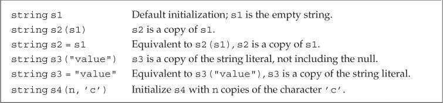
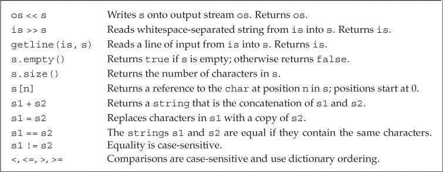
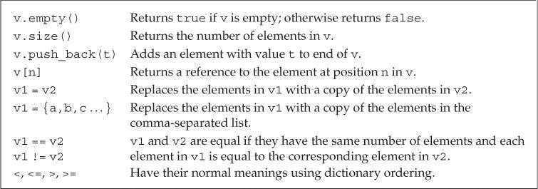
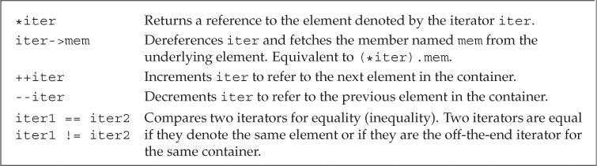
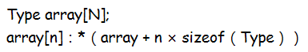
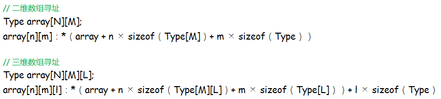

# 第3章 字符串、向量和数组

## 命名空间的using声明（Namespace using Declarations）

使用using声明后就无须再通过专门的前缀去获取所需的名字了。

```c++
using std::cout;
```

程序中使用的每个名字都需要用独立的using声明引入。

头文件中通常不应该包含using声明。

## 标准库类型string（Library string Type）

标准库类型`string`表示可变长的字符序列，定义在头文件*string*中。 

### 定义和初始化string对象（Defining and Initializing strings）

初始化string的方式：



如果使用等号初始化一个变量，实际上执行的是拷贝初始化（copy initialization），编译器把等号右侧的初始值拷贝到新创建的对象中去。如果不使用等号，则执行的是直接初始化（direct initialization）。 

### string对象上的操作（Operations on strings）

string的操作：



在执行读取操作时，string对象会自动忽略开头的空白（空格符、换行符、制表符等）并从第一个真正的字符开始读取，直到遇见下一处空白为止。

使用`getline`函数可以读取一整行字符。该函数只要遇到换行符就结束读取并返回结果，如果输入的开始就是一个换行符，则得到空string。触发getline函数返回的那个换行符实际上被丢弃掉了，得到的string对象中并不包含该换行符。

`size`函数返回string对象的长度，返回值是`string::size_type`类型，这是一种无符号类型。要使用size_type，必须先指定它是由哪种类型定义的。

如果一个表达式中已经有了size函数就不要再使用int了，这样可以避免混用int和unsigned int可能带来的问题。

当把string对象和字符字面值及字符串字面值混合在一条语句中使用时，必须确保每个加法运算符两侧的运算对象中至少有一个是string。

```c++
string s4 = s1 + ", ";          // ok: adding a string and a literal
string s5 = "hello" + ", ";     // error: no string operand
string s6 = s1 + ", " + "world";    // ok: each + has a string operand
```

为了与C兼容，C++语言中的字符串字面值并不是标准库string的对象。 

### 处理string对象中的字符（Dealing with the Characters in a string）

头文件*cctype*中的字符操作函数：


建议使用C++版本的C标准库头文件。C语言中名称为*name.h*的头文件，在C++中则被命名为*cname*。

C++11提供了范围for（range for）语句，可以遍历给定序列中的每个元素并执行某种操作。

```c++
for (declaration : expression)
    statement
```

*expression*部分是一个对象，用于表示一个序列。*declaration*部分负责定义一个变量，该变量被用于访问序列中的基础元素。每次迭代，*declaration*部分的变量都会被初始化为*expression*部分的下一个元素值。

```c++
string str("some string");
// print the characters in str one character to a line
for (auto c : str)      // for every char in str
    cout << c << endl;  // print the current character followed by a newline
```

如果想在范围for语句中改变string对象中字符的值，必须把循环变量定义成引用类型。

下标运算符接收的输入参数是string::size_type类型的值，表示要访问字符的位置，返回值是该位置上字符的引用。

下标数值从0记起，范围是0至*size - 1*。使用超出范围的下标将引发不可预知的后果。

C++标准并不要求标准库检测下标是否合法。编程时可以把下标的类型定义为相应的size_type，这是一种无符号数，可以确保下标不会小于0，此时代码只需要保证下标小于size的值就可以了。另一种确保下标合法的有效手段就是使用范围for语句。

## 标准库类型vector（Library vector Type）

标准库类型`vector`表示对象的集合，也叫做容器（container），定义在头文件*vector*中。vector中所有对象的类型都相同，每个对象都有一个索引与之对应并用于访问该对象。

vector是模板（template）而非类型，由vector生成的类型必须包含vector中元素的类型，如vector\<int\>。

因为引用不是对象，所以不存在包含引用的vector。

在早期的C++标准中，如果vector的元素还是vector，定义时必须在外层vector对象的右尖括号和其元素类型之间添加一个空格，如vector\<vector\<int\> \>。但是在C++11标准中，可以直接写成vector\<vector\<int\>\>，不需要添加空格。

### 定义和初始化vector对象（Defining and Initializing vectors）

初始化vector对象的方法：


初始化vector对象时如果使用圆括号，可以说提供的值是用来构造（construct）vector对象的；如果使用的是花括号，则是在列表初始化（list initialize）该vector对象。

可以只提供vector对象容纳的元素数量而省略初始值，此时会创建一个值初始化（value-initialized）的元素初值，并把它赋给容器中的所有元素。这个初值由vector对象中的元素类型决定。

### 向vector对象中添加元素（Adding Elements to a vector）

`push_back`函数可以把一个值添加到vector的尾端。

```c++
vector<int> v2;         // empty vector
for (int i = 0; i != 100; ++i)
    v2.push_back(i);    // append sequential integers to v2
// at end of loop v2 has 100 elements, values 0 . . . 99
```

范围for语句体内不应该改变其所遍历序列的大小。

### 其他vector操作（Other vector Operations）

vector支持的操作：



size函数返回vector对象中元素的个数，返回值是由vector定义的size_type类型。vector对象的类型包含其中元素的类型。 

```c++
vector<int>::size_type  // ok
vector::size_type       // error
```

vector和string对象的下标运算符只能用来访问已经存在的元素，而不能用来添加元素。 

```c++
vector<int> ivec;   // empty vector
for (decltype(ivec.size()) ix = 0; ix != 10; ++ix)
{
    ivec[ix] = ix;  // disaster: ivec has no elements
    ivec.push_back(ix); // ok: adds a new element with value ix
}
```

## 迭代器介绍（Introducing Iterators）

迭代器的作用和下标类似，但是更加通用。所有标准库容器都可以使用迭代器，但是其中只有少数几种同时支持下标运算符。

### 使用迭代器（Using Iterators）

定义了迭代器的类型都拥有`begin`和`end`两个成员函数。begin函数返回指向第一个元素的迭代器，end函数返回指向容器“尾元素的下一位置（one past the end）”的迭代器，通常被称作尾后迭代器（off-the-end iterator）或者简称为尾迭代器（end iterator）。尾后迭代器仅是个标记，表示程序已经处理完了容器中的所有元素。迭代器一般为`iterator`类型。

```c++
// b denotes the first element and e denotes one past the last element in ivec
auto b = ivec.begin(), e = ivec.end();    // b and e have the same type
```

如果容器为空，则begin和end返回的是同一个迭代器，都是尾后迭代器。

标准容器迭代器的运算符：



因为end返回的迭代器并不实际指向某个元素，所以不能对其进行递增或者解引用的操作。

在for或者其他循环语句的判断条件中，最好使用`!=`而不是`<`。所有标准库容器的迭代器都定义了`==`和`!=`，但是只有其中少数同时定义了`<`运算符。

如果vector或string对象是常量，则只能使用`const_iterator`迭代器，该迭代器只能读元素，不能写元素。

begin和end返回的迭代器具体类型由对象是否是常量决定，如果对象是常量，则返回const_iterator；如果对象不是常量，则返回iterator。

```c++
vector<int> v;
const vector<int> cv;
auto it1 = v.begin();   // it1 has type vector<int>::iterator
auto it2 = cv.begin();  // it2 has type vector<int>::const_iterator
```

C++11新增了`cbegin`和`cend`函数，不论vector或string对象是否为常量，都返回const_iterator迭代器。 

任何可能改变容器对象容量的操作，都会使该对象的迭代器失效。 

### 迭代器运算（Iterator Arithmetic）

vector和string迭代器支持的操作：


`difference_type`类型用来表示两个迭代器间的距离，这是一种带符号整数类型。 

## 数组（Arrays）

数组类似vector，但数组的大小确定不变，不能随意向数组中添加元素。

如果不清楚元素的确切个数，应该使用vector。

### 定义和初始化内置数组（Defining and Initializing Built-in Arrays）

数组是一种复合类型，声明形式为`a[d]`，其中*a*是数组名称，*d*是数组维度（dimension）。维度必须是一个常量表达式。

默认情况下，数组的元素被默认初始化。

定义数组的时候必须指定数组的类型，不允许用auto关键字由初始值列表推断类型。

如果定义数组时提供了元素的初始化列表，则允许省略数组维度，编译器会根据初始值的数量计算维度。但如果显式指明了维度，那么初始值的数量不能超过指定的大小。如果维度比初始值的数量大，则用提供的值初始化数组中靠前的元素，剩下的元素被默认初始化。

```c++
const unsigned sz = 3;
int ia1[sz] = {0,1,2};  // array of three ints with values 0, 1, 2
int a2[] = {0, 1, 2};   // an array of dimension 3
int a3[5] = {0, 1, 2};  // equivalent to a3[] = {0, 1, 2, 0, 0}
string a4[3] = {"hi", "bye"};   // same as a4[] = {"hi", "bye", ""}
int a5[2] = {0,1,2};    // error: too many initializers
```

可以用字符串字面值初始化字符数组，但字符串字面值结尾处的空字符也会一起被拷贝到字符数组中。 

```c++
char a1[] = {'C', '+', '+'};        // list initialization, no null
char a2[] = {'C', '+', '+', '\0'};  // list initialization, explicit null
char a3[] = "C++";      // null terminator added automatically
const char a4[6] = "Daniel";    // error: no space for the null!
```

不能用一个数组初始化或直接赋值给另一个数组。

从数组的名字开始由内向外阅读有助于理解复杂数组声明的含义。

```c++
int *ptrs[10];              // ptrs is an array of ten pointers to int
int &refs[10] = /* ? */;    // error: no arrays of references
int (*Parray)[10] = &arr;   // Parray points to an array of ten ints
int (&arrRef)[10] = arr;    // arrRef refers to an array of ten ints
```

### 访问数组元素（Accessing the Elements of an Array）

数组下标通常被定义成`size_t`类型，这是一种机器相关的无符号类型，可以表示内存中任意对象的大小。size_t定义在头文件*cstddef*中。

大多数常见的安全问题都源于缓冲区溢出错误。当数组或其他类似数据结构的下标越界并试图访问非法内存区域时，就会产生此类错误。

### 指针和数组（Pointers and Arrays）

在大多数表达式中，使用数组类型的对象其实是在使用一个指向该数组首元素的指针。

```c++
string nums[] = {"one", "two", "three"};    // array of strings
string *p = &nums[0];   // p points to the first element in nums
string *p2 = nums;      // equivalent to p2 = &nums[0]
```

一维数组寻址公式：



当使用数组作为一个auto变量的初始值时，推断得到的类型是指针而非数组。但decltype关键字不会发生这种转换，直接返回数组类型。 

```c++
int ia[] = {0,1,2,3,4,5,6,7,8,9};   // ia is an array of ten ints
auto ia2(ia);   // ia2 is an int* that points to the first element in ia
ia2 = 42;       // error: ia2 is a pointer, and we can't assign an int to a pointer
auto ia2(&ia[0]);   // now it's clear that ia2 has type int*
// ia3 is an array of ten ints
decltype(ia) ia3 = {0,1,2,3,4,5,6,7,8,9};
ia3 = p;    // error: can't assign an int* to an array
ia3[4] = i;     // ok: assigns the value of i to an element in ia3
```

C++11在头文件*iterator*中定义了两个名为`begin`和`end`的函数，功能与容器中的两个同名成员函数类似，参数是一个数组。 

```c++
int ia[] = {0,1,2,3,4,5,6,7,8,9};   // ia is an array of ten ints
int *beg = begin(ia);   // pointer to the first element in ia
int *last = end(ia);    // pointer one past the last element in ia
```

两个指针相减的结果类型是`ptrdiff_t`，这是一种定义在头文件*cstddef*中的带符号类型。

标准库类型限定使用的下标必须是无符号类型，而内置的下标运算无此要求。

### C风格字符串（C-Style Character Strings）

C风格字符串是将字符串存放在字符数组中，并以空字符结束（null terminated）。这不是一种类型，而是一种为了表达和使用字符串而形成的书写方法。

C++标准支持C风格字符串，但是最好不要在C++程序中使用它们。对大多数程序来说，使用标准库string要比使用C风格字符串更加安全和高效。

C风格字符串的函数：


C风格字符串函数不负责验证其参数的正确性，传入此类函数的指针必须指向以空字符作为结尾的数组。

### 与旧代码的接口（Interfacing to Older Code）

任何出现字符串字面值的地方都可以用以空字符结束的字符数组来代替：

- 允许使用以空字符结束的字符数组来初始化string对象或为string对象赋值。
- 在string对象的加法运算中，允许使用以空字符结束的字符数组作为其中一个运算对象（不能两个运算对象都是）。
- 在string对象的复合赋值运算中，允许使用以空字符结束的字符数组作为右侧运算对象。

不能用string对象直接初始化指向字符的指针。为了实现该功能，string提供了一个名为`c_str`的成员函数，返回const char*类型的指针，指向一个以空字符结束的字符数组，数组的数据和string对象一样。

```c++
string s("Hello World");    // s holds Hello World
char *str = s;  // error: can't initialize a char* from a string
const char *str = s.c_str();    // ok
```

针对string对象的后续操作有可能会让c_str函数之前返回的数组失去作用，如果程序想一直都能使用其返回的数组，最好将该数组重新拷贝一份。

可以使用数组来初始化vector对象，但是需要指明要拷贝区域的首元素地址和尾后地址。

```c++
int int_arr[] = {0, 1, 2, 3, 4, 5};
// ivec has six elements; each is a copy of the corresponding element in int_arr
vector<int> ivec(begin(int_arr), end(int_arr));
```

在新版本的C++程序中应该尽量使用vector、string和迭代器，避免使用内置数组、C风格字符串和指针。 

## 多维数组（Multidimensional Arrays）

C++中的多维数组其实就是数组的数组。当一个数组的元素仍然是数组时，通常需要用两个维度定义它：一个维度表示数组本身的大小，另一个维度表示其元素（也是数组）的大小。通常把二维数组的第一个维度称作行，第二个维度称作列。

多维数组初始化的几种方式：

```c++
int ia[3][4] = 
{   // three elements; each element is an array of size 4
    {0, 1, 2, 3},   // initializers for the row indexed by 0
    {4, 5, 6, 7},   // initializers for the row indexed by 1
    {8, 9, 10, 11}  // initializers for the row indexed by 2
};
// equivalent initialization without the optional nested braces for each row
int ib[3][4] = {0, 1, 2, 3, 4, 5, 6, 7, 8, 9, 10, 11};
// explicitly initialize only element 0 in each row
int ic[3][4] = {{ 0 }, { 4 }, { 8 }};
// explicitly initialize row 0; the remaining elements are value initialized
int id[3][4] = {0, 3, 6, 9};
```

可以使用下标访问多维数组的元素，数组的每个维度对应一个下标运算符。如果表达式中下标运算符的数量和数组维度一样多，则表达式的结果是给定类型的元素。如果下标运算符数量比数组维度小，则表达式的结果是给定索引处的一个内层数组。 

```c++
// assigns the first element of arr to the last element in the last row of ia
ia[2][3] = arr[0][0][0];
int (&row)[4] = ia[1];  // binds row to the second four-element array in ia
```

多维数组寻址公式：



使用范围for语句处理多维数组时，为了避免数组被自动转换成指针，语句中的外层循环控制变量必须声明成引用类型。 

```c++
for (const auto &row : ia)  // for every element in the outer array
    for (auto col : row)    // for every element in the inner array
        cout << col << endl;
```

如果*row*不是引用类型，编译器初始化*row*时会自动将数组形式的元素转换成指向该数组内首元素的指针，这样得到的*row*就是int\*类型，而之后的内层循环则试图在一个int\*内遍历，程序将无法通过编译。 

```c++
for (auto row : ia)
    for (auto col : row)
```

使用范围for语句处理多维数组时，除了最内层的循环，其他所有外层循环的控制变量都应该定义成引用类型。

因为多维数组实际上是数组的数组，所以由多维数组名称转换得到的指针指向第一个内层数组。

```c++
int ia[3][4];       // array of size 3; each element is an array of ints of size 4
int (*p)[4] = ia;   // p points to an array of four ints
p = &ia[2];         // p now points to the last element in ia
```

声明指向数组类型的指针时，必须带有圆括号。 

```c++
int *ip[4];     // array of pointers to int
int (*ip)[4];   // pointer to an array of four ints
```

使用auto和decltype能省略复杂的指针定义。 

```c++
// print the value of each element in ia, with each inner array on its own line
// p points to an array of four ints
for (auto p = ia; p != ia + 3; ++p) 
{
    // q points to the first element of an array of four ints; that is, q points to an int
    for (auto q = *p; q != *p + 4; ++q)
        cout << *q << ' ';
    cout << endl;
}
```

