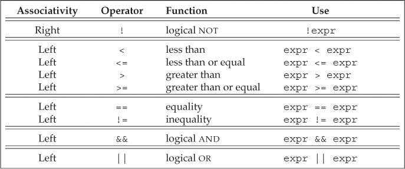

# 第4章 表达式

## 基础（Fundamentals）

表达式（expression）由一个或多个运算对象（operand）组成，对表达式求值将得到一个结果（result）。字面值和变量是最简单的表达式，其结果就是字面值和变量的值。

### 基础概念（Basic Concepts）

C++定义了一元运算符（unary operator）和二元运算符（binary operator）。除此之外，还有一个作用于三个运算对象的三元运算符。函数调用也是一种特殊的运算符，它对运算对象的数量没有限制。

表达式求值过程中，小整数类型（如`bool`、`char`、`short`等）通常会被提升（promoted）为较大的整数类型，主要是`int`。

C++定义了运算符作用于内置类型和复合类型的运算对象时所执行的操作。当运算符作用于类类型的运算对象时，用户可以自定义其含义，这被称作运算符重载（overloaded operator）。

C++的表达式分为右值（rvalue）和左值（lvalue）。当一个对象被用作右值的时候，用的是对象的值（内容）；当对象被用作左值时，用的是对象的地址。需要右值的地方可以用左值代替，反之则不行。

- 赋值运算符需要一个非常量左值作为其左侧运算对象，返回结果也是一个左值。
- 取地址符作用于左值运算对象，返回指向该运算对象的指针，该指针是一个右值。
- 内置解引用运算符、下标运算符、迭代器解引用运算符、`string`和`vector`的下标运算符都返回左值。
- 内置类型和迭代器的递增递减运算符作用于左值运算对象。前置版本返回左值，后置版本返回右值。

如果`decltype`作用于一个求值结果是左值的表达式，会得到引用类型。

### 优先级与结合律（Precedence and Associativity）

复合表达式（compound expression）指含有两个或多个运算符的表达式。优先级与结合律决定了运算对象的组合方式。

括号无视优先级与结合律，表达式中括号括起来的部分被当成一个单元来求值，然后再与其他部分一起按照优先级组合。

### 求值顺序（Order of Evaluation）

对于那些没有指定执行顺序的运算符来说，如果表达式指向并修改了同一个对象，将会引发错误并产生未定义的行为。

```c++
int i = 0;
cout << i << " " << ++i << endl;    // undefined
```

处理复合表达式时建议遵循以下两点：

- 不确定求值顺序时，使用括号来强制让表达式的组合关系符合程序逻辑的要求。
- 如果表达式改变了某个运算对象的值，则在表达式的其他位置不要再使用这个运算对象。

当改变运算对象的子表达式本身就是另一个子表达式的运算对象时，第二条规则无效。如`*++iter`，递增运算符改变了*iter*的值，而改变后的*iter*又是解引用运算符的运算对象。类似情况下，求值的顺序不会成为问题。

## 算术运算符（Arithmetic Operators）

算术运算符（左结合律）：


在除法运算中，C++语言的早期版本允许结果为负数的商向上或向下取整，C++11新标准则规定商一律向0取整（即直接去除小数部分）。

## 逻辑和关系运算符（Logical and Relational Operators）

关系运算符作用于算术类型和指针类型，逻辑运算符作用于任意能转换成布尔值的类型。逻辑运算符和关系运算符的返回值都是布尔类型。



逻辑与（logical AND）运算符`&&`和逻辑或（logical OR）运算符`||`都是先计算左侧运算对象的值再计算右侧运算对象的值，当且仅当左侧运算对象无法确定表达式的结果时才会去计算右侧运算对象的值。这种策略称为短路求值（short-circuit evaluation）。

- 对于逻辑与运算符来说，当且仅当左侧运算对象为真时才对右侧运算对象求值。
- 对于逻辑或运算符来说，当且仅当左侧运算对象为假时才对右侧运算对象求值。

进行比较运算时，除非比较的对象是布尔类型，否则不要使用布尔字面值`true`和`false`作为运算对象。

## 赋值运算符（Assignment Operators）

赋值运算符`=`的左侧运算对象必须是一个可修改的左值。

C++11新标准允许使用花括号括起来的初始值列表作为赋值语句的右侧运算对象。

```c++
vector<int> vi;     // initially empty
vi = {0,1,2,3,4,5,6,7,8,9};     // vi now has ten elements, values 0 through 9
```

赋值运算符满足右结合律。 

```c++
int ival, jval;
ival = jval = 0;    // ok: each assigned 0
```

因为赋值运算符的优先级低于关系运算符的优先级，所以在条件语句中，赋值部分通常应该加上括号。

不要混淆相等运算符`==`和赋值运算符`=`。

复合赋值运算符包括`+=`、`-=`、`*=`、`/=`、`%=`、`<<=`、`>>=`、`&=`、`^=`和`|=`。任意一种复合运算都完全等价于*a = a op b*。

## 递增和递减运算符（Increment and Decrement Operators）

递增和递减运算符是为对象加1或减1的简洁书写形式。很多不支持算术运算的迭代器可以使用递增和递减运算符。

递增和递减运算符分为前置版本和后置版本：

- 前置版本首先将运算对象加1（或减1），然后将改变后的对象作为求值结果。
- 后置版本也会将运算对象加1（或减1），但求值结果是运算对象改变前的值的副本。

```c++
int i = 0, j;
j = ++i;    // j = 1, i = 1: prefix yields the incremented value
j = i++;    // j = 1, i = 2: postfix yields the unincremented value
```

除非必须，否则不应该使用递增或递减运算符的后置版本。后置版本需要将原始值存储下来以便于返回修改前的内容，如果我们不需要这个值，那么后置版本的操作就是一种浪费。

在某些语句中混用解引用和递增运算符可以使程序更简洁。

```c++
cout << *iter++ << endl;
```

## 成员访问运算符（The Member Access Operators）

点运算符`.`和箭头运算符`->`都可以用来访问成员，表达式`ptr->mem`等价于`(*ptr).mem`。

```c++
string s1 = "a string", *p = &s1;
auto n = s1.size();  // run the size member of the string s1
n = (*p).size();    // run size on the object to which p points
n = p->size();      // equivalent to (*p).size()
```

## 条件运算符（The Conditional Operator）

条件运算符的使用形式如下：

```c++
cond ? expr1 : expr2;
```

其中*cond*是判断条件的表达式，如果*cond*为真则对*expr1*求值并返回该值，否则对*expr2*求值并返回该值。

只有当条件运算符的两个表达式都是左值或者能转换成同一种左值类型时，运算的结果才是左值，否则运算的结果就是右值。

条件运算符可以嵌套，但是考虑到代码的可读性，运算的嵌套层数最好不要超过两到三层。

条件运算符的优先级非常低，因此当一个长表达式中嵌套了条件运算子表达式时，通常需要在它两端加上括号。

## 位运算符（The Bitwise Operators）

位运算符（左结合律）：


在位运算中符号位如何处理并没有明确的规定，所以建议仅将位运算符用于无符号类型的处理。

左移运算符`<<`在运算对象右侧插入值为0的二进制位。右移运算符`>>`的行为依赖于其左侧运算对象的类型：如果该运算对象是无符号类型，在其左侧插入值为0的二进制位；如果是带符号类型，在其左侧插入符号位的副本或者值为0的二进制位，如何选择视具体环境而定。

## sizeof运算符（The sizeof Operator）

`sizeof`运算符返回一个表达式或一个类型名字所占的字节数，返回值是`size_t`类型。

在`sizeof`的运算对象中解引用一个无效指针仍然是一种安全的行为，因为指针实际上并没有被真正使用。

`sizeof`运算符的结果部分依赖于其作用的类型：

- 对`char`或者类型为`char`的表达式执行`sizeof`运算，返回值为1。
- 对引用类型执行`sizeof`运算得到被引用对象所占空间的大小。
- 对指针执行`sizeof`运算得到指针本身所占空间的大小。
- 对解引用指针执行`sizeof`运算得到指针指向的对象所占空间的大小，指针不需要有效。
- 对数组执行`sizeof`运算得到整个数组所占空间的大小。
- 对`string`或`vector`对象执行`sizeof`运算只返回该类型固定部分的大小，不会计算对象中元素所占空间的大小。

## 逗号运算符（Comma Operator）

逗号运算符`,`含有两个运算对象，按照从左向右的顺序依次求值，最后返回右侧表达式的值。逗号运算符经常用在`for`循环中。

```c++
vector<int>::size_type cnt = ivec.size();
// assign values from size... 1 to the elements in ivec
for(vector<int>::size_type ix = 0; ix != ivec.size(); ++ix, --cnt)
    ivec[ix] = cnt;
```

## 类型转换（Type Conversions）

无须程序员介入，会自动执行的类型转换叫做隐式转换（implicit conversions）。

### 算术转换（Integral Promotions）

把一种算术类型转换成另一种算术类型叫做算术转换。

整型提升（integral promotions）负责把小整数类型转换成较大的整数类型。

### 其他隐式类型转换（Other Implicit Conversions）

在大多数表达式中，数组名字自动转换成指向数组首元素的指针。

常量整数值0或字面值`nullptr`能转换成任意指针类型；指向任意非常量的指针能转换成`void*`；指向任意对象的指针能转换成`const void*`。

任意一种算术类型或指针类型都能转换成布尔类型。如果指针或算术类型的值为0，转换结果是`false`，否则是`true`。

指向非常量类型的指针能转换成指向相应的常量类型的指针。

### 显式转换（Explicit Conversions）

显式类型转换也叫做强制类型转换（cast）。虽然有时不得不使用强制类型转换，但这种方法本质上是非常危险的。建议尽量避免强制类型转换。

命名的强制类型转换（named cast）形式如下：

```c++
cast-name<type>(expression);
```

其中*type*是转换的目标类型，*expression*是要转换的值。如果*type*是引用类型，则转换结果是左值。*cast-name*是`static_cast`、`dynamic_cast`、`const_cast`和`reinterpret_cast`中的一种，用来指定转换的方式。

- `dynamic_cast`支持运行时类型识别。
- 任何具有明确定义的类型转换，只要不包含底层`const`，都能使用`static_cast`。
- `const_cast`只能改变运算对象的底层`const`，不能改变表达式的类型。同时也只有`const_cast`能改变表达式的常量属性。`const_cast`常常用于函数重载。
- `reinterpret_cast`通常为运算对象的位模式提供底层上的重新解释。

早期版本的C++语言中，显式类型转换包含两种形式： 

```c++
type (expression);    // function-style cast notation
(type) expression;    // C-language-style cast notation
```

