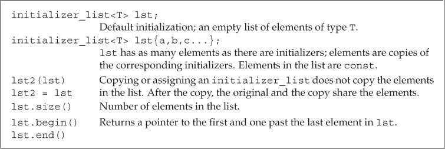

# 第6章 函数

## 函数基础（Function Basics）

典型的函数定义包括返回类型（return type）、函数名字、由0个或多个形式参数（parameter，简称形参）组成的列表和函数体（function body）。函数执行的操作在函数体中指明。

```c++
// factorial of val is val * (val - 1) * (val - 2) . . . * ((val - (val - 1)) * 1)
int fact(int val)
{
    int ret = 1;    // local variable to hold the result as we calculate it
    while (val > 1)
    ret *= val--;   // assign ret * val to ret and decrement val
    return ret;     // return the result
}
```

程序通过调用运算符（call operator）来执行函数。调用运算符的形式之一是一对圆括号`()`，作用于一个表达式，该表达式是函数或者指向函数的指针；圆括号内是一个用逗号隔开的实际参数（argument，简称实参）列表，用来初始化函数形参。调用表达式的类型就是函数的返回类型。 

```c++
int main()
{
    int j = fact(5);    // j equals 120, i.e., the result of fact(5)
    cout << "5! is " << j << endl;
    return 0;
}
```

函数调用完成两项工作：

- 用实参初始化对应的形参。
- 将控制权从主调函数转移给被调函数。此时，主调函数（calling function）的执行被暂时中断，被调函数（called function）开始执行。

`return`语句结束函数的执行过程，完成两项工作：

- 返回`return`语句中的值（可能没有值）。
- 将控制权从被调函数转移回主调函数，函数的返回值用于初始化调用表达式的结果。

实参是形参的初始值，两者的顺序和类型必须一一对应。

函数的形参列表可以为空，但是不能省略。

```c++
void f1() { /* ... */ }      // implicit void parameter list
void f2(void) { /* ... */ }  // explicit void parameter list
```

形参列表中的形参通常用逗号隔开，每个形参都是含有一个声明符的声明，即使两个形参类型一样，也必须把两个类型声明都写出来。 

```c++
int f3(int v1, v2) { /* ... */ }      // error
int f4(int v1, int v2) { /* ... */ }  // ok
```

函数的任意两个形参不能同名，函数最外层作用域中的局部变量也不能使用与函数形参一样的名字。

形参的名字是可选的，但是无法使用未命名的形参。即使某个形参不被函数使用，也必须为它提供一个实参。

函数的返回类型不能是数组类型或者函数类型，但可以是指向数组或函数的指针。

### 局部对象（Local Objects）

形参和函数体内定义的变量统称为局部变量（local variable）。

局部静态对象（local static object）在程序的执行路径第一次经过对象定义语句时初始化，并且直到程序结束才被销毁，对象所在的函数结束执行并不会对它产生影响。在变量类型前添加关键字`static`可以定义局部静态对象。

如果局部静态对象没有显式的初始值，它将执行值初始化。

### 函数声明（Function Declarations）

和变量类似，函数只能定义一次，但可以声明多次。函数声明也叫做函数原型（function prototype）。

函数应该在头文件中声明，在源文件中定义。定义函数的源文件应该包含含有函数声明的头文件。

### 分离式编译（Separate Compilation）

分离式编译允许我们把程序按照逻辑关系分割到几个文件中去，每个文件独立编译。这一过程通常会产生后缀名是*.obj*或*.o*的文件，该文件包含对象代码（object code）。之后编译器把对象文件链接（link）在一起形成可执行文件。

## 参数传递（Argument Passing）

形参初始化的机理与变量初始化一样。

形参的类型决定了形参和实参交互的方式：

- 当形参是引用类型时，它对应的实参被引用传递（passed by reference），函数被传引用调用（called by reference）。引用形参是它对应实参的别名。
- 当形参不是引用类型时，形参和实参是两个相互独立的对象，实参的值会被拷贝给形参（值传递，passed by value），函数被传值调用（called by value）。

### 传值参数（Passing Arguments by Value）

如果形参不是引用类型，则函数对形参做的所有操作都不会影响实参。

使用指针类型的形参可以访问或修改函数外部的对象。

```c++
// function that takes a pointer and sets the pointed-to value to zero
void reset(int *ip)
{
    *ip = 0;  // changes the value of the object to which ip points
    ip = 0;   // changes only the local copy of ip; the argument is unchanged
}
```

如果想在函数体内访问或修改函数外部的对象，建议使用引用形参代替指针形参。

### 传引用参数（Passing Arguments by Reference）

通过使用引用形参，函数可以改变实参的值。

```c++
// function that takes a reference to an int and sets the given object to zero
void reset(int &i)  // i is just another name for the object passed to reset
{
    i = 0;  // changes the value of the object to which i refers
}
```

使用引用形参可以避免拷贝操作，拷贝大的类类型对象或容器对象比较低效。另外有的类类型（如IO类型）根本就不支持拷贝操作，这时只能通过引用形参访问该类型的对象。

除了内置类型、函数对象和标准库迭代器外，其他类型的参数建议以引用方式传递。

如果函数无须改变引用形参的值，最好将其声明为常量引用。

一个函数只能返回一个值，但利用引用形参可以使函数返回额外信息。

### const形参和实参（const Parameters and Arguments）

当形参有顶层`const`时，传递给它常量对象或非常量对象都是可以的。

可以使用非常量对象初始化一个底层`const`形参，但是反过来不行。

把函数不会改变的形参定义成普通引用会极大地限制函数所能接受的实参类型，同时也会给别人一种误导，即函数可以修改实参的值。

### 数组形参（Array Parameters）

因为不能拷贝数组，所以无法以值传递的方式使用数组参数，但是可以把形参写成类似数组的形式。

```c++
// each function has a single parameter of type const int*
void print(const int*);
void print(const int[]);    // shows the intent that the function takes an array
void print(const int[10]);  // dimension for documentation purposes (at best)
```

因为数组会被转换成指针，所以当我们传递给函数一个数组时，实际上传递的是指向数组首元素的指针。

因为数组是以指针的形式传递给函数的，所以一开始函数并不知道数组的确切尺寸，调用者应该为此提供一些额外信息。

以数组作为形参的函数必须确保使用数组时不会越界。

如果函数不需要对数组元素执行写操作，应该把数组形参定义成指向常量的指针。

形参可以是数组的引用，但此时维度是形参类型的一部分，函数只能作用于指定大小的数组。

将多维数组传递给函数时，数组第二维（以及后面所有维度）的大小是数组类型的一部分，不能省略。 

```c++
f(int &arr[10])     // error: declares arr as an array of references
f(int (&arr)[10])   // ok: arr is a reference to an array of ten ints
```

### main：处理命令行选项（main：Handling Command-Line Options）

可以在命令行中向`main`函数传递参数，形式如下：

```c++
int main(int argc, char *argv[]) { /*...*/ }
int main(int argc, char **argv) { /*...*/ }
```

第二个形参*argv*是一个数组，数组元素是指向C风格字符串的指针；第一个形参*argc*表示数组中字符串的数量。

当实参传递给`main`函数后，*argv*的第一个元素指向程序的名字或者一个空字符串，接下来的元素依次传递命令行提供的实参。最后一个指针之后的元素值保证为0。

在*Visual Studio*中可以设置`main`函数调试参数：


### 含有可变形参的函数（Functions with Varying Parameters）

C++11新标准提供了两种主要方法处理实参数量不定的函数。

- 如果实参类型相同，可以使用`initializer_list`标准库类型。

  ```c++
  void error_msg(initializer_list<string> il)
  {
      for (auto beg = il.begin(); beg != il.end(); ++beg)
      cout << *beg << " " ;
      cout << endl;
  }
  ```

- 如果实参类型不同，可以定义可变参数模板。

C++还可以使用省略符形参传递可变数量的实参，但这种功能一般只用在与C函数交换的接口程序中。

`initializer_list`是一种标准库类型，定义在头文件*initializer_list*中，表示某种特定类型的值的数组。

`initializer_list`提供的操作：



拷贝或赋值一个`initializer_list`对象不会拷贝列表中的元素。拷贝后，原始列表和副本共享元素。

`initializer_list`对象中的元素永远是常量值。

如果想向`initializer_list`形参传递一个值的序列，则必须把序列放在一对花括号内。

```c++
if (expected != actual)
    error_msg(ErrCode(42), {"functionX", expected, actual});
else
    error_msg(ErrCode(0), {"functionX", "okay"});
```

因为`initializer_list`包含`begin`和`end`成员，所以可以使用范围`for`循环处理其中的元素。

省略符形参是为了便于C++程序访问某些特殊的C代码而设置的，这些代码使用了名为`varargs`的C标准库功能。通常，省略符形参不应该用于其他目的。

省略符形参应该仅仅用于C和C++通用的类型，大多数类类型的对象在传递给省略符形参时都无法正确拷贝。

## 返回类型和return语句（Return Types and the return Statement）

`return`语句有两种形式，作用是终止当前正在执行的函数并返回到调用该函数的地方。

```c++
return;
return expression;
```

### 无返回值函数（Functions with No Return Value）

没有返回值的`return`语句只能用在返回类型是`void`的函数中。返回`void`的函数可以省略`return`语句，因为在这类函数的最后一条语句后面会隐式地执行`return`。

通常情况下，如果`void`函数想在其中间位置提前退出，可以使用`return`语句。

一个返回类型是`void`的函数也能使用`return`语句的第二种形式，不过此时`return`语句的*expression*必须是另一个返回`void`的函数。

强行令`void`函数返回其他类型的表达式将产生编译错误。

### 有返回值函数（Functions That Return a Value）

`return`语句的第二种形式提供了函数的结果。只要函数的返回类型不是`void`，该函数内的每条`return`语句就必须返回一个值，并且返回值的类型必须与函数的返回类型相同，或者能隐式地转换成函数的返回类型（`main`函数例外）。

在含有`return`语句的循环后面应该也有一条`return`语句，否则程序就是错误的，但很多编译器无法发现此错误。

函数返回一个值的方式和初始化一个变量或形参的方式完全一样：返回的值用于初始化调用点的一个临时量，该临时量就是函数调用的结果。

如果函数返回引用类型，则该引用仅仅是它所引用对象的一个别名。

函数不应该返回局部对象的指针或引用，因为一旦函数完成，局部对象将被释放。

```c++
// disaster: this function returns a reference to a local object
const string &manip()
{
    string ret;
    // transform ret in some way
    if (!ret.empty())
        return ret;   // WRONG: returning a reference to a local object!
    else
        return "Empty";   // WRONG: "Empty" is a local temporary string
}
```

如果函数返回指针、引用或类的对象，则可以使用函数调用的结果访问结果对象的成员。

调用一个返回引用的函数会得到左值，其他返回类型得到右值。

C++11规定，函数可以返回用花括号包围的值的列表。同其他返回类型一样，列表也用于初始化表示函数调用结果的临时量。如果列表为空，临时量执行值初始化；否则返回的值由函数的返回类型决定。

- 如果函数返回内置类型，则列表内最多包含一个值，且该值所占空间不应该大于目标类型的空间。

- 如果函数返回类类型，由类本身定义初始值如何使用。

  ```c++
  vector<string> process()
  {
      // . . .
      // expected and actual are strings
      if (expected.empty())
          return {};  // return an empty vector
      else if (expected == actual)
          return {"functionX", "okay"};  // return list-initialized vector
      else
          return {"functionX", expected, actual};
  }
  ```

`main`函数可以没有`return`语句直接结束。如果控制流到达了`main`函数的结尾处并且没有`return`语句，编译器会隐式地插入一条返回0的`return`语句。

`main`函数的返回值可以看作是状态指示器。返回0表示执行成功，返回其他值表示执行失败，其中非0值的具体含义依机器而定。

为了使`main`函数的返回值与机器无关，头文件*cstdlib*定义了`EXIT_SUCCESS`和`EXIT_FAILURE`这两个预处理变量，分别表示执行成功和失败。

```c++
int main()
{
    if (some_failure)
        return EXIT_FAILURE; // defined in cstdlib
    else
        return EXIT_SUCCESS; // defined in cstdlib
}
```

建议使用预处理变量`EXIT_SUCCESS`和`EXIT_FAILURE`表示`main`函数的执行结果。

如果一个函数调用了它自身，不管这种调用是直接的还是间接的，都称该函数为递归函数（recursive function）。

```c++
// calculate val!, which is 1 * 2 * 3 . . . * val
int factorial(int val)
{
    if (val > 1)
        return factorial(val-1) * val;
    return 1;
}
```

在递归函数中，一定有某条路径是不包含递归调用的，否则函数会一直递归下去，直到程序栈空间耗尽为止。

相对于循环迭代，递归的效率较低。但在某些情况下使用递归可以增加代码的可读性。循环迭代适合处理线性问题（如链表，每个节点有唯一前驱、唯一后继），而递归适合处理非线性问题（如树，每个节点的前驱、后继不唯一）。

`main`函数不能调用它自身。

### 返回数组指针（Returning a Pointer to an Array）

因为数组不能被拷贝，所以函数不能返回数组，但可以返回数组的指针或引用。

返回数组指针的函数形式如下：

```c++
Type (*function(parameter_list))[dimension]    
```

其中*Type*表示元素类型，*dimension*表示数组大小，*(\*function (parameter_list))*两端的括号必须存在。

C++11允许使用尾置返回类型（trailing return type）简化复杂函数声明。尾置返回类型跟在形参列表后面，并以一个`->`符号开头。为了表示函数真正的返回类型在形参列表之后，需要在本应出现返回类型的地方添加`auto`关键字。

```c++
// fcn takes an int argument and returns a pointer to an array of ten ints
auto func(int i) -> int(*)[10];
```

任何函数的定义都能使用尾置返回类型，但是这种形式更适用于返回类型比较复杂的函数。

如果我们知道函数返回的指针将指向哪个数组，就可以使用`decltype`关键字声明返回类型。但`decltype`并不会把数组类型转换成指针类型，所以还要在函数声明中添加一个`*`符号。

```c++
int odd[] = {1,3,5,7,9};
int even[] = {0,2,4,6,8};
// returns a pointer to an array of five int elements
decltype(odd) *arrPtr(int i)
{
    return (i % 2) ? &odd : &even;  // returns a pointer to the array
}
```

## 函数重载（Overloaded Functions）

同一作用域内的几个名字相同但形参列表不同的函数叫做重载函数。

`main`函数不能重载。

不允许两个函数除了返回类型以外的其他所有要素都相同。

顶层`const`不影响传入函数的对象，一个拥有顶层`const`的形参无法和另一个没有顶层`const`的形参区分开来。

```c++
Record lookup(Phone);
Record lookup(const Phone);  // redeclares Record lookup(Phone)
Record lookup(Phone*);
Record lookup(Phone* const); // redeclares Record lookup(Phone*)
```

如果形参是某种类型的指针或引用，则通过区分其指向的对象是常量还是非常量可以实现函数重载，此时的`const`是底层的。当我们传递给重载函数一个非常量对象或者指向非常量对象的指针时，编译器会优先选用非常量版本的函数。 

```c++
// functions taking const and nonconst references or pointers have different parameters
// declarations for four independent, overloaded functions
Record lookup(Account&);        // function that takes a reference to Account
Record lookup(const Account&);  // new function that takes a const reference
Record lookup(Account*);        // new function, takes a pointer to Account
Record lookup(const Account*);  // new function, takes a pointer to const
```

`const_cast`可以用于函数的重载。当函数的实参不是常量时，将得到普通引用。 

```c++
// return a reference to the shorter of two strings
const string &shorterString(const string &s1, const string &s2)
{
    return s1.size() <= s2.size() ? s1 : s2;
}

string &shorterString(string &s1, string &s2)
{
    auto &r = shorterString(const_cast<const string&>(s1),
                    const_cast<const string&>(s2));
    return const_cast<string&>(r);
}
```

函数匹配（function matching）也叫做重载确定（overload resolution），是指编译器将函数调用与一组重载函数中的某一个进行关联的过程。

调用重载函数时有三种可能的结果：

- 编译器找到一个与实参最佳匹配（best match）的函数，并生成调用该函数的代码。
- 编译器找不到任何一个函数与实参匹配，发出无匹配（no match）的错误信息。
- 有一个以上的函数与实参匹配，但每一个都不是明显的最佳选择，此时编译器发出二义性调用（ambiguous call）的错误信息。

### 重载与作用域（Overloading and Scope）

在不同的作用域中无法重载函数名。一旦在当前作用域内找到了所需的名字，编译器就会忽略掉外层作用域中的同名实体。

```c++
string read();
void print(const string &);
void print(double);     // overloads the print function
void fooBar(int ival)
{
    bool read = false;  // new scope: hides the outer declaration of read
    string s = read();  // error: read is a bool variable, not a function
    // bad practice: usually it's a bad idea to declare functions at local scope
    void print(int);    // new scope: hides previous instances of print
    print("Value: ");   // error: print(const string &) is hidden
    print(ival);    // ok: print(int) is visible
    print(3.14);    // ok: calls print(int); print(double) is hidden
}
```

在C++中，名字查找发生在类型检查之前。 

## 特殊用途语言特性（Features for Specialized Uses）

### 默认实参（Default Arguments）

默认实参作为形参的初始值出现在形参列表中。可以为一个或多个形参定义默认值，不过一旦某个形参被赋予了默认值，它后面的所有形参都必须有默认值。

```c++
typedef string::size_type sz;
string screen(sz ht = 24, sz wid = 80, char backgrnd = ' ');
```

调用含有默认实参的函数时，可以包含该实参，也可以省略该实参。

如果想使用默认实参，只要在调用函数的时候省略该实参即可。

虽然多次声明同一个函数是合法的，但是在给定的作用域中一个形参只能被赋予一次默认实参。函数的后续声明只能为之前那些没有默认值的形参添加默认实参，而且该形参右侧的所有形参必须都有默认值。

```c++
// no default for the height or width parameters
string screen(sz, sz, char = ' ');
string screen(sz, sz, char = '*');      // error: redeclaration
string screen(sz = 24, sz = 80, char);  // ok: adds default
```

默认实参只能出现在函数声明和定义其中一处。通常应该在函数声明中指定默认实参，并将声明放在合适的头文件中。 

```c++
// 函数声明
void fun(int n);

int main()
{
    // Error: 编译器向前查找函数声明
    //        fun调用形式与声明不符
    fun();
    return EXIT_SUCCESS;
}

// 函数定义
void fun(int n = 0) { /*...*/ }
```

局部变量不能作为函数的默认实参。

用作默认实参的名字在函数声明所在的作用域内解析，但名字的求值过程发生在函数调用时。

```c++
// the declarations of wd, def, and ht must appear outside a function
sz wd = 80;
char def = ' ';
sz ht();
string screen(sz = ht(), sz = wd, char = def);
string window = screen();   // calls screen(ht(), 80, ' ')

void f2()
{
    def = '*';      // changes the value of a default argument
    sz wd = 100;    // hides the outer definition of wd but does not change the
    default
    window = screen();  // calls screen(ht(), 80, '*')
}
```

### 内联函数和constexpr函数（Inline and constexpr Functions）

内联函数会在每个调用点上“内联地”展开，省去函数调用所需的一系列工作。定义内联函数时需要在函数的返回类型前添加关键字`inline`。

```c++
// inline version: find the shorter of two strings
inline const string &horterString(const string &s1, const string &s2)
{
    return s1.size() <= s2.size() ? s1 : s2;
}
```

在函数声明和定义中都能使用关键字`inline`，但是建议只在函数定义时使用。

一般来说，内联机制适用于优化规模较小、流程直接、调用频繁的函数。内联函数中不允许有循环语句和`switch`语句，否则函数会被编译为普通函数。

`constexpr`函数是指能用于常量表达式的函数。`constexpr`函数的返回类型及所有形参的类型都得是字面值类型。另外C++11标准要求`constexpr`函数体中必须有且只有一条`return`语句，但是此限制在C++14标准中被删除。

```c++
constexpr int new_sz() 
{ 
    return 42; 
}

constexpr int foo = new_sz();   // ok: foo is a constant expression
```

`constexpr`函数的返回值可以不是一个常量。

```c++
// scale(arg) is a constant expression if arg is a constant expression
constexpr size_t scale(size_t cnt) 
{ 
    return new_sz() * cnt; 
}

int arr[scale(2)];  // ok: scale(2) is a constant expression
int i = 2;          // i is not a constant expression
int a2[scale(i)];   // error: scale(i) is not a constant expression
```

`constexpr`函数被隐式地指定为内联函数。

和其他函数不同，内联函数和`constexpr`函数可以在程序中多次定义。因为在编译过程中，编译器需要函数的定义来随时展开函数。对于某个给定的内联函数或`constexpr`函数，它的多个定义必须完全一致。因此内联函数和`constexpr`函数通常定义在头文件中。

### 调试帮助（Aids for Debugging）

|  变量名称  |     内容     |
| :--------: | :----------: |
| `__func__` | 当前函数名称 |
| `__FILE__` | 当前文件名称 |
| `__LINE__` |   当前行号   |
| `__TIME__` | 文件编译时间 |
| `__DATE__` | 文件编译日期 |

## 函数匹配（Function Matching）

函数实参类型与形参类型越接近，它们匹配得越好。

重载函数集中的函数称为候选函数（candidate function）。

可行函数（viable function）的形参数量与函数调用所提供的实参数量相等，并且每个实参的类型与对应的形参类型相同，或者能转换成形参的类型。

调用重载函数时应该尽量避免强制类型转换。

### 实参类型转换（Argument Type Conversions）

所有算术类型转换的级别都一样。

如果载函数的区别在于它们的引用或指针类型的形参是否含有底层`const`，则调用发生时编译器通过实参是否是常量来决定函数的版本。

```c++
Record lookup(Account&);    // function that takes a reference to Account
Record lookup(const Account&);  // new function that takes a const reference

const Account a;
Account b;
lookup(a);  // calls lookup(const Account&)
lookup(b);  // calls lookup(Account&)
```

## 函数指针（Pointers to Functions）

要想声明一个可以指向某种函数的指针，只需要用指针替换函数名称即可。

```c++
// compares lengths of two strings
bool lengthCompare(const string &, const string &);
// pf points to a function returning bool that takes two const string references
bool (*pf)(const string &, const string &); // uninitialized
```

可以直接使用指向函数的指针来调用函数，无须提前解引用指针。 

```c++
pf = lengthCompare; // pf now points to the function named lengthCompare
pf = &lengthCompare; // equivalent assignment: address-of operator is optional

bool b1 = pf("hello", "goodbye");       // calls lengthCompare
bool b2 = (*pf)("hello", "goodbye");    // equivalent call
bool b3 = lengthCompare("hello", "goodbye");    // equivalent call
```

对于重载函数，编译器通过指针类型决定函数版本，指针类型必须与重载函数中的某一个精确匹配。

```c++
void ff(int*);
void ff(unsigned int);
void (*pf1)(unsigned int) = ff; // pf1 points to ff(unsigned)
```

 可以把函数的形参定义成指向函数的指针。调用时允许直接把函数名当作实参使用，它会自动转换成指针。

```c++
// third parameter is a function type and is automatically treated as a pointer to function
void useBigger(const string &s1, const string &s2, bool pf(const string &, const string &));
// equivalent declaration: explicitly define the parameter as a pointer to function
void useBigger(const string &s1, const string &s2, bool (*pf)(const string &, const string &));

// automatically converts the function lengthCompare to a pointer to function
useBigger(s1, s2, lengthCompare);
```

关键字`decltype`作用于函数时，返回的是函数类型，而不是函数指针类型。

函数可以返回指向函数的指针。但返回类型不会像函数类型的形参一样自动地转换成指针，必须显式地将其指定为指针类型。