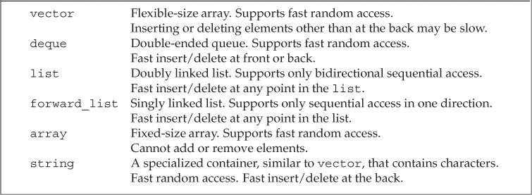
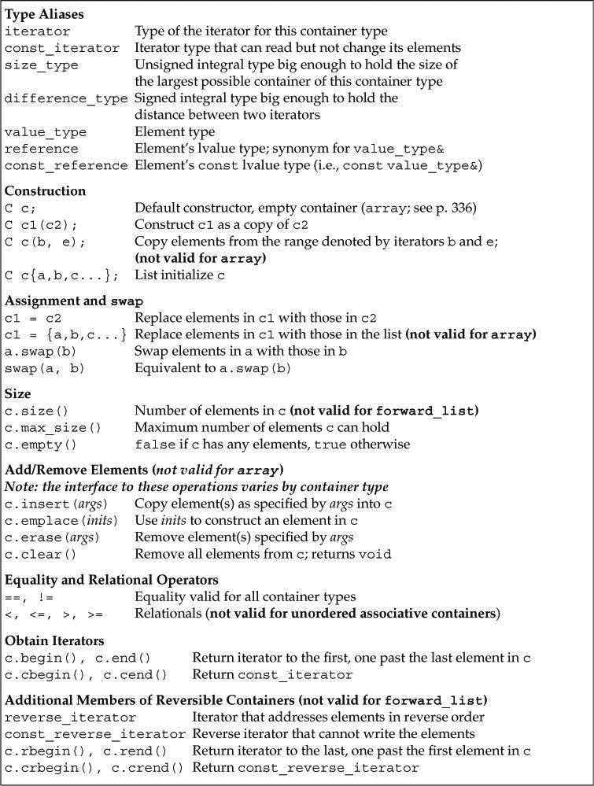
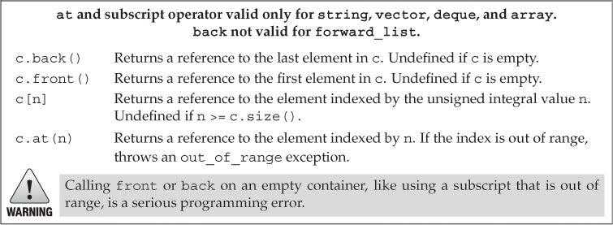
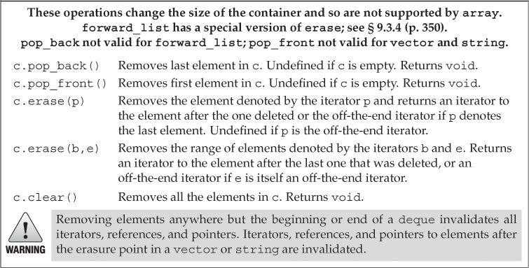
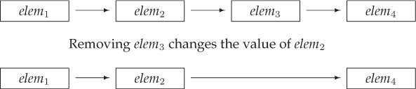
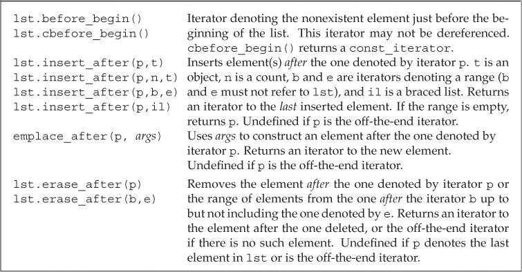
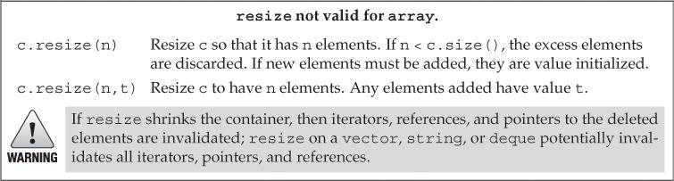
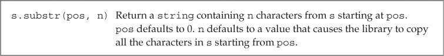
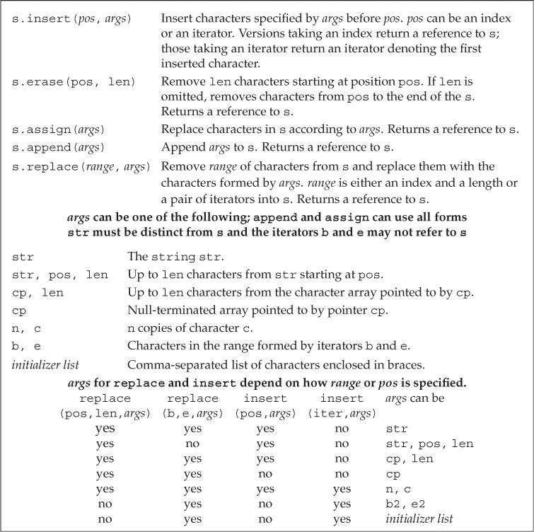

# 第9章 顺序容器

## 顺序容器概述（Overview of the Sequential Containers）

顺序容器类型：



|      类型      |                             特性                             |
| :------------: | :----------------------------------------------------------: |
|    `vector`    | 可变大小数组。支持快速随机访问。在尾部之外的位置插入/删除元素可能很慢 |
|    `deque`     |   双端队列。支持快速随机访问。在头尾位置插入/删除速度很快    |
|     `list`     | 双向链表。只支持双向顺序访问。在任何位置插入/删除速度都很快  |
| `forward_list` | 单向链表。只支持单向顺序访问。在任何位置插入/删除速度都很快  |
|    `array`     |      固定大小数组。支持快速随机访问。不能添加/删除元素       |
|    `string`    | 类似vector，但用于保存字符。支持快速随机访问。在尾部插入/删除速度很快 |

forward_list和array是C++11新增类型。与内置数组相比，array更安全易用。forward_list没有size操作。

容器选择原则：

- 除非有合适的理由选择其他容器，否则应该使用vector。

- 如果程序有很多小的元素，且空间的额外开销很重要，则不要使用list或forward_list。

- 如果程序要求随机访问容器元素，则应该使用vector或deque。

- 如果程序需要在容器头尾位置插入/删除元素，但不会在中间位置操作，则应该使用deque。

- 如果程序只有在读取输入时才需要在容器中间位置插入元素，之后需要随机访问元素。则

- - 先确定是否真的需要在容器中间位置插入元素。当处理输入数据时，可以先向vector追加数据，再调用标准库的sort函数重排元素，从而避免在中间位置添加元素。
  - 如果必须在中间位置插入元素，可以在输入阶段使用list。输入完成后将list中的内容拷贝到vector中。

- 不确定应该使用哪种容器时，可以先只使用vector和list的公共操作：使用迭代器，不使用下标操作，避免随机访问。这样在必要时选择vector或list都很方便。

## 容器库概览（Container Library Overview）

每个容器都定义在一个头文件中，文件名与类型名相同。容器均为模板类型。



### 迭代器（Iterators）

forward_list类型不支持递减运算符`--`。

一个迭代器范围（iterator range）由一对迭代器表示。这两个迭代器通常被称为begin和end，分别指向同一个容器中的元素或尾后地址。end迭代器不会指向范围中的最后一个元素，而是指向尾元素之后的位置。这种元素范围被称为左闭合区间（left-inclusive interval），其标准数学描述为*[begin，end）*。迭代器begin和end必须指向相同的容器，end可以与begin指向相同的位置，但不能指向begin之前的位置（由程序员确保）。

假定begin和end构成一个合法的迭代器范围，则：

- 如果begin等于end，则范围为空。
- 如果begin不等于end，则范围内至少包含一个元素，且begin指向该范围内的第一个元素。
- 可以递增begin若干次，令begin等于end。

```c++
while (begin != end)
{
    *begin = val;   // ok: range isn't empty so begin denotes an element
    ++begin;    // advance the iterator to get the next element
}
```

### 容器类型成员（Container Type Members）

通过类型别名，可以在不了解容器元素类型的情况下使用元素。如果需要元素类型，可以使用容器的`value_type`。如果需要元素类型的引用，可以使用`reference`或`const_reference`。

### begin和end成员（begin and end Members）

`begin`和`end`操作生成指向容器中第一个元素和尾后地址的迭代器。其常见用途是形成一个包含容器中所有元素的迭代器范围。

begin和end操作有多个版本：带`r`的版本返回反向迭代器。以`c`开头的版本（C++11新增）返回const迭代器。不以`c`开头的版本都是重载的，当对非常量对象调用这些成员时，返回普通迭代器，对const对象调用时，返回const迭代器。

```c++
list<string> a = {"Milton", "Shakespeare", "Austen"};
auto it1 = a.begin();    // list<string>::iterator
auto it2 = a.rbegin();   // list<string>::reverse_iterator
auto it3 = a.cbegin();   // list<string>::const_iterator
auto it4 = a.crbegin();  // list<string>::const_reverse_iterator
```

当auto与begin或end结合使用时，返回的迭代器类型依赖于容器类型。但调用以`c`开头的版本仍然可以获得const迭代器，与容器是否是常量无关。

当程序不需要写操作时，应该使用`cbegin`和`cend`。

### 容器定义和初始化（Defining and Initializing a Container）

容器定义和初始化方式：


将一个容器初始化为另一个容器的拷贝时，两个容器的容器类型和元素类型都必须相同。

传递迭代器参数来拷贝一个范围时，不要求容器类型相同，而且新容器和原容器中的元素类型也可以不同，但是要能进行类型转换。

```c++
// each container has three elements, initialized from the given initializers
list<string> authors = {"Milton", "Shakespeare", "Austen"};
vector<const char*> articles = {"a", "an", "the"};
list<string> list2(authors);        // ok: types match
deque<string> authList(authors);    // error: container types don't match
vector<string> words(articles);     // error: element types must match
// ok: converts const char* elements to string
forward_list<string> words(articles.begin(), articles.end());
```

C++11允许对容器进行列表初始化。

```c++
// each container has three elements, initialized from the given initializers
list<string> authors = {"Milton", "Shakespeare", "Austen"};
vector<const char*> articles = {"a", "an", "the"};
```

定义和使用array类型时，需要同时指定元素类型和容器大小。

```c++
array<int, 42>      // type is: array that holds 42 ints
array<string, 10>   // type is: array that holds 10 strings
array<int, 10>::size_type i;   // array type includes element type and size
array<int>::size_type j;       // error: array<int> is not a type
```

对array进行列表初始化时，初始值的数量不能大于array的大小。如果初始值的数量小于array的大小，则只初始化靠前的元素，剩余元素会被值初始化。如果元素类型是类类型，则该类需要一个默认构造函数。 

可以对array进行拷贝或赋值操作，但要求二者的元素类型和大小都相同。

### 赋值和swap（Assignment and swap）

容器赋值操作：


赋值运算符两侧的运算对象必须类型相同。`assign`允许用不同但相容的类型赋值，或者用容器的子序列赋值。

```c++
list<string> names;
vector<const char*> oldstyle;
names = oldstyle;   // error: container types don't match
// ok: can convert from const char*to string
names.assign(oldstyle.cbegin(), oldstyle.cend());
```

由于其旧元素被替换，因此传递给assign的迭代器不能指向调用assign的容器本身。

`swap`交换两个相同类型容器的内容。除array外，swap不对任何元素进行拷贝、删除或插入操作，只交换两个容器的内部数据结构，因此可以保证快速完成。

```c++
vector<string> svec1(10);   // vector with ten elements
vector<string> svec2(24);   // vector with 24 elements
swap(svec1, svec2);
```

赋值相关运算会导致指向左边容器内部的迭代器、引用和指针失效。而swap操作交换容器内容，不会导致迭代器、引用和指针失效（array和string除外）。

对于array，swap会真正交换它们的元素。因此在swap操作后，指针、引用和迭代器所绑定的元素不变，但元素值已经被交换。

```c++
array<int, 3> a = { 1, 2, 3 };
array<int, 3> b = { 4, 5, 6 };
auto p = a.cbegin(), q = a.cend();
a.swap(b);
// 输出交换后的值，即4、5、6
while (p != q)
{
    cout << *p << endl;
    ++p;
}
```

对于其他容器类型（除string），指针、引用和迭代器在swap操作后仍指向操作前的元素，但这些元素已经属于不同的容器了。

```c++
vector<int> a = { 1, 2, 3 };
vector<int> b = { 4, 5, 6 };
auto p = a.cbegin(), q = a.cend();
a.swap(b);
// 输出交换前的值，即1、2、3
while (p != q)
{
    cout << *p << endl;
    ++p;
}
```

array不支持assign，也不允许用花括号列表进行赋值。

```c++
array<int, 10> a1 = {0,1,2,3,4,5,6,7,8,9};
array<int, 10> a2 = {0};    // elements all have value 0
a1 = a2;    // replaces elements in a1
a2 = {0};   // error: cannot assign to an array from a braced list
```

新标准库同时提供了成员和非成员函数版本的swap。非成员版本的swap在泛型编程中非常重要，建议统一使用非成员版本的swap。

### 容器大小操作（Container Size Operations）

`size`成员返回容器中元素的数量；`empty`当size为0时返回true，否则返回false；`max_size`返回一个大于或等于该类型容器所能容纳的最大元素数量的值。forward_list支持max_size和empty，但不支持size。

### 关系运算符（Relational Operators）

每个容器类型都支持相等运算符（`==`、`!=`）。除无序关联容器外，其他容器都支持关系运算符（`>`、`>=`、`<`、`<=`）。关系运算符两侧的容器类型和保存元素类型都必须相同。

两个容器的比较实际上是元素的逐对比较，其工作方式与string的关系运算符类似：

- 如果两个容器大小相同且所有元素对应相等，则这两个容器相等。
- 如果两个容器大小不同，但较小容器中的每个元素都等于较大容器中的对应元素，则较小容器小于较大容器。
- 如果两个容器都不是对方的前缀子序列，则两个容器的比较结果取决于第一个不等元素的比较结果。

```c++
vector<int> v1 = { 1, 3, 5, 7, 9, 12 };
vector<int> v2 = { 1, 3, 9 };
vector<int> v3 = { 1, 3, 5, 7 };
vector<int> v4 = { 1, 3, 5, 7, 9, 12 };
v1 < v2     // true; v1 and v2 differ at element [2]: v1[2] is less than v2[2]
v1 < v3     // false; all elements are equal, but v3 has fewer of them;
v1 == v4    // true; each element is equal and v1 and v4 have the same size()
v1 == v2    // false; v2 has fewer elements than v1
```

容器的相等运算符实际上是使用元素的`==`运算符实现的，而其他关系运算符则是使用元素的`<`运算符。如果元素类型不支持所需运算符，则保存该元素的容器就不能使用相应的关系运算。

## 顺序容器操作（Sequential Container Operations）

### 向顺序容器添加元素（Adding Elements to a Sequential Container）

除array外，所有标准库容器都提供灵活的内存管理，在运行时可以动态添加或删除元素。


`push_back`将一个元素追加到容器尾部，`push_front`将元素插入容器头部。

```c++
// read from standard input, putting each word onto the end of container
string word;
while (cin >> word)
    container.push_back(word);
```

`insert`将元素插入到迭代器指定的位置之前。一些不支持push_front的容器可以使用insert将元素插入开始位置。

```c++
vector<string> svec;
list<string> slist;
// equivalent to calling slist.push_front("Hello!");
slist.insert(slist.begin(), "Hello!");
// no push_front on vector but we can insert before begin()
// warning: inserting anywhere but at the end of a vector might be slow
svec.insert(svec.begin(), "Hello!");
```

将元素插入到vector、deque或string的任何位置都是合法的，但可能会很耗时。

在新标准库中，接受元素个数或范围的insert版本返回指向第一个新增元素的迭代器，而旧版本中这些操作返回void。如果范围为空，不插入任何元素，insert会返回第一个参数。

```c++
list<string> 1st;
auto iter = 1st.begin();
while (cin >> word)
    iter = 1st.insert(iter, word);  // same as calling push_front
```

新标准库增加了三个直接构造而不是拷贝元素的操作：`emplace_front`、`emplace_back`和`emplace`，其分别对应push_front、push_back和insert。当调用push或insert时，元素对象被拷贝到容器中。而调用emplace时，则是将参数传递给元素类型的构造函数，直接在容器的内存空间中构造元素。

```c++
// construct a Sales_data object at the end of c
// uses the three-argument Sales_data constructor
c.emplace_back("978-0590353403", 25, 15.99);
// error: there is no version of push_back that takes three arguments
c.push_back("978-0590353403", 25, 15.99);
// ok: we create a temporary Sales_data object to pass to push_back
c.push_back(Sales_data("978-0590353403", 25, 15.99));
```

传递给emplace的参数必须与元素类型的构造函数相匹配。

forward_list有特殊版本的insert和emplace操作，且不支持push_back和emplace_back。vector和string不支持push_front和emplace_front。

### 访问元素（Accessing Elements）

每个顺序容器都有一个`front`成员函数，而除了forward_list之外的顺序容器还有一个`back`成员函数。这两个操作分别返回首元素和尾元素的引用。

在调用front和back之前，要确保容器非空。

顺序容器的元素访问操作：



在容器中访问元素的成员函数都返回引用类型。如果容器是const对象，则返回const引用，否则返回普通引用。

可以快速随机访问的容器（string、vector、deque和array）都提供下标运算符。保证下标有效是程序员的责任。如果希望确保下标合法，可以使用`at`成员函数。at类似下标运算，但如果下标越界，at会抛出out_of_range异常。

```c++
vector<string> svec;  // empty vector
cout << svec[0];      // run-time error: there are no elements in svec!
cout << svec.at(0);   // throws an out_of_range exception
```

### 删除元素（Erasing Elements）

顺序容器的元素删除操作：



删除deque中除首尾位置之外的任何元素都会使所有迭代器、引用和指针失效。删除vector或string的元素后，指向删除点之后位置的迭代器、引用和指针也都会失效。

删除元素前，程序员必须确保目标元素存在。

`pop_front`和`pop_back`函数分别删除首元素和尾元素。vector和string类型不支持pop_front，forward_list类型不支持pop_back。

`erase`函数删除指定位置的元素。可以删除由一个迭代器指定的单个元素，也可以删除由一对迭代器指定的范围内的所有元素。两种形式的erase都返回指向删除元素（最后一个）之后位置的迭代器。

```c++
// delete the range of elements between two iterators
// returns an iterator to the element just after the last removed element
elem1 = slist.erase(elem1, elem2);  // after the call elem1 == elem2
```

`clear`函数删除容器内的所有元素。

### 特殊的forward_list操作（Specialized forward_list Operations）

在forward_list中添加或删除元素的操作是通过改变给定元素之后的元素来完成的。



forward_list的插入和删除操作：



### 改变容器大小（Resizing a Container）

顺序容器的大小操作：



`resize`函数接受一个可选的元素值参数，用来初始化添加到容器中的元素，否则新元素进行值初始化。如果容器保存的是类类型元素，且resize向容器添加新元素，则必须提供初始值，或元素类型提供默认构造函数。

### 容器操作可能使迭代器失效（Container Operations May Invalidate Iterators）

向容器中添加或删除元素可能会使指向容器元素的指针、引用或迭代器失效。失效的指针、引用或迭代器不再表示任何元素，使用它们是一种严重的程序设计错误。

- 向容器中添加元素后：

- - 如果容器是vector或string类型，且存储空间被重新分配，则指向容器的迭代器、指针和引用都会失效。如果存储空间未重新分配，指向插入位置之前元素的迭代器、指针和引用仍然有效，但指向插入位置之后元素的迭代器、指针和引用都会失效。
  - 如果容器是deque类型，添加到除首尾之外的任何位置都会使迭代器、指针和引用失效。如果添加到首尾位置，则迭代器会失效，而指针和引用不会失效。
  - 如果容器是list或forward_list类型，指向容器的迭代器、指针和引用仍然有效。

- 从容器中删除元素后，指向被删除元素的迭代器、指针和引用失效：

- - 如果容器是list或forward_list类型，指向容器其他位置的迭代器、指针和引用仍然有效。
  - 如果容器是deque类型，删除除首尾之外的任何元素都会使迭代器、指针和引用失效。如果删除尾元素，则尾后迭代器失效，其他迭代器、指针和引用不受影响。如果删除首元素，这些也不会受影响。
  - 如果容器是vector或string类型，指向删除位置之前元素的迭代器、指针和引用仍然有效。但尾后迭代器总会失效。

必须保证在每次改变容器后都正确地重新定位迭代器。

不要保存end函数返回的迭代器。

```c++
// safer: recalculate end on each trip whenever the loop adds/erases elements
while (begin != v.end())
{
    // do some processing
    ++begin;    // advance begin because we want to insert after this element
    begin = v.insert(begin, 42);    // insert the new value
    ++begin;    // advance begin past the element we just added
}
```

## vector对象是如何增长的（How a vector Grows）

vector和string的实现通常会分配比新空间需求更大的内存空间，容器预留这些空间作为备用，可用来保存更多新元素。

容器大小管理操作：


`capacity`函数返回容器在不扩充内存空间的情况下最多可以容纳的元素数量。`reserve`函数告知容器应该准备保存多少元素，它并不改变容器中元素的数量，仅影响容器预先分配的内存空间大小。


只有当需要的内存空间超过当前容量时，reserve才会真正改变容器容量，分配不小于需求大小的内存空间。当需求大小小于当前容量时，reserve并不会退回内存空间。因此在调用reserve之后，capacity会大于或等于传递给reserve的参数。

在C++11中可以使用`shrink_to_fit`函数来要求deque、vector和string退回不需要的内存空间（并不保证退回）。

## 额外的string操作（Additional string Operations）

### 构造string的其他方法（Other Ways to Construct strings）

构造string的其他方法：


从另一个string对象拷贝字符构造string时，如果提供的拷贝开始位置（可选）大于给定string的大小，则构造函数会抛出out_of_range异常。

子字符串操作：



如果传递给`substr`函数的开始位置超过string的大小，则函数会抛出out_of_range异常。

### 改变string的其他方法（Other Ways to Change a string）

修改string的操作：



`append`函数是在string末尾进行插入操作的简写形式。

```c++
string s("C++ Primer"), s2 = s;     // initialize s and s2 to "C++ Primer"
s.insert(s.size(), " 4th Ed.");     // s == "C++ Primer 4th Ed."
s2.append(" 4th Ed.");     // equivalent: appends " 4th Ed." to s2; s == s2
```

`replace`函数是调用erase和insert函数的简写形式。

```c++
// equivalent way to replace "4th" by "5th"
s.erase(11, 3);         // s == "C++ Primer Ed."
s.insert(11, "5th");    // s == "C++ Primer 5th Ed."
// starting at position 11, erase three characters and then insert "5th"
s2.replace(11, 3, "5th");   // equivalent: s == s2
```

### string搜索操作（string Search Operations）

string的每个搜索操作都返回一个string::size_type值，表示匹配位置的下标。如果搜索失败，则返回一个名为`string::npos`的static成员。标准库将npos定义为const string::size_type类型，并初始化为-1。

不建议用int或其他带符号类型来保存string搜索函数的返回值。

string搜索操作：


### compare函数（The compare Functions）

string类型提供了一组`compare`函数进行字符串比较操作，类似C标准库的strcmp函数。

compare函数的几种参数形式：


### 数值转换（Numeric Conversions）

C++11增加了string和数值之间的转换函数：


进行数值转换时，string参数的第一个非空白字符必须是符号（`+`或`-`）或数字。它可以以`0x`或`0X`开头来表示十六进制数。对于转换目标是浮点值的函数，string参数也可以以小数点开头，并可以包含`e`或`E`来表示指数部分。 

如果给定的string不能转换为一个数值，则转换函数会抛出invalid_argument异常。如果转换得到的数值无法用任何类型表示，则抛出out_of_range异常。

## 容器适配器（Container Adaptors）

标准库定义了`stack`、`queue`和`priority_queue`三种容器适配器。容器适配器可以改变已有容器的工作机制。

所有容器适配器都支持的操作和类型：


默认情况下，stack和queue是基于deque实现的，priority_queue是基于vector实现的。可以在创建适配器时将一个命名的顺序容器作为第二个类型参数，来重载默认容器类型。

```c++
// empty stack implemented on top of vector
stack<string, vector<string>> str_stk;
// str_stk2 is implemented on top of vector and initially holds a copy of svec
stack<string, vector<string>> str_stk2(svec);
```

所有适配器都要求容器具有添加和删除元素的能力，因此适配器不能构造在array至上。适配器还要求容器具有添加、删除和访问尾元素的能力，因此也不能用forward_list构造适配器。

栈适配器stack定义在头文件*stack*中，其支持的操作如下：


队列适配器queue和priority_queue定义在头文件*queue*中，其支持的操作如下：


queue使用先进先出（first-in，first-out，FIFO）的存储和访问策略。进入队列的对象被放置到队尾，而离开队列的对象则从队首删除。