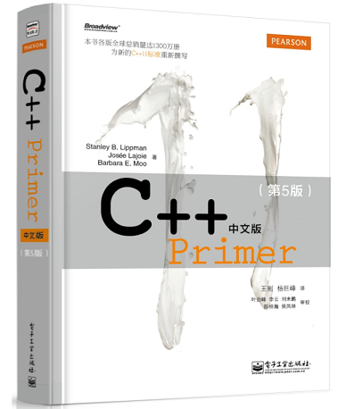

# 《C++ Primer中文版（第5版）》笔记

## 目录

[第1章 开始](https://github.com/czs108/Cpp-Primer-5th-Note-CN/tree/master/Chapter-1%20Getting%20Started)

### 第I部分 C++基础

[第2章 变量和基本类型](https://github.com/czs108/Cpp-Primer-5th-Note-CN/tree/master/Chapter-2%20Variables%20and%20Basic%20Types)

[第3章 字符串、向量和数组](https://github.com/czs108/Cpp-Primer-5th-Note-CN/tree/master/Chapter-3%20Strings%2C%20Vectors%2C%20and%20Arrays)

[第4章 表达式](https://github.com/czs108/Cpp-Primer-5th-Note-CN/tree/master/Chapter-4%20Expressions)

[第5章 语句](https://github.com/czs108/Cpp-Primer-5th-Note-CN/tree/master/Chapter-5%20Statements)

[第6章 函数](https://github.com/czs108/Cpp-Primer-5th-Note-CN/tree/master/Chapter-6%20Functions)

[第7章 类](https://github.com/czs108/Cpp-Primer-5th-Note-CN/tree/master/Chapter-7%20Classes)  

### 第II部分 C++标准库

[第8章 IO库](https://github.com/czs108/Cpp-Primer-5th-Note-CN/tree/master/Chapter-8%20The%20IO%20Library)

[第9章 顺序容器](https://github.com/czs108/Cpp-Primer-5th-Note-CN/tree/master/Chapter-9%20%20Sequential%20Containers)

[第10章 泛型算法](https://github.com/czs108/Cpp-Primer-5th-Note-CN/tree/master/Chapter-10%20Generic%20Algorithms)

[第11章 关联容器](https://github.com/czs108/Cpp-Primer-5th-Note-CN/tree/master/Chapter-11%20Associative%20Containers)

[第12章 动态内存](https://github.com/czs108/Cpp-Primer-5th-Note-CN/tree/master/Chapter-12%20Dynamic%20Memory)  

### 第III部分 类设计者的工具

[第13章 拷贝控制](https://github.com/czs108/Cpp-Primer-5th-Note-CN/tree/master/Chapter-13%20Copy%20Control)

[第14章 操作重载与类型转换](https://github.com/czs108/Cpp-Primer-5th-Note-CN/tree/master/Chapter-14%20Overloaded%20Operations%20and%20Conversions)

[第15章 面向对象程序设计](https://github.com/czs108/Cpp-Primer-5th-Note-CN/tree/master/Chapter-15%20Object-Oriented%20Programming)

[第16章 模板与泛型编程](https://github.com/czs108/Cpp-Primer-5th-Note-CN/tree/master/Chapter-16%20Templates%20and%20Generic%20Programming)  

### 第IV部分 高级主题

[第17章 标准库特殊设施](https://github.com/czs108/Cpp-Primer-5th-Note-CN/tree/master/Chapter-17%20Specialized%20Library%20Facilities)

[第18章 用于大型程序的工具](https://github.com/czs108/Cpp-Primer-5th-Note-CN/tree/master/Chapter-18%20Tools%20for%20Large%20Programs)

[第19章 特殊工具与技术](https://github.com/czs108/Cpp-Primer-5th-Note-CN/tree/master/Chapter-19%20Specialized%20Tools%20and%20Techniques)